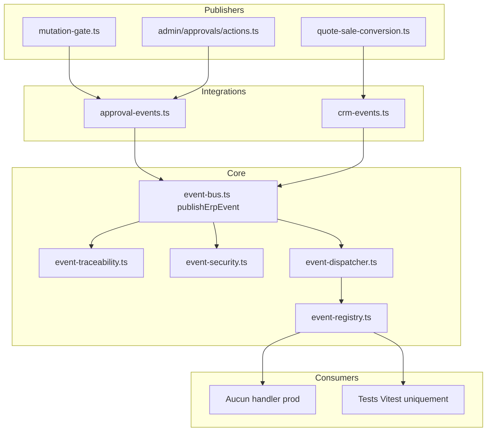

# REMPRES ERP — Phase B3.2+
# Event Bus Exploitation & Stabilization — Rapport final

**Version bus :** `erp-event-bus-b3.2-v1`  
**Version exploitation :** `erp-event-catalog-b3.2-plus-v1`  
**Date :** 2026-05-22  
**Mode :** Foundation First — **pas de rebuild, pas de notification center, pas de BPM, pas de second bus**

---

## Synthèse exécutive

| Question | Verdict |
|----------|---------|
| Bus B3.2 reconstruit ? | **Non** — exploité tel quel |
| Cartographie complète ? | **Oui** — audit + catalogue gouverné |
| CRM migration préparée ? | **Oui** — table `CRM_EVENT_MIGRATION_TABLE` |
| Notification foundation ? | **Oui** — contrats design uniquement |
| Automation foundation ? | **Oui** — contrats design uniquement |
| Handler governance ? | **Oui** — standard + règles in-process |
| Finance readiness ? | **Oui** — bloqué par registry `enabled: false` |
| Phase validée ? | **Oui** — industrialisation documentée + artefacts gouvernance |

> **Le bus passe de « présent » à « infrastructure d’orchestration officielle ».**  
> **Priorité immédiate :** migration CRM par vagues (publishers) + 1er handler notification read-only — **sans** supprimer alerts/audit legacy.

---

## 0. Rappel contexte ERP

### Déjà validé (ne pas refaire)

| Bloc | Phases |
|------|--------|
| ERP Core | M1 → M3.75 |
| Vente | B1 → B2.4 |
| Finance | B3 cockpit/runtime (writes off) |
| Approval | B3.1 `lib/erp-core/approval/` |
| Event Bus | B3.2 `lib/erp-core/events/` |

### Règle officielle post-B3.2

Toute orchestration future (notifications, automation, refresh avancé, workflow transverse) **doit** passer par :

`lib/erp-core/events/`

**Interdit :** Kafka, second bus, WebSocket bus parallèle, side effects hardcodés hors publishers, workflow parallèle.

### Ce que B3.2+ a ajouté (sans casser B3.2)

| Artefact | Chemin |
|----------|--------|
| Catalogue exploitable | `governance/event-catalog-governance.ts` |
| Handler standard | `governance/handler-governance-standard.ts` |
| Notification foundation | `foundation/notification-foundation.ts` |
| Automation foundation | `foundation/automation-foundation.ts` |
| CRM migration plan | `foundation/crm-event-migration-plan.ts` |
| Finance readiness | `foundation/finance-event-readiness.ts` |

---

## 1. PHASE 1 — Audit complet event bus actuel

### 1.1 Architecture réelle



**Nature :** bus **single in-process**, synchrone, même process Node Next.js.

**Pipeline publish :**

1. `assertValidEventType` (pattern `domain.entity.action`)
2. Construction `ErpEventEnvelope` + meta officielle si type catalogue
3. `assertCanPublishEvent` (acteur + department)
4. Trace `published` (ring buffer 500)
5. `persistEventBusAudit` → `governance_audit_events` (`category: event`)
6. `dispatchErpEvent` → handlers match pattern → trace `handler_ok` / `handler_error`

### 1.2 Cartographie publishers

| Publisher | Fichier | Appelé par |
|-----------|---------|------------|
| `emitApprovalRequestCreated` | `integrations/approval-events.ts` | `mutation-gate` (nouvelle demande) |
| `emitMutationBlockedPending` | idem | `mutation-gate` (pending existant) |
| `emitApprovalGateGranted` | idem | `mutation-gate` (déjà approved) |
| `emitApprovalRequestApproved` | idem | `admin/approvals/actions.ts` |
| `emitApprovalRequestRejected` | idem | idem |
| `emitCrmQuoteConverted` | `integrations/crm-events.ts` | `quote-sale-conversion.ts` |
| `emitCrmQuoteConvertRequested` | idem | **jamais appelé** |
| (+ interne) `runtime.orchestration.completed` | via `emitCrmQuoteConverted` | idem |

**Point de correction documentation :** `approval.request.approved` n’est **pas** émis par `mutation-gate` — uniquement par `/admin/approvals`.

### 1.3 Flux réellement publiés (runtime)

| Event type | Statut runtime |
|------------|----------------|
| `approval.request.created` | **ACTIF** |
| `approval.request.approved` | **ACTIF** |
| `approval.request.rejected` | **ACTIF** |
| `approval.gate.granted` | **ACTIF** |
| `mutation.blocked.pending` | **ACTIF** |
| `crm.quote.converted` | **ACTIF** |
| `runtime.orchestration.completed` | **ACTIF** |
| `crm.quote.convert_requested` | **PARTIEL** (publisher seul) |
| `runtime.orchestration.failed` | **NON** |
| `finance.transaction.recorded` | **NON** |
| `system.audit.recorded` | **NON** |

### 1.4 Flux non publiés / side effects legacy

| Mécanisme | Où | Rôle | Relation bus |
|-----------|-----|------|--------------|
| `recordCrmGovernanceAudit` | `crm-mutations.ts` (×9), `quote-sale-conversion` | Audit CRM | Parallèle — à migrer |
| `recordApprovalEngineAudit` | `mutation-gate` | Audit approval | Parallèle — complémentaire |
| `tryCreateAlert` | `mutation-gate`, `admin/approvals`, HR | Alertes UI | **Pas** sur bus — cible handlers futurs |
| `tryLogGovernanceAuditEvent` | workflow legacy, bus trace | Audit transverse | OK |
| `revalidatePath` | approvals, settings | Cache Next | Hors domaine événementiel |

**Consommateurs bus en production :** **0** (`registerErpEventHandler` uniquement dans tests).

### 1.5 Dette technique bus

| ID | Dette | Gravité |
|----|-------|---------|
| D1 | Pas de handlers prod | Haute (by design B3.2) |
| D2 | CRM 9/10 mutations sans event | Haute |
| D3 | `role_key` absent contexte publish/subscribe | Moyenne |
| D4 | Ring buffer volatile (restart = perte) | Faible |
| D5 | Double/triple effet (audit + alert + event) | Moyenne |
| D6 | `publishErpEvent` accepte types hors catalogue (dev) | Faible |
| D7 | Pas de `runtime.orchestration.failed` | Moyenne |
| D8 | Alerts non dérivées du bus | Haute (cible B4) |

### 1.6 Risques

- **Handlers futurs** qui rappellent `publish` → boucles (mitigation : règle loop guard).
- **Migration CRM** trop rapide → duplication audit (garder audit jusqu’à bascule supervisée).
- **Confusion alert vs event** — documenter que `governance_alerts` reste jusqu’à handler notification.

---

## 2. PHASE 2 — Event catalog governance

### 2.1 ERP EVENT GOVERNANCE MAP

Source code : `lib/erp-core/events/governance/event-catalog-governance.ts` → `ERP_EVENT_GOVERNANCE_MAP`.

### 2.2 Classification par famille

#### DOMAIN EVENTS

| Type | Statut |
|------|--------|
| `crm.quote.converted` | active |
| `finance.transaction.recorded` | planned |

#### MUTATION EVENTS

| Type | Statut |
|------|--------|
| `mutation.blocked.pending` | active |
| `crm.quote.convert_requested` | partial |

#### APPROVAL EVENTS

| Type | Statut |
|------|--------|
| `approval.request.created` | active |
| `approval.request.approved` | active |
| `approval.request.rejected` | active |
| `approval.gate.granted` | active |

#### AUDIT EVENTS

| Type | Statut |
|------|--------|
| `system.audit.recorded` | planned |

#### NOTIFICATION_CANDIDATE EVENTS

| Type | Statut |
|------|--------|
| *(aucun dans catalogue B3.2)* | — |

**Stratégie :** en B4+, soit famille dédiée `notification_candidate` à l’emit, soit **mapper** depuis events `approval.*` / `crm.*` (recommandé — moins de types).

#### RUNTIME EVENTS

| Type | Statut |
|------|--------|
| `runtime.orchestration.completed` | active |
| `runtime.orchestration.failed` | catalog_only |

### 2.3 Naming lock

- Pattern regex : `ERP_EVENT_TYPE_PATTERN`
- Production : **`publishOfficialErpEvent` + amendement `OFFICIAL_ERP_EVENT_TYPES`**
- Interdit : types libres en prod (réservés tests / migration contrôlée)

### 2.4 Extensions catalogue prévues (CRM migration)

À ajouter via amendement taxonomy (phases B3.3.x) :

- `crm.lead.created`
- `crm.lead.status_updated`
- `crm.quote.created`
- `crm.quote.status_updated`
- … (voir `CRM_EVENT_MIGRATION_TABLE`)

---

## 3. PHASE 3 — CRM → Event Bus migration plan

### 3.1 État actuel

| Mutation | Bus | Audit legacy |
|----------|-----|--------------|
| `crm.quote.convert_sale` | **Oui** (+ approval chain) | Oui |
| 9 autres actions CRM | **Non** | Oui (`crm-mutations.ts`) |

### 3.2 Table migration (résumé)

Source : `foundation/crm-event-migration-plan.ts`

| Phase | Actions |
|-------|---------|
| **done** | `crm.quote.convert_sale` |
| **next** | lead create, quote create, quote status update |
| **later** | lead convert, opportunity *, activity * |

### 3.3 Principe migration (sans rewrite)

Pour chaque mutation :

1. **Ajouter** type officiel + publisher `integrations/crm-events.ts`
2. **Appeler** publisher **après** succès DB (même ordre que audit aujourd’hui)
3. **Conserver** `recordCrmGovernanceAudit` jusqu’à validation supervision
4. **Ne pas** déplacer `tryCreateAlert` — futur handler `approval.*` / `crm.*`
5. **Brancher** `emitCrmQuoteConvertRequested` avant gate (compléter convert)

### 3.4 Ordre d’exécution recommandé

1. `crm.quote.convert_requested` (compléter flux convert)
2. `crm.quote.status_updated` + `crm.quote.created`
3. `crm.lead.created`
4. Vagues opportunity / activity

---

## 4. PHASE 4 — Notification foundation design

**Fichier :** `foundation/notification-foundation.ts`  
**Version :** `erp-notification-foundation-b3.2-plus-v1`

### 4.1 Pattern retenu

```
ErpEvent (bus)
    ↓
ErpNotificationCandidateMapper (pur fonction)
    ↓
ErpNotificationCandidate (projection)
    ↓
ErpNotificationHandler (consumer)
    ↓
ErpNotificationService.deliver (futur)
```

### 4.2 Interfaces clés

| Type | Rôle |
|------|------|
| `ErpNotificationCandidate` | DTO notification (template, channels, scope) |
| `ErpNotificationCandidateMapper` | Event → candidate ou null |
| `ErpNotificationHandler` | Traite candidate |
| `ErpNotificationService` | Delivery (in_app, email…) — **non implémenté** |
| `ErpNotificationHandlerRegistration` | Abonnement pattern + mapper |

### 4.3 Routing & security (design)

- **Scope destinataires :** `actor` | `approvers` | `department` | `super_admin`
- **Filtrage :** réutiliser `assertCanSubscribe` + `departmentScope` handler
- **Channels :** `in_app` d’abord (proche `governance_alerts`)

### 4.4 Pont avec legacy

| Legacy | Future |
|--------|--------|
| `tryCreateAlert` dans mutation-gate | Handler sur `approval.request.created` |
| `tryCreateAlert` dans admin approvals | Handler sur `approval.request.approved/rejected` |

**Règle :** pas de suppression alerts en B3.2+ — **coexistence** jusqu’à handler validé.

### 4.5 Non livré (volontaire)

- Notification center UI
- Templates HTML / email
- Préférences utilisateur
- File d’attente persistante

---

## 5. PHASE 5 — Automation foundation design

**Fichier :** `foundation/automation-foundation.ts`  
**Version :** `erp-automation-foundation-b3.2-plus-v1`

### 5.1 Pattern retenu

```
ErpEvent
    ↓
ErpAutomationRule (match pattern + payloadMatch)
    ↓
ErpAutomationHandler (actionKey)
    ↓
Execution (side effect métier léger — futur)
```

### 5.2 Modèle

| Type | Rôle |
|------|------|
| `ErpAutomationRule` | Règle déclarative (draft/active/disabled) |
| `ErpAutomationExecutionContext` | rule + event + timestamp |
| `ErpAutomationHandler` | Exécute actionKey |
| `ERP_AUTOMATION_RULE_EXAMPLES` | Exemples documentés (non exécutés) |

### 5.3 Exemples métier (futurs)

| Scénario | Event pattern | Action |
|----------|---------------|--------|
| Devis approuvé | `approval.request.approved` | notify sales |
| Seuil finance | `finance.transaction.recorded` | alert CFO |
| Contrat RH | `rh.contract.expiring` | reminder HR |

### 5.4 Non livré (volontaire)

- Workflow builder / BPM
- Moteur externe
- UI règles
- Persistance règles en DB (phase Automation B4+)

---

## 6. PHASE 6 — Event handler governance

**Fichier :** `governance/handler-governance-standard.ts`

### 6.1 Modèle officiel

```typescript
registerErpEventHandler({
  pattern: "approval.*",
  consumerKey: "notification-approval-bridge",
  handler: async (event) => { /* 1 responsabilité */ },
  departmentScope: "VENTE", // optionnel
});
```

**Extension B3.2+ (design) :** `ErpHandlerGovernanceRegistration` ajoute `responsibility`, `maxSensitivity`, `idempotent`.

### 6.2 Règles

| # | Règle |
|---|-------|
| 1 | **1 handler = 1 responsabilité** |
| 2 | **Pas de retry** in-process (B3.2+) — échec → `handler_error` trace |
| 3 | **Isolation** — try/catch par handler (déjà dans dispatcher) |
| 4 | **Safety** — pas de `publish` du même type depuis handler |
| 5 | **Observability** — `consumerKey` obligatoire, traces ring |
| 6 | **Max 8 handlers** par pattern (garde-fou) |

### 6.3 Lifecycle (in-process)

```
register → (runtime) event published → dispatch → handler_ok | handler_error
```

Pas de distributed saga — volontaire.

### 6.4 Enregistrement recommandé (prochaine phase)

| consumerKey | pattern | responsibility |
|-------------|---------|----------------|
| `notification-approval-bridge` | `approval.*` | notification |
| `trace-supervisor` | `*` | trace_only |
| `cockpit-vente-refresh` | `crm.*` | cockpit_refresh |

Enregistrement au **boot serveur** (module `lib/erp-core/events/bootstrap/` — futur, hors B3.2+).

---

## 7. PHASE 7 — Finance event readiness

**Fichier :** `foundation/finance-event-readiness.ts`

### 7.1 État Finance

| Élément | Statut |
|---------|--------|
| Cockpit `/finance/dashboard` | Live |
| KPI SoT | `finance-treasury-runtime-v1` |
| Write registry | **Tout `enabled: false`** |
| Approval gate | Prêt (`assertErpMutationApprovalGate`) |
| Event catalogue | `finance.transaction.recorded` **planned** |

### 7.2 Table readiness (résumé)

| Write action | Event futur | Bloquant |
|--------------|-------------|----------|
| `finance.expense.create` | `finance.expense.created` | registry |
| `finance.journal.post` | `finance.transaction.recorded` | registry + approval |
| `finance.invoice.issue` | `finance.invoice.issued` | registry |
| `finance.payment.allocate` | `finance.payment.allocated` | registry |

### 7.3 Séquence activation (future)

1. Créer `integrations/finance-events.ts`
2. Activer une action registry (`enabled: true`) + tests
3. Émettre après commit DB (comme CRM)
4. Handlers notification/automation sur events `restricted` + scope FINANCE

**B3.2+ :** aucune activation — analyse uniquement.

---

## 8. Consolidation — améliorations B3.2+

### 8.1 Ce qui était déjà fait (B3.2)

- Bus core complet
- Taxonomy + 11 types officiels
- Publishers approval + CRM convert
- Intégration mutation-gate + admin approvals + quote conversion
- Trace + audit category `event`

### 8.2 Ce qui a été amélioré (B3.2+)

- Cartographie statuts **active / partial / catalog_only / planned**
- Plans migration CRM et readiness Finance **en code** (gouvernance)
- Designs notification + automation **typés**
- Standard handlers documenté + règles retry/loop
- Tests `b3-2-plus-event-exploitation.test.ts`

### 8.3 Architecture retenue

**Un bus, in-process, publishers d’intégration, handlers à responsabilité unique, legacy coexistants jusqu’à bascule.**

### 8.4 Risques restants

Voir §1.6 — inchangés sauf mitigation plans documentés.

### 8.5 Dette restante

1. Handlers prod = 0  
2. CRM 90% sans bus  
3. Alerts parallèles  
4. `role_key` security enrichissement  
5. `convert_requested` + `orchestration.failed` non branchés  
6. Finance events non émis  
7. Pas de bootstrap handlers au démarrage app  

### 8.6 Prochaines priorités (ordre strict)

| Priorité | Action | Phase suggérée |
|----------|--------|----------------|
| **P0** | Brancher `emitCrmQuoteConvertRequested` + `runtime.orchestration.failed` | B3.3a |
| **P1** | Publishers CRM « next » (lead/quote) + amendement taxonomy | B3.3b |
| **P2** | 1er handler : `notification-approval-bridge` (read-only map → log) | B4-notif-foundation |
| **P3** | Remplacer progressivement `tryCreateAlert` approval par handler | B4-notif |
| **P4** | `finance-events.ts` quand writes activés | Finance-B4 |
| **P5** | Bootstrap handlers + admin UI traces bus | B3.3c |

---

## 9. Critères de validation phase B3.2+

| Critère | Statut |
|---------|--------|
| Event bus cartographié | ✅ |
| Catalog gouverné | ✅ |
| CRM migration préparée | ✅ |
| Notification foundation conçue | ✅ |
| Automation foundation conçue | ✅ |
| Handler governance définie | ✅ |
| Finance readiness analysée | ✅ |
| Rapport final produit | ✅ |
| Sans rebuild / chaos / archi parallèle | ✅ |

---

## 10. Verdict final

# ERP EVENT BUS — **EXPLOITED FOUNDATION VALIDÉE (B3.2+)**

Le bus n’est plus une fondation « théorique » : il est **cartographié, gouverné, et prêt à recevoir handlers et migrations CRM par vagues**.

**Non prêt pour :** production notifications/automation complètes, remplacement alerts, CRM 100% bus-driven.

**Prêt pour :** exécution disciplinée des priorités P0→P5 sans architecture parallèle.

---

*Foundation First — industrialisation de l’infrastructure existante, pas de build sauvage.*
