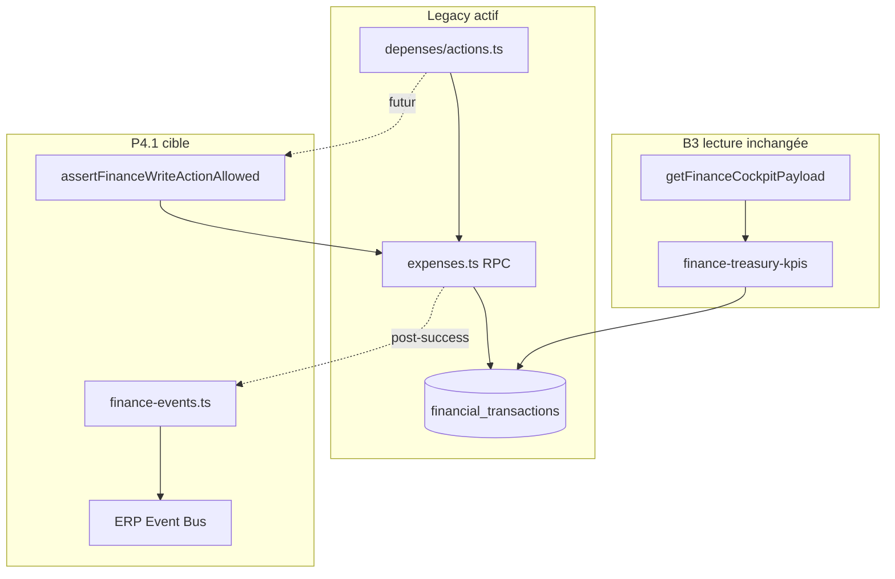

# REMPRES ERP — Phase P4
# Finance Event Activation & Write Governance — Rapport final

**Version catalogue :** `erp-event-catalog-p4-v1`  
**Version readiness :** `finance-event-readiness-p4-v1`  
**Version bus :** `erp-event-bus-b3.2-v1` (inchangé)  
**Date :** 2026-05-22  
**Mode :** Foundation First — **pas d'activation writes, pas de rebuild Finance, pas de `finance-events.ts` câblé**

---

## Synthèse exécutive

| Question | Verdict |
|----------|---------|
| Audit Finance produit ? | **Oui** |
| Catalogue finance gouverné (4 types officiels) ? | **Oui** |
| Publishers définis (design map) ? | **Oui** — `publisher_ready`, non câblés |
| Write activation plan ? | **Oui** — tout `enabled: false` |
| Mutation integration roadmap ? | **Oui** |
| Approval readiness matrix ? | **Oui** |
| Legacy coexistence ? | **Oui** |
| Readiness gouvernance P4 | **READY** |
| Readiness activation writes prod | **NOT READY** (volontaire) |
| P4 validé ? | **Oui** |

> **P4 fait de Finance le 2ᵉ domaine catalogué sur le bus ERP, sans activer les mutations.**  
> **Priorité immédiate : P4.1 — `finance-events.ts` + câblage `createExpense` / `updateExpense` via `assertFinanceWriteActionAllowed`.**

---

## 0. Contexte ERP

### Position projet

REMPRES ERP est en **POST-P3** : fondation enterprise avancée, plus prototype.

| Bloc | État |
|------|------|
| ERP Core M1 → M3.75 | ✅ Validé |
| Vente B1 → B2.4 | ✅ Validé |
| Finance B3 cockpit/runtime lecture | ✅ Validé |
| Approval B3.1 | ✅ Validé |
| Event Bus B3.2 | ✅ Validé |
| Exploitation B3.2+ | ✅ Validé |
| CRM P1 → P1.1, ponts P2/P2.1, delivery P3 | ✅ Poussé (`7a7e924`, `7e32b92`) |

### Règle architecturale

- **Un seul bus** : `lib/erp-core/events/`
- **Pattern mutation** : `registry → gate → write → publisher → audit → runtime`
- **Naming** : `domain.entity.action`
- **Extensions** : amendement `OFFICIAL_ERP_EVENT_TYPES` avant tout usage

### Ce que P4 ne fait PAS

❌ Rebuild cockpit Finance  
❌ Nouvelle architecture Finance parallèle  
❌ Activation `enabled: true` sur le registry  
❌ Second bus / events libres  
❌ Suppression brutale legacy (`tryLogAuditEvent`, RPC expenses)  
❌ Pont notification `finance.*` (réservé P5)

---

## 1. Rappel — déjà fait (ne pas refaire)

### Finance B3 (lecture)

| Composant | Fichier | Rôle |
|-----------|---------|------|
| Treasury KPIs | `finance-treasury-kpis.ts` | SoT `financial_transactions` via `getFinanceCfoData` |
| Enterprise KPIs | `finance-enterprise-kpis.ts` | Compteurs `finance_journal_batches`, AR, paiements |
| KPI bundle | `finance-kpi-runtime.ts` | `buildDeptFinanceKpiPayload` |
| Cockpit | `finance-cockpit-payload.ts` | `/finance/dashboard` |
| Sécurité lecture/écriture | `finance-runtime-security.ts` | Dept FINANCE, bloc supervision |
| Write registry | `finance-write-governance.ts` | 5 actions, **toutes `enabled: false`** |

### Bus ERP (existant)

- 9+ types CRM/approval actifs (P1–P3)
- 1 slot Finance historique : `finance.transaction.recorded` (planned B3.2+)
- Ponts : `crm.*`, `approval.*` — **pas `finance.*`**

### Commits récents pertinents

- `7a7e924` — P1–P3 CRM events + notification bridges  
- `7e32b92` — perf layout/dashboard  

---

## 2. Audit Finance — état actuel (Phase 1)

### 2.1 Cartographie runtime `lib/finance/runtime/`

```
index.ts                    → barrel B3
finance-transaction-rules.ts → règles agrégation FT (sale/expense, non cancelled)
finance-treasury-kpis.ts      → KPI trésorerie (finance-treasury-runtime-v1)
finance-enterprise-kpis.ts  → KPI enterprise + assertFinanceRuntimeReadAccess
finance-kpi-runtime.ts        → bundle dept + buildDeptFinanceKpiPayload
finance-cockpit-payload.ts    → payload manager cockpit
finance-runtime-security.ts   → read/write access FINANCE
finance-write-governance.ts   → registry + assertFinanceWriteActionAllowed (NON APPELÉ)
```

### 2.2 Write registry (B3 contract)

| Action | enabled | requiresApproval | Description |
|--------|---------|------------------|-------------|
| `finance.expense.create` | false | false | Création dépense |
| `finance.expense.update` | false | false | Modification dépense |
| `finance.journal.post` | false | **true** | Comptabilisation journal |
| `finance.invoice.issue` | false | false | Émission facture AR |
| `finance.payment.allocate` | false | false | Allocation paiement |

**Gate B3.1** : câblé pour `JOURNAL_POST` via `assertErpMutationApprovalGate` — inactif tant que `enabled: false`.

### 2.3 Writes réels (legacy — production)

| Chemin | Cible SoT | Gouvernance B3 |
|--------|-----------|----------------|
| `depenses/actions.ts` → `expenses.ts` | `financial_transactions` (RPC) | ❌ `assertApprovalOrThrow` legacy |
| `sales.ts` | `financial_transactions` (RPC) | ❌ hors registry |
| RPC `post_finance_journal_batch` | `finance_journal_batches` | ❌ pas exposé TS |
| `finance_*` repositories | lecture seule | N/A |

**Ratio bus-driven Finance :** 0 % — Finance n'émet aucun événement officiel.

### 2.4 Dette identifiée

| ID | Dette | Gravité |
|----|-------|---------|
| F1 | Double système approval (legacy vs B3.1) sur dépenses | Haute |
| F2 | `assertFinanceWriteActionAllowed` jamais appelé | Haute |
| F3 | `recordFinanceGovernanceAudit` défini, 0 caller | Moyenne |
| F4 | Pages finance sans `assertFinanceRuntimeReadAccess` uniforme | Moyenne |
| F5 | 0 handler `finance.*` | Attendu (P5) |
| F6 | Seuil CFO en draft automation seulement | Faible |

### 2.5 Risques

| Risque | Mitigation P4 |
|--------|----------------|
| Activation writes sans gate | Registry reste `enabled: false` |
| Double audit bus + legacy | `publishIntegrationOfficialEvent` (`persistAudit: false`) |
| Montants dupliqués dans payloads | Payload = références + metadata, SoT = FT |
| Supervision write | `assertFinanceRuntimeWriteAccess` bloque supervision |
| Journal post sans approval | `requiresApproval: true` sur `JOURNAL_POST` |

### 2.6 Readiness pré-P4

| Critère | État |
|---------|------|
| Gate structure | ✅ Prêt |
| Taxonomie 1 slot | ⚠️ Insuffisant (1 type) |
| Publishers | ❌ Absents |
| Intégration mutations | ❌ 0 % |
| KPI runtime | ✅ Stable lecture |

---

## 3. Finance Event Governance Amendment (Phase 2)

### 3.1 Amendement catalogue officiel

**Fichier gouvernance :** `lib/erp-core/events/governance/finance-event-governance-amendment.ts`

| Type officiel | family | sensitivity | owner | correlation |
|---------------|--------|-------------|-------|-------------|
| `finance.transaction.recorded` | domain | restricted | finance | transactionId |
| `finance.transaction.failed` | domain | restricted | finance | transactionId |
| `finance.threshold.exceeded` | domain | restricted | finance | thresholdKey |
| `finance.payment.recorded` | domain | restricted | finance | paymentId |

**Taxonomie :** `event-taxonomy.ts` — 17 types officiels ERP (14 + 3 Finance P4).

**Catalogue :** `ERP_EVENT_GOVERNANCE_MAP` — 4 entrées Finance, statut **`catalog_only`**.

### 3.2 Vérifications

| Contrôle | Résultat |
|----------|----------|
| Naming lock `domain.entity.action` | ✅ |
| Doublons | ✅ Aucun |
| family cohérent | ✅ `domain` |
| sensitivity | ✅ `restricted` (données financières) |
| ownership | ✅ `finance` / dept `FINANCE` |

### 3.3 Types non-officiels (roadmap)

Conservés en design / readiness, **pas** dans `OFFICIAL_ERP_EVENT_TYPES` :

- `finance.expense.created` / `finance.expense.updated`
- `finance.invoice.issued`
- `finance.payment.allocated` (action registry ≠ `finance.payment.recorded`)

---

## 4. Finance Publisher Design (Phase 3)

### 4.1 Fichier cible (P4.1)

`lib/erp-core/events/integrations/finance-events.ts` — **non créé en P4** (design only).

### 4.2 Design map

**Fichier :** `lib/erp-core/events/governance/finance-publisher-design-map.ts`

| Publisher | Event officiel | entityType | wirePhase |
|-----------|----------------|------------|-----------|
| `emitFinanceTransactionRecorded` | `finance.transaction.recorded` | `financial_transactions` | publisher_ready |
| `emitFinanceTransactionFailed` | `finance.transaction.failed` | `financial_transactions` | publisher_ready |
| `emitFinanceThresholdExceeded` | `finance.threshold.exceeded` | `finance_threshold` | publisher_ready |
| `emitFinancePaymentRecorded` | `finance.payment.recorded` | `finance_payment_allocations` | publisher_ready |
| `emitFinanceExpenseCreated` | `finance.expense.created` | `expenses` | publisher_ready |
| `emitFinanceExpenseUpdated` | `finance.expense.updated` | `expenses` | publisher_ready |

### 4.3 Standard aligné CRM

- `publishIntegrationOfficialEvent` — `persistAudit: false`, `awaitDispatch: false`
- `departmentKey: "FINANCE"`
- 1 publisher = 1 responsabilité
- `correlationId` = ID entité primaire
- `causationId` optionnel (ex. `journalBatchId`, `invoiceId`)

### 4.4 Traceability & security

| Aspect | Règle |
|--------|-------|
| Trace bus | Ring buffer trace (published → handler) |
| Audit métier | Legacy + `recordFinanceGovernanceAudit` en parallèle |
| Publish security | `assertCanPublishEvent` (actor + dept) |
| Write security | `assertFinanceRuntimeWriteAccess` avant publish |

---

## 5. Finance Write Activation Plan (Phase 4)

**Fichier :** `lib/erp-core/events/foundation/finance-write-activation-plan.ts`

| mutation | phase | gate | write | publisher | audit | handler futur |
|----------|-------|------|-------|-----------|-------|---------------|
| expense.create | **prepare_p4_1** | B3 gate | RPC create_expense | emitFinanceExpenseCreated | tryLogAuditEvent | notification-finance P5 |
| expense.update | **prepare_p4_1** | B3 gate | RPC update_expense | emitFinanceExpenseUpdated | tryLogAuditEvent | idem |
| journal.post | **prepare_p4_2** | B3 + approval | RPC post_journal | recorded / failed | approval audit | approval + finance bridge |
| invoice.issue | future | B3 gate | AR insert (futur) | emitFinanceInvoiceIssued | governance audit | P5+ |
| payment.allocate | **prepare_p4_2** | B3 gate | allocations | emitFinancePaymentRecorded | governance audit | treasury refresh |

**Règle activation :** `registry.enabled = true` **uniquement** après test intégration gate→write→publish→audit.

---

## 6. Finance Mutation Integration Plan (Phase 5)

**Fichier :** `lib/erp-core/events/foundation/finance-mutation-integration-plan.ts`

### Ordre d'intégration obligatoire

1. `assertFinanceWriteActionAllowed` (registry enabled)
2. Write DB / RPC
3. `publishIntegrationOfficialEvent` via `finance-events.ts`
4. Audit legacy + governance (coexistence)
5. `revalidateFinanceScope` / refresh cockpit

### Roadmap

| Phase | Mutations | Events |
|-------|-----------|--------|
| **P4.1** | createExpense, updateExpense | expense.created/updated |
| **P4.2** | journal post RPC, payment allocate, sale record | transaction.*, payment.recorded |
| **P4.3** | threshold evaluator | threshold.exceeded |
| later | deleteExpense, invoice issue | extensions taxonomy |

**État actuel :** 0 mutation `integrationPhase: "done"`.

---

## 7. Finance Approval Readiness (Phase 6)

**Fichier :** `lib/erp-core/events/foundation/finance-approval-readiness.ts`

| mutation | classe | registry requiresApproval | gate actif |
|----------|--------|----------------------------|------------|
| expense.create | **auto** | false | legacy `assertApprovalOrThrow` |
| expense.update | **auto** | false | legacy |
| journal.post | **approval_ready** | true | B3.1 `assertErpMutationApprovalGate` |
| invoice.issue | **future_approval** | false → true plus tard | B3.1 prêt |
| payment.allocate | **approval_ready** | false → activer avant prod | B3.1 prêt |

**Règle :** ne pas activer `requiresApproval` partout — conserver legacy sur dépenses jusqu'à validation handler P5.

---

## 8. Legacy Coexistence Strategy (Phase 7)

**Fichier :** `lib/erp-core/events/foundation/finance-legacy-coexistence.ts`

| Mécanisme | Statut | Retrait |
|-----------|--------|---------|
| RPC `create_expense_transaction` | actif | Jamais (SoT DB) |
| `assertApprovalOrThrow` | actif | Après handler finance.* validé |
| `tryLogAuditEvent` | actif | Après 30j forensic governance audit |
| `getFinanceCfoData` | actif | Jamais — runtime lecture |
| `getModulePermissions` pages | parallèle | Alignement `assertFinanceRuntimeReadAccess` |
| `recordFinanceGovernanceAudit` | parallèle | Premier write P4.1 |

---

## 9. Readiness Validation (Phase 8)

**Fichier :** `lib/erp-core/events/foundation/finance-event-readiness-validation.ts`

| Check | Passé |
|-------|-------|
| R1 — 4 types officiels Finance | ✅ |
| R2 — Collisions | ✅ |
| R3 — sensitivity restricted | ✅ |
| R4 — ownership finance | ✅ |
| R5 — Publishers définis | ✅ |
| R6 — Auditability plans | ✅ |
| R7 — Writes disabled | ✅ |
| R8 — SoT integrity | ✅ |

### Verdict

| Dimension | Verdict |
|-----------|---------|
| **P4 gouvernance / design** | **READY** |
| **Activation writes production** | **NOT READY** — `finance:write_not_enabled:*` |

---

## 10. Architecture cible post-P4



---

## 11. Risques & dette post-P4

| Risque | Impact | Priorité |
|--------|--------|----------|
| Migration approval legacy → B3 sur dépenses | Régression workflow | P4.1 |
| Journal post RPC sans UI | Événements orphelins | P4.2 |
| Pas de bridge `finance.*` | Alerts silencieuses | P5 |
| RLS approval super_admin only | Blocage métiers | Dette B3.1 |

---

## 12. Prochaines priorités

| Priorité | Phase | Livrable |
|----------|-------|----------|
| **P0** | P4.1 | `finance-events.ts` + expense create/update câblés |
| P1 | P4.1 | `enabled: true` expense.create/update seulement |
| P2 | P4.2 | journal post + payment.recorded |
| P3 | P5 | `notification-finance-bridge` pattern `finance.*` |
| P4 | P6 | automation `finance.threshold.exceeded` |
| P5 | P7 | RH event foundation |
| P6 | P8 | Logistique |

---

## 13. Artefacts P4 livrés

| Artefact | Chemin |
|----------|--------|
| Amendement gouvernance | `lib/erp-core/events/governance/finance-event-governance-amendment.ts` |
| Publisher design map | `lib/erp-core/events/governance/finance-publisher-design-map.ts` |
| Write activation plan | `lib/erp-core/events/foundation/finance-write-activation-plan.ts` |
| Mutation integration plan | `lib/erp-core/events/foundation/finance-mutation-integration-plan.ts` |
| Approval readiness | `lib/erp-core/events/foundation/finance-approval-readiness.ts` |
| Legacy coexistence | `lib/erp-core/events/foundation/finance-legacy-coexistence.ts` |
| Readiness validation | `lib/erp-core/events/foundation/finance-event-readiness-validation.ts` |
| Readiness table (P4) | `lib/erp-core/events/foundation/finance-event-readiness.ts` |
| Taxonomie amendée | `lib/erp-core/events/event-taxonomy.ts` |
| Catalogue P4 | `lib/erp-core/events/governance/event-catalog-governance.ts` |
| Tests P4 | `tests/unit/p4-finance-event-activation.test.ts` |
| Rapport final | `docs/ERP_FINANCE_EVENT_ACTIVATION_P4_REPORT.md` |

---

## 14. Validation critères P4

| Critère | Statut |
|---------|--------|
| Audit finance produit | ✅ |
| Catalogue finance gouverné | ✅ |
| Publishers définis | ✅ |
| Write activation plan | ✅ |
| Mutation roadmap | ✅ |
| Approval readiness | ✅ |
| Coexistence définie | ✅ |
| Readiness validée | ✅ |
| Rapport final | ✅ |
| Sans rebuild / chaos / archi parallèle | ✅ |

---

**P4 validé — Foundation First respecté.**  
Finance est le **deuxième domaine catalogué** sur le bus ERP ; l'activation runtime attend **P4.1**.
