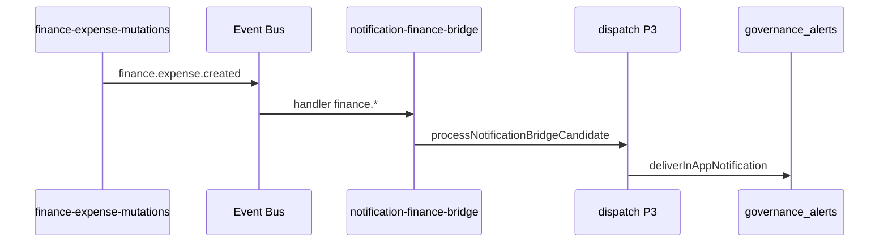

# REMPRES ERP — Phase P5
# Finance Notification Bridge — Rapport final

**Version bridge :** `finance-bridge-design-p5-v1`  
**Bootstrap :** `erp-event-handlers-bootstrap-p5-v1`  
**Date :** 2026-05-22  
**Mode :** Foundation First — **pas de nouveau delivery, pas de tryCreateAlert Finance**

---

## Synthèse exécutive

| Question | Verdict |
|----------|---------|
| Audit notification produit ? | **Oui** |
| Gouvernance notification Finance ? | **Oui** — 6 événements classifiés |
| Bridge design + implémentation ? | **Oui** — `notification-finance-bridge` |
| Candidate map ? | **Oui** |
| Bootstrap auto idempotent ? | **Oui** |
| Coexistence legacy ? | **Oui** — pas de tryCreateAlert Finance |
| Readiness | **READY** |
| P5 validé ? | **Oui** |

> **Finance rejoint CRM et Approval au niveau notification-governed.**  
> **Priorité immédiate : P6 — automation `finance.threshold.exceeded` + émission P4.2.**

---

## 0. Contexte ERP (POST-P4.1)

| Bloc | État |
|------|------|
| Event Bus B3.2 + exploitation | ✅ |
| Ponts CRM P2 + Approval P2.1 | ✅ |
| Delivery in_app P3 | ✅ → `governance_alerts` |
| Finance events P4/P4.1 | ✅ `finance.expense.*` actifs |
| Finance notification P5 | ✅ **ce livrable** |

### Règle

```
finance event → notification-finance-bridge → dispatch → delivery → governance_alerts
```

Pas de `tryCreateAlert` direct sur Finance.

---

## 1. Audit — état notification (Phase 1)

### 1.1 Architecture actuelle (pre-P5)

```
publishErpEvent
  → ensureErpEventHandlersBootstrapped()
  → dispatch
      → notification-crm-bridge (crm.*)
      → notification-approval-bridge (approval.*)
      → [GAP] finance.*
```

### 1.2 Patterns communs P2/P2.1/P3

| Étape | Composant |
|-------|-----------|
| Map | `map*EventToNotificationCandidate` |
| Trace | `recordNotificationBridgeProjection` + ring 200 |
| Dispatch | `processNotificationBridgeCandidate` |
| Delivery | `deliverInAppNotification` → `tryEmitGovernanceAlert` |
| SoT UI | `governance_alerts` |

### 1.3 Finance gaps (pre-P5)

| Gap | Impact |
|-----|--------|
| Aucun handler `finance.*` | Events P4.1 sans notification in_app |
| Pas de `TEMPLATE_TO_ALERT_TYPE` finance | Delivery impossible |
| Pas de definitions `finance_*` | Alerts génériques fallback |

### 1.4 Risques mitigés

| Risque | Mitigation P5 |
|--------|----------------|
| Second delivery layer | Réutilisation P3 inchangée |
| Notifications libres | Mapper gouverné uniquement |
| Collision CRM/approval | Pattern `finance.*` isolé, scope FINANCE |

---

## 2. Finance Notification Governance Map (Phase 2)

**Fichier :** `governance/finance-notification-governance-map.ts`

| Event | Status | Priority | Scope | Delivery |
|-------|--------|----------|-------|----------|
| `finance.expense.created` | bridgeable_active | normal | department | ✅ |
| `finance.expense.updated` | bridgeable_active | normal | department | ✅ |
| `finance.transaction.recorded` | bridgeable_catalog_only | normal | department | ✅ (quand émis) |
| `finance.transaction.failed` | bridgeable_catalog_only | high | super_admin | ✅ |
| `finance.threshold.exceeded` | bridgeable_catalog_only | high | super_admin | ✅ |
| `finance.payment.recorded` | bridgeable_catalog_only | high | department | ✅ |

**Interdit :** notifications hors catalogue / hors bridge.

---

## 3. Finance Bridge Design (Phase 3)

**Fichier :** `handlers/notification-finance-bridge.ts`

| Propriété | Valeur |
|-----------|--------|
| Pattern | `finance.*` |
| consumerKey | `notification-finance-bridge` |
| departmentScope | `FINANCE` |
| Mapper | `mapFinanceEventToNotificationCandidate` |
| Dispatch | `processNotificationBridgeCandidate` |
| Delivery | P3 `deliverInAppNotification` |
| Lifecycle | Bootstrap idempotent p5-v1 |

Alignement strict : `notification-crm-bridge.ts`, `notification-approval-bridge.ts`.

---

## 4. Finance Notification Candidate Map (Phase 4)

**Fichier :** `foundation/finance-notification-candidate-map.ts`

| Event | templateKey | Target | Priority |
|-------|-------------|--------|----------|
| expense.created | `finance.expense.created` | finance_manager / dept | normal |
| expense.updated | `finance.expense.updated` | finance_manager / dept | normal |
| threshold.exceeded | `finance.threshold.exceeded` | CFO / super_admin | high |
| transaction.failed | `finance.transaction.failed` | CFO / super_admin | high |
| transaction.recorded | `finance.transaction.recorded` | dept FINANCE | normal |
| payment.recorded | `finance.payment.recorded` | dept FINANCE | high |

Réutilise `ErpNotificationCandidate` — pas de type custom.

---

## 5. Bridge Integration Plan (Phase 5)

**Fichier :** `foundation/finance-bridge-integration-plan.ts`

| Step | Statut |
|------|--------|
| Handler + mapper | ✅ done |
| Bootstrap register | ✅ done |
| Alert types definitions | ✅ done |
| Tests P5 | ✅ done |

**Vérifications :**

- Idempotency : `hasHandler` avant register
- Runtime safety : mapper `null` → pas de delivery
- Pas de bootstrap manuel ailleurs

---

## 6. Legacy Coexistence (Phase 6)

**Fichier :** `foundation/finance-notification-legacy-coexistence.ts`

| Mécanisme | Statut Finance |
|-----------|----------------|
| `tryCreateAlert` direct | **aucun** |
| `tryLogAuditEvent` depenses | parallel (audit ≠ notification) |
| `assertApprovalOrThrow` | parallel |
| Bridge → governance_alerts | **SoT actif** |
| HR tryCreateAlert | hors scope |

---

## 7. Readiness Validation (Phase 7)

**Verdict : READY**

| Check | Pass |
|-------|------|
| N1 Routing finance.* | ✅ |
| N2 Ownership FINANCE | ✅ |
| N3 Collisions template | ✅ |
| N4 Security restricted | ✅ |
| N5 Delivery P3 | ✅ |
| N6 governance_alerts types | ✅ |
| N7 Bootstrap idempotent | ✅ |

---

## 8. Flux post-P5 (dépense créée)



---

## 9. Fichiers livrés

| Artefact | Chemin |
|----------|--------|
| Bridge | `lib/erp-core/events/handlers/notification-finance-bridge.ts` |
| Bootstrap | `lib/erp-core/events/bootstrap/register-default-handlers.ts` |
| Delivery mapping | `lib/erp-core/events/delivery/in-app-notification-service.ts` |
| Alert definitions | `lib/governance/alerts/definitions.ts` |
| Governance map | `governance/finance-notification-governance-map.ts` |
| Design map | `governance/finance-bridge-design-map.ts` |
| Candidate map | `foundation/finance-notification-candidate-map.ts` |
| Integration plan | `foundation/finance-bridge-integration-plan.ts` |
| Legacy | `foundation/finance-notification-legacy-coexistence.ts` |
| Readiness | `foundation/finance-notification-readiness-validation.ts` |
| Tests | `tests/unit/p5-finance-notification-bridge.test.ts` |

---

## 10. Dette & prochaines priorités

| Priorité | Phase | Action |
|----------|-------|--------|
| P0 | P6 | Automation seuil + `emitFinanceThresholdExceeded` |
| P1 | P4.2 | Journal / payment → notifications actives |
| P2 | P7 | RH event foundation |
| P3 | P8 | Observability / UI bus |

---

## 11. Validation critères P5

| Critère | Statut |
|---------|--------|
| Audit produit | ✅ |
| Gouvernance notification | ✅ |
| Bridge design + code | ✅ |
| Candidates définis | ✅ |
| Bootstrap roadmap | ✅ |
| Coexistence | ✅ |
| Readiness | ✅ |
| Rapport final | ✅ |
| Sans rebuild / chaos | ✅ |

---

**P5 validé — Finance est notification-governed au même niveau que CRM et Approval.**
