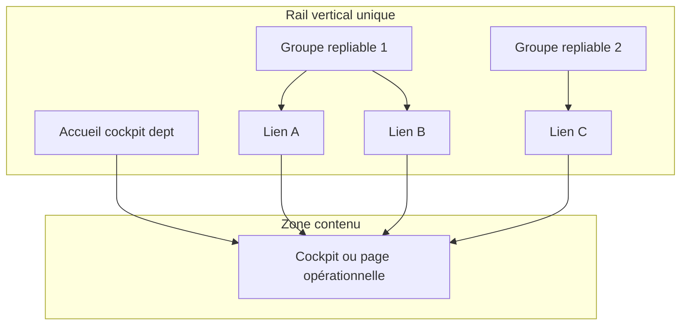

# REMPRES ERP — Micro phase M3
# Sidebar & Cockpit Architecture

**Produit :** RemPres ERP  
**Date :** 2026-05-22  
**Mode :** architecture UX gouvernée — **pas de build métier, pas de CRUD, pas de workflow**  
**Prérequis :** M1 · M1.5 · M2 · M2.5 · Super Admin 1.6  
**Contrat machine :** `lib/navigation/erp-ux-architecture.ts`  
**Statut honnête :** architecture **verrouillée** ; implémentation métier **largement en retard** sur cette cible

---

## Synthèse exécutive

La phase M3 définit **ce qu’est** une sidebar ERP, **ce qu’est** un cockpit, et **comment** chaque département + Super Admin doivent se comporter en UX — sans coder les métiers.

**Décisions M3 verrouillées :**

| Sujet | Décision officielle |
|-------|---------------------|
| **Sidebar métier** | Rail **vertical unique**, **collapsible**, groupes **expand/collapse** (modèle `CollapsibleNavGroup` super_admin) |
| **Sidebar secondaire** | **Interdite** pour les départements métiers — migration obligatoire avant build |
| **Super Admin** | Sidebar gouvernance **terminée** — ne pas modifier le modèle |
| **Cockpit** | KPI + graphiques + alertes + activité + actions utiles — **≠** welcome / help / onboarding |
| **Homepage manager** | **Cockpit département** (`/vente/dashboard`, `/rh`, …) — **≠** `/dashboard` global hybride |
| **Homepage super_admin** | Cockpit **global** `/dashboard` — **déjà conforme** |
| **CRM** | Groupe repliable sous **Vente** (pas rail top-level séparé à terme) |
| **Formation** | Groupe unique incluant Consultation |

---

## 1. UX actuelle (audit phase 1)

### 1.1 Cartographie des expériences

| Zone | Composant / route | Nature UX actuelle | Conformité M3 |
|------|-------------------|-------------------|---------------|
| Super Admin accueil | `SuperAdminCockpitClient` `/dashboard` | Cockpit exécutif global | **Conforme** |
| Manager accueil | `DashboardClient` `/dashboard` | Cockpit **hybride** orienté vente/clients | **Non conforme** |
| Dept dashboards | `DepartmentDashboardPage` → `GovernanceHomeCenter` | **Help center** textuel | **Legacy — à remplacer** |
| RH pilotage | `/rh` | Cockpit partiel (KPI RH réels) | **Partiel** |
| Vente opérationnel | `/vente/*` | Métier riche | Hors M3 |
| Supervision SA | `/dept/*` | Lecture KPI dept | OK (supervision, pas homepage métier) |
| Executive | `/dashboard/executive` | Dashboard global alternatif | Risque duplication |
| Visual analytics | `*/visual` | Couche analytique | Sous-ensemble « charts » cockpit |

### 1.2 Shell & navigation (M2.5 rappel)

- Visibilité rail alignée `department_key` (`shell-visibility.ts`).
- **Problème structurel restant :** `PrimarySidebar` (icônes modules) + **`SecondarySidebarPanel`** (248px, sections COMMERCE/CRM/RH…) = **double navigation**.

### 1.3 Widgets & KPI actuels

| Source | Widgets |
|--------|---------|
| `DashboardClient` | Clients, ventes jour/mois, stock, graphique ventes, timeline activité globale, raccourcis modules |
| `SuperAdminCockpitClient` | KPI multi-domaines, alertes gouvernance, mix départements, supervision cards |
| `GovernanceHomeCenter` | Welcome, mission, règles, bonnes pratiques — **décoratif / pédagogique** |
| `/rh` | Effectifs, contrats, présences — **cockpit métier embryonnaire** |

### 1.4 Duplications détectées

- **3 types d’« accueil »** : `/dashboard`, `/[dept]/dashboard`, pages racine `/rh`.
- **Commerce + CRM** : deux modules rail + deux sections secondaires.
- **Cockpit global** vs **executive** vs **dept** — chevauchement informationnel.

---

## 2. Sidebar actuelle

### 2.1 Super Admin (référence officielle M3)

| Attribut | Implémentation |
|----------|----------------|
| Composant | `SuperAdminPrimarySidebar` + `CollapsibleNavGroup` |
| Structure | Accueil → groupes Actions / Archives / Paramètres repliables |
| Secondaire | **Aucune** |
| Collapse | Rail + groupes `localStorage` |
| Mobile | `SuperAdminMobileNav` même hiérarchie |

**Verdict :** **modèle cible** pour tout l’ERP.

### 2.2 Utilisateurs métier (écart M3)

| Attribut | Implémentation actuelle |
|----------|-------------------------|
| Rail primaire | `PrimarySidebar` — **1 icône = 1 module** (commerce, crm, finance, …) |
| Navigation interne | **`SecondarySidebarPanel`** — liste liens par section |
| Mobile | Drawer avec sections **déjà inline** (plus proche M3) |
| Profondeur | 3 niveaux ressentis : rail → secondaire → page |

**Verdict :** **non conforme** M3 — sidebar secondaire explicite.

### 2.3 Composants réutilisables existants

| Composant | Usage futur M3 |
|-----------|----------------|
| `CollapsibleNavGroup` | **Oui** — généraliser au rail métier |
| `GovernanceSidebarSection` | Contenu des groupes repliables (liens) |
| `SecondarySidebarPanel` | **Déprécier** pour métier |
| `GovernanceChrome` | Bandeaux horizontaux Actions/Archives/Settings uniquement |

---

## 3. Cockpit actuel

### 3.1 Super Admin — cockpit global (référence)

Structure `SuperAdminCockpitClient` (ordre validé phase 1.2) :

1. Header exécutif (état plateforme, priorités)  
2. KPI globaux (revenus, ventes, dépenses, marge, RH, formation N/D, marketing N/D, stock, validations)  
3. Graphiques (7j, tendance, mix départements)  
4. Alertes rapides → `/admin/alerts`  
5. Activité récente (`ActivityTimeline`)  
6. Supervision départements → `/dept/...`  
7. Actions rapides gouvernance  

**≠ help center** — **conforme M3**.

### 3.2 Managers métier — état actuel

| Route | Rendu | Conformité cockpit M3 |
|-------|-------|----------------------|
| `/dashboard` | `DashboardClient` KPI vente-centric | **Non** — mélange global |
| `/*/dashboard` (sauf RH) | `GovernanceHomeCenter` | **Non** — onboarding |
| `/rh` | KPI + liens hub | **Partiel** |

### 3.3 Définition officielle cockpit M3

Un **cockpit ERP** est une page de **pilotage opérationnel** qui répond en &lt; 10 secondes à :

- Où en est mon département ?  
- Qu’est-ce qui demande attention ?  
- Quelle action immédiate ?

**Inclus :** KPI actionnables, alertes, tendances, activité récente **du périmètre**, raccourcis **du département**.  

**Exclus :** texte de mission, règles de gouvernance génériques, tutoriels, documentation, cartes « bienvenue » vides.

---

## 4. Legacy dashboards

| Legacy | Fichiers / routes | Action build futur |
|--------|-------------------|-------------------|
| Help center dept | `GovernanceHomeCenter`, `DepartmentDashboardPage` | **Remplacer** par cockpit dept |
| Dashboard global managers | `DashboardClient` sur `/dashboard` | **Rediriger** vers `cockpitRoute` dept |
| Rail commerce + crm séparés | `app-shell` 2 `ModuleId` | **Fusionner** en groupes Vente |
| Secondary sidebar | `SecondarySidebarPanel` | **Retirer** du layout métier |
| Executive duplicate | `/dashboard/executive` | Clarifier vs cockpit SA ou réservé ADMINISTRATION |
| `DirectionPage` | `/direction` | Lien gouvernance, pas cockpit métier |

---

## 5. Architecture sidebar officielle (phase 2)

### 5.1 Principes non négociables

1. **Un seul rail vertical** à gauche (couleur primaire ou variante dept).  
2. **Collapsible** : rail étroit ↔ large ; groupes repliables.  
3. **Filtré** : `shellRail` + `department_key` (M2.5).  
4. **Profondeur max 2** : Groupe → liens (pas de 3e colonne).  
5. **Pattern interaction :** clic en-tête groupe → expand → liens dessous → contenu à droite.  
6. **Pas de `SecondarySidebarPanel`** pour métier.

### 5.2 Structure par rôle

| Rôle | Sidebar |
|------|---------|
| **SUPER_ADMIN** | Accueil + Actions + Archives + Paramètres (groupes) — **figé** |
| **MANAGER_* / AGENT_*** | Accueil (cockpit dept) + **N groupes** = sous-domaines du département |

### 5.3 Structure par département (cible)

Détail dans `OFFICIAL_DEPARTMENT_SIDEBAR_ARCHITECTURE` :

| Département | Groupes repliables |
|-------------|-------------------|
| **VENTE** | Commerce · CRM |
| **FINANCE** | Finance |
| **RH** | Ressources humaines |
| **FORMATION** | Formation & Consultation |
| **MARKETING** | Marketing |
| **LOGISTIQUE** | Logistique |

### 5.4 Migration technique (hors M3 — pour build)

1. Créer `DepartmentPrimarySidebar` sur base `CollapsibleNavGroup`.  
2. Alimenter depuis `OFFICIAL_DEPARTMENT_SIDEBAR_ARCHITECTURE` + permissions item-level.  
3. Retirer `SecondarySidebarPanel` du layout si `!isSuperAdmin`.  
4. Étendre `useActiveNav` pour segment = groupe + lien actif.  
5. Mobile : conserver pattern drawer inline (déjà aligné).

---

## 6. Architecture cockpit officielle (phase 3)

### 6.1 Template zones (`COCKPIT_ZONE_ORDER`)

| Zone | Contenu | Super Admin | Dept |
|------|---------|-------------|------|
| `context_header` | Salutation, date, état, période | Oui | Oui |
| `kpi_primary` | 4–8 cartes max | Multi-domaine | **Dept only** |
| `alerts` | Liste priorisée + lien file | Gouvernance | Dept |
| `charts` | 1–3 visualisations | Global / mix | Dept |
| `recent_activity` | Timeline filtrée | Global | Dept |
| `quick_actions` | 3–6 liens | Gouvernance | Opérations dept |

### 6.2 Cockpit par département (KPI cibles — à implémenter au build)

| Dept | KPI primaires (exemples) | Interdits |
|------|--------------------------|-----------|
| **VENTE** | CA jour/mois, commandes, clients actifs, pipeline ouvert, stock critique lié vente | Dépenses globales, effectifs RH |
| **FINANCE** | Trésorerie, dépenses mois, marge, créances | Volume ventes détaillé, campagnes marketing |
| **RH** | Effectifs, contrats actifs, présences, recrutement ouvert | CA, stock |
| **FORMATION** | Sessions actives, inscriptions, missions consultation ouvertes | KPI vente |
| **MARKETING** | Campagnes actives, leads, conversion amont | Clôture ventes, paie |
| **LOGISTIQUE** | Stock, ruptures, mouvements, achats en cours | CA, CRM |
| **SUPER_ADMIN** | KPI plateforme (déjà implémentés) | **Toute mutation métier** |

### 6.3 Densité & hiérarchie

- **Above the fold :** header + KPI primaires + alertes critiques.  
- **Scroll :** graphiques + activité + actions.  
- **Pas plus de 2 lignes KPI** sans scroll sur laptop.  
- Composants factorisés : `CockpitMetricCard`, `StatsCard`, `ActivityTimeline` — réutilisation autorisée.

---

## 7. Homepage governance (phase 4)

### 7.1 Règle de routage officielle

| Profil | Route « Accueil » | Composant |
|--------|-------------------|-----------|
| **SUPER_ADMIN** | `/dashboard` | `SuperAdminCockpitClient` |
| **MANAGER_VENTE / AGENT_VENTE** | `/vente/dashboard` (cockpit) — **pas** `/dashboard` | Cockpit Vente (à build) |
| **MANAGER_FINANCE** | `/finance/dashboard` | Cockpit Finance |
| **MANAGER_RH** | `/rh` ou `/rh/dashboard` | Cockpit RH (unifier) |
| **MANAGER_FORMATION** | `/formation/dashboard` | Cockpit Formation |
| **MANAGER_MARKETING** | `/marketing/dashboard` | Cockpit Marketing |
| **MANAGER_LOGISTIQUE** | `/logistique/dashboard` | Cockpit Logistique |
| **MANAGER_ADMINISTRATION** | `/actions` ou `/dept` | Gouvernance partielle — **pas** cockpit vente |

### 7.2 Interdictions homepage

- **Pas** de copie du cockpit super_admin pour les managers.  
- **Pas** de `GovernanceHomeCenter` comme landing dept.  
- **Pas** de grille `/dept` pour les managers (réservée SA / admin console).  
- Lien rail **Accueil** → `cockpitRoute` du département utilisateur (pas toujours `/dashboard`).

### 7.3 Message utile (header dept)

Exemple MANAGER_VENTE : *« Pilotage commercial — [date] — [alertes N] »* — pas *« Bienvenue dans RemPres »* générique.

---

## 8. KPI governance (phase 5)

### 8.1 Règles globales

1. **Un KPI = une décision possible** (sinon retirer).  
2. **Source de données documentée** par carte (comme rapport SA 1.2).  
3. **N/D affiché honnêtement** si domaine non câblé — pas de `0` trompeur.  
4. **Pas de KPI autre département** sur cockpit dept.  
5. **Maximum 8 KPI primaires** par cockpit.  
6. **Alertes** : priorité severity + lien module de résolution.

### 8.2 Widgets interdits (`FORBIDDEN_DEPT_COCKPIT_PATTERNS`)

- `welcome_onboarding_cards`  
- `governance_rules_text_blocks`  
- `global_executive_kpi_strip` (managers)  
- `other_department_supervision_cards`  
- `help_center_layout`  

### 8.3 Ownership KPI

| KPI | Owner dept |
|-----|------------|
| CA, clients, pipeline | VENTE |
| Trésorerie, dépenses | FINANCE |
| Effectifs, absences | RH |
| Sessions, missions conseil | FORMATION |
| Campagnes, leads | MARKETING |
| Stock, ruptures | LOGISTIQUE |
| Validations plateforme, alertes système | SUPER_ADMIN |

---

## 9. Navigation interne (phase 6)

### 9.1 Modèle officiel

| Mécanisme | Usage |
|-----------|--------|
| **Rail groupe actif** | Surbrillance en-tête + lien actif dans groupe |
| **Header app** | Libellé contexte (`navContextLabel` / `SuperAdminNavContextLabel`) |
| **PageHeader** | Titre page + sous-titre + actions page |
| **Bandeau module** | `GovernanceChrome` **uniquement** Actions / Archives / Settings |
| **Breadcrumbs** | Optionnels — max 3 niveaux ; pas obligatoires sur chaque page M3 |
| **Raccourcis cockpit** | Liens directs vers opérations fréquentes — dept only |

### 9.2 Interdictions

- Navigation profonde &gt; 3 clics pour tâches quotidiennes.  
- Changement de module sans feedback header.  
- Liens cross-dept dans cockpit (M2).  
- Deux systèmes parallèles (rail + secondaire).

### 9.3 Module switching

- Changer de groupe = expand autre groupe, contenu central swap.  
- Pas de full page reload si possible (App Router layout stable — déjà OK).

---

## 10. Responsive governance (phase 8)

| Breakpoint | Sidebar | Cockpit |
|------------|---------|---------|
| Desktop | Rail 268px / 76px replié ; groupes expand | Grille KPI 4 col → 2 |
| Laptop | Idem | KPI 2–3 col |
| Tablet | Drawer overlay ; groupes inline | KPI 2 col |
| Mobile | Drawer full ; liens 44px min height | KPI 1 col ; graphiques stack |

**Composants à préserver :** `CollapsibleNavGroup` chevron, `PanelLeftClose`, drawer backdrop, `min-h-[44px]`.

**M3 n’ajoute pas** de breakpoint — documente les contraintes pour le build.

---

## 11. Cross-department review (phase 7)

| Risque M2 | État post-M2.5 | Cible M3 |
|-----------|----------------|----------|
| Raccourcis homepage cross-dept | Filtrés `shellRail` | Cockpit dept supprime le besoin |
| KPI vente sur `/dashboard` manager | **Encore présent** | Redirection + cockpit dept |
| Tuiles dept sur dashboard manager | Partielles | Retirer |
| Super Admin copie cockpit RH | Non — modèle distinct | Maintenir |
| Manager voit Actions via ancien `isAdminRole` | Corrigé M2.5 partiel | Sidebar seule |

---

## 12. Scalability review (phase 9)

| Mécanisme | Scalabilité 30+ dept |
|-----------|---------------------|
| `OFFICIAL_DEPARTMENT_SIDEBAR_ARCHITECTURE` | Étendre entrée + groupes |
| `CollapsibleNavGroup` | Oui — N groupes par dept |
| Cockpit template zones | Oui — même squelette |
| `DepartmentNavigationSpec` existant | Oui — `dashboardRoute`, `routePrefixes` |
| Secondary sidebar | **Non** — ne pas scaler |
| Hardcoded `app-shell` modules[] | **Non** — remplacer par registry |

**Recommandation :** générateur sidebar/cockpit depuis `departments` table + config JSON/TS par dept.

---

## 13. Incohérences trouvées (liste complète)

| # | Incohérence |
|---|-------------|
| I1 | Sidebar secondaire métier vs M3 « un seul rail expand » |
| I2 | Super Admin conforme, métier non |
| I3 | `DepartmentDashboardPage` = help center, pas cockpit |
| I4 | `/dashboard` manager ≠ cockpit dept |
| I5 | Commerce + CRM = 2 modules rail (M1.5 pas encore fusionné UX) |
| I6 | RH a vrai cockpit sur `/rh` mais dashboard route = help center |
| I7 | Mobile plus aligné M3 que desktop |
| I8 | Executive dashboard parallèle |
| I9 | Visual pages hors template cockpit non documenté |
| I10 | Header Accueil pointe `/dashboard` pour tous |

---

## 14. Problèmes détectés

1. **Double navigation** desktop (Primary + Secondary).  
2. **Triple modèle homepage** (Client / GovernanceHome / RH).  
3. **Cockpit hybride** vente sur accueil global.  
4. **Widgets pédagogiques** occupent routes dashboard dept.  
5. **Pas de cockpit** formation/marketing/logistique/finance réels.  
6. **KPI globaux** sur pages non-SA.  
7. **Context loss** entre rail icône et secondaire.  
8. **Architecture non scalable** tant que `modules[]` en dur.

---

## 15. Dette UX future (build métier)

| Priorité | Item |
|----------|------|
| P0 | `DepartmentPrimarySidebar` + suppression secondaire |
| P0 | Remplacer `GovernanceHomeCenter` par cockpits dept |
| P0 | Redirection post-login → `cockpitRoute` dept |
| P1 | Fusion rail Vente (groupes Commerce + CRM) |
| P1 | Unifier RH `/rh` et `/rh/dashboard` |
| P2 | Template `DepartmentCockpitLayout` partagé |
| P2 | Tests visuels + E2E navigation 2 niveaux |
| P3 | Breadcrumbs standardisés |

---

## 16. Risques restants

| Risque | Mitigation M3 |
|--------|---------------|
| Build ignore M3 et garde secondaire | Revue PR vs `erp-ux-architecture.ts` |
| Cockpit dept trop vide | Minimum KPI + 3 quick actions |
| Sur-information SA | Déjà géré |
| Régression SA sidebar | Interdire modification SA |
| Performance N groupes | Virtualiser si &gt; 15 liens |

---

## 17. Confirmation officielle M3

| Critère | Architecture M3 | Code actuel |
|---------|-------------------|-------------|
| **Gouvernée** | Oui | Partiel (SA oui) |
| **Cohérente** | Oui (spec) | Non (desktop métier) |
| **Non hybride** | Oui (cible) | Non |
| **Non dupliquée** | Oui (cible) | Non (dashboards) |
| **Scalable** | Oui | Avec registry |
| **Enterprise-grade** | Oui (référence) | Après build P0 |

### Formulation de verrouillage

> **Tout build sidebar, cockpit, homepage, widgets et navigation interne** doit respecter :  
> 1) **un rail collapsible à groupes** (pas de sidebar secondaire métier) ;  
> 2) **cockpit = KPI + alertes + activité + actions**, pas help center ;  
> 3) **homepage dept = cockpit dept**, homepage globale = super_admin uniquement ;  
> 4) **KPI ownership** par département ;  
> 5) **Super Admin inchangé** comme référence.

**M3 définit. M3 n’implémente pas les métiers.**

---

## Annexe A — Schéma navigation cible (Mermaid)

---

## Annexe B — Documents liés

- `docs/ERP_DEPARTMENTS_FOUNDATION_M1_REPORT.md`  
- `docs/ERP_DEPARTMENTS_CANONICAL_DECISIONS_M1_5_REPORT.md`  
- `docs/ERP_ROLES_ACCESS_MATRIX_M2_REPORT.md`  
- `docs/ERP_NAVIGATION_VISIBILITY_ALIGNMENT_M2_5_REPORT.md`  
- `docs/SUPER_ADMIN_HOMEPAGE_COCKPIT_FINAL_REPORT.md`  
- `lib/navigation/erp-ux-architecture.ts`

---

*Micro phase M3 — architecture sidebar & cockpit. Prochaine étape : build départements (P0 dette UX).*
