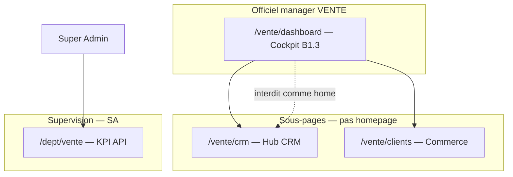

# REMPRES ERP — Phase B1.3
# Vente Cockpit Architecture — Sales Cockpit Governance

**Produit :** RemPres ERP  
**Date :** 2026-05-22  
**Mode :** architecture cockpit — **aucun code, CRUD, workflow, SQL, analytics final**  
**Prérequis verrouillés :** M1 · M1.5 · M2 · M2.5 · M3 · M3.75 · **B1.1** · **B1.2**  
**Compléments :** `docs/ERP_VENTE_DOMAIN_ARCHITECTURE_B1_1_REPORT.md` · `docs/ERP_VENTE_SIDEBAR_NAVIGATION_B1_2_REPORT.md` · `lib/navigation/erp-ux-architecture.ts`

---

## Synthèse exécutive

| Verdict | Formulation |
|---------|-------------|
| **Route cockpit officielle** | **`/vente/dashboard`** — seule homepage manager/agent VENTE (B1.2) |
| **État actuel** | **Structure M3** (`DepartmentCockpitPlaceholder`) — **pas** de données métier branchées |
| **Mission** | Pilotage commercial décisionnel — **≠** help center, **≠** marketing |
| **Zones** | `COCKPIT_ZONE_ORDER` M3 (6 zones ordonnées) |
| **Dette majeure** | **3 surfaces KPI** parallèles : placeholder, `/dept/vente`, `/vente/crm` hub |

**B1.3 verrouille** KPI, widgets, alertes, activité, quick actions et hiérarchie **avant** data model et workflows Vente.

---

## 1. Cockpit Vente actuel (audit phase 1)

### 1.1 Surfaces observées

| Surface | Route | Composant | Données | Rôle B1.3 |
|---------|-------|-----------|---------|-----------|
| **Cockpit officiel (entry)** | `/vente/dashboard` | `DepartmentDashboardPage` → `DepartmentCockpitPlaceholder` | Placeholder `—` | **Cible unique build** |
| **CRM hub opérationnel** | `/vente/crm` | `VenteCrmHubPage` + `getCrmOperationalOverview` | **Réelles** (leads, pipeline, devis…) | **Sous-page CRM** — pas homepage |
| **Supervision dept** | `/dept/vente` | `DeptDashboardPage` + API `/api/dept/vente/kpis` | **Réelles** (clients, ventes, stock) | **Supervision SA / admin** — pas manager home |
| **Homepage hybride legacy** | `/dashboard` | `DashboardClient` + `getDashboardKpis` | Réelles vente+global | **Redirect** métiers VENTE (M3.5) |
| **Help center** | — | `GovernanceHomeCenter` | Texte gouvernance | **Retiré** du flux Vente (M3.5) |
| **Visual analytics** | `/vente/crm/visual` | Couche `department-dashboards/crm/visual` | Snapshot | **Hors cockpit P0** — lien secondaire |

### 1.2 État `/vente/dashboard` (cockpit entry B1.2)

```
PageHeader — "Cockpit Vente"
├── Zone context_header — salutation + mention zones M3
├── Zone kpi_primary — 4 cartes "Indicateur N" (—)
├── Zone alerts — état vide placeholder
├── Zone charts — skeleton placeholder
├── Zone recent_activity — vide
└── Zone quick_actions — hrefs bruts (3 premiers liens Commerce archi)
```

**Conformité structurelle M3 :** **Oui** (zones présentes, ordre respecté).  
**Conformité métier B1.3 :** **Non** — aucun KPI actionnable branché.

### 1.3 `getDashboardKpis` — source legacy partagée

| Champ | Pertinence Vente cockpit | Note |
|-------|-------------------------|------|
| `clientsTotal` | **Oui** — critique | Commerce |
| `salesToday`, `netSaleAmountToday` | **Oui** — critique | Commerce |
| `salesAmountMonth`, `netSaleAmountMonth` | **Oui** — critique | Commerce |
| `productsLowStock`, `productsOutOfStock` | **Utile** — alerte | Lien logistique — alerte Vente only |
| `salesLast7Days` | **Oui** — chart zone | Commerce |
| `recentActivity` | **Partiel** — filtre global logs | Doit être **feed commercial** dédié, pas audit SA |
| `deletesClientsLast24h` | Secondaire | Gouvernance |

**Usage actuel :** `SuperAdminCockpitClient` + ancien `DashboardClient` — **ne doit pas** devenir le cockpit Vente tel quel (contient grille tous départements, liens gouvernance).

### 1.4 `/vente/crm` — hub CRM (concurrence cockpit)

| Élément | Contenu |
|---------|---------|
| KPI | Leads actifs, opportunités, devis ouverts, activités, pipeline pondéré GNF |
| Widgets | Grille « Accès rapide » = `CRM_NAV` (doublon sidebar B1.2) |
| Liens | Vers `/vente/dashboard` (« Pilotage département »), visual, finance, logistique |

**Verdict :** page **utile** comme **sous-espace CRM**, **interdite** comme **homepage Vente** ou **substitut cockpit**.

### 1.5 `/api/dept/vente/kpis` — supervision

Stats : `clients`, `products`, `salesToday`, `salesThisMonth` + chart 7j + activity logs modules commerce.

**Manque :** pipeline CRM, leads, devis — **incomplet** pour cockpit Vente unifié.  
**Usage B1.3 :** réutiliser **partiellement** stats Commerce ; **enrichir** CRM au build — pas remplacer le cockpit.

---

## 2. Legacy cockpit

| Legacy | Statut | Impact |
|--------|--------|--------|
| `GovernanceHomeCenter` sur `*/dashboard` dept | Supprimé Vente | Fichier existe — ne pas réutiliser |
| `DashboardClient` gradient welcome + tous `DeptCard` | Hors `/dashboard` métiers | Modèle **interdit** managers |
| `DepartmentDashboardPage` → help center | Remplacé placeholder M3.5 | OK |
| CRM hub comme « pilotage » | Lien inverse vers `/vente/dashboard` | Hiérarchie à clarifier : **dashboard = root** |
| `constants/departments.ts` route `vente` → `/dept/vente` | Supervision | **Ne pas** confondre avec cockpit manager |
| Quick actions placeholder affichent **URL** | UX faible | Libellés B1.3 au build |
| `recentActivity` = `activity_logs` global | Mélange audit/commerce | Filtrer par domaine Vente |

---

## 3. Mission officielle cockpit Vente

### 3.1 Définition normative (B1.3)

> **Le cockpit Vente** est la **vue de pilotage unique** du responsable commercial : il synthétise en un écran l’**état du revenu**, du **pipe**, des **alertes à traiter** et des **actions immédiates**, pour décider **où agir aujourd’hui** dans le périmètre Vente.

### 3.2 Le cockpit est

| Fonction | Description |
|----------|-------------|
| **Pilotage** | KPI commerce + CRM consolidés |
| **Décision** | Alertes priorisées avec lien de résolution |
| **Monitoring** | Tendances 7j / mois, pipeline pondéré |
| **Action rapide** | 3–6 raccourcis vers opérations critiques |
| **Intelligence commerciale** | Synthèse lisible — pas BI exhaustive |

### 3.3 Le cockpit n’est pas

| Interdit | Raison |
|----------|--------|
| Page de bienvenue / onboarding | `FORBIDDEN_DEPT_COCKPIT_PATTERNS` |
| Help center / règles gouvernance | M3 |
| Page marketing produit | Hors ERP opérationnel |
| Documentation process | Formation, pas cockpit |
| Dashboard super_admin | `/dashboard` réservé SA |
| Grille supervision tous départements | `/dept` — SA |
| Hub CRM autonome | `/vente/crm` = sous-espace |

### 3.4 Phrase mission (une ligne)

**« Où en est mon commerce aujourd’hui, qu’est-ce qui bloque le pipe, et quelle action je lance maintenant ? »**

---

## 4. KPI officiels Vente

### 4.1 Légende priorité

| Niveau | Signification |
|--------|---------------|
| **P0 — Critique** | Toujours visible above-the-fold (max 4–6 cartes) |
| **P1 — Utile** | Visible scroll 1 ou rotation |
| **P2 — Secondaire** | Drill-down / détail module |
| **I — Interdit** | Autre département ou décoratif |

### 4.2 Matrice KPI

| ID KPI | Libellé FR | Zone source | Priorité | Source données (build) |
|--------|------------|-------------|----------|------------------------|
| `net_revenue_today` | CA net du jour | Commerce | **P0** | `sales` net GNF |
| `net_revenue_month` | CA net du mois | Commerce | **P0** | `sales` agrégé |
| `sales_count_today` | Ventes du jour (nb) | Commerce | **P0** | `sales` count |
| `pipeline_weighted` | Pipeline pondéré | CRM | **P0** | `v_crm_pipeline_weighted` |
| `open_opportunities` | Opportunités ouvertes | CRM | **P0** | `crm_opportunities` |
| `active_leads` | Leads actifs | CRM | **P1** | `crm_leads` |
| `open_quotes` | Devis en cours | CRM | **P1** | `crm_quotes` |
| `clients_active` | Clients actifs | Commerce | **P1** | `clients` |
| `conversion_lead_to_opp` | Taux conversion leads | CRM | **P2** | CRM analytics |
| `quotes_expiring_7d` | Devis expirent <7j | CRM | **P1** (alerte) | `crm_quotes` |
| `stock_critical_sale` | Produits bloquant vente | Commerce/alerte | **P1** | `products` stock |
| `open_activities` | Activités CRM à faire | CRM | **P1** | `crm_activities` |
| `team_quota_attainment` | Objectif équipe % | Vente | **P2** | futur quotas |
| `forecast_month` | Prévision mois | CRM | **P2** | forecasting module |
| `gross_revenue_month` | CA brut (sans annul.) | Commerce | **P2** | détail |
| `deletes_clients_24h` | Suppressions clients 24h | Gouvernance | **P2** | logs |

### 4.3 KPI interdits sur cockpit Vente

| KPI interdit | Owner |
|--------------|-------|
| Trésorerie, dépenses, marge comptable | Finance |
| Effectifs, absences, masse salariale | RH |
| Campagnes, impressions, CAC | Marketing |
| Stock entrepôt global, mouvements logistiques | Logistique |
| Validations plateforme, tenants, SLA | Super Admin |
| KPI **autres** départements (cartes `/dept`) | Supervision |

### 4.4 Règles gouvernance KPI (M3 + B1.3)

1. **Max 8 cartes** zone `kpi_primary` (4 P0 commerce + 4 P0/P1 CRM recommandé).  
2. **N/D honnête** si CRM non câblé — pas `0` trompeur.  
3. **Un KPI = une action** (lien vers module résolution).  
4. **Source documentée** par carte (tooltip ou sous-titre).  
5. **Pas de duplication** même métrique Commerce vs CRM hub vs dept API.

---

## 5. Widgets officiels Vente

| Widget ID | Type | Zone M3 | Statut | Contenu |
|-----------|------|---------|--------|---------|
| `header_context` | Bandeau contexte | `context_header` | **Obligatoire** | Salutation, date, dept, nb alertes P0 |
| `kpi_card_grid` | Cartes métriques | `kpi_primary` | **Obligatoire** | `CockpitMetricCard` / `StatsCard` |
| `alert_list` | Liste priorisée | `alerts` | **Obligatoire** | Severity + message + CTA |
| `sales_trend_7d` | Ligne/bar chart | `charts` | **Obligatoire** | CA 7 jours (`SalesChart` réutilisable) |
| `pipeline_snapshot` | Bar/funnel mini | `charts` | **Utile** | Stades pipeline — 1 viz max avec trend |
| `commercial_activity_feed` | Timeline | `recent_activity` | **Obligatoire** | Events commerce+CRM — **≠ audit global** |
| `quick_action_grid` | Boutons CTA | `quick_actions` | **Obligatoire** | Max **6** actions libellées |
| `crm_hub_grid` | Grille liens CRM_NAV | — | **Interdit** | Doublon sidebar (B1.2 D-N1) |
| `dept_supervision_grid` | Tous dept cards | — | **Interdit** | `FORBIDDEN_DEPT_COCKPIT_PATTERNS` |
| `welcome_gradient_hero` | Marketing hero | — | **Interdit** | DashboardClient pattern |
| `governance_rules_block` | Texte règles | — | **Interdit** | Help center |
| `executive_global_strip` | KPI multi-dept | — | **Interdit** | SA only |
| `ai_insights_panel` | IA décoratif | — | **P2 futur** | Hors P0 — pas gadget vide |

---

## 6. Alertes & priorités officielles

### 6.1 Sévérités

| Niveau | Usage |
|--------|-------|
| **critical** | Perte revenu imminente, devis majeur expiré, rupture vente |
| **warning** | Lead sans suivi > N jours, opportunité stagnante |
| **info** | Rappel objectif, activité planifiée |

### 6.2 Catalogue alertes Vente

| ID alerte | Condition (logique métier) | Sévérité | CTA résolution |
|-----------|---------------------------|----------|----------------|
| `quote_expiring` | Devis envoyé expire < 7j | critical/warning | `/vente/crm/quotes` |
| `opportunity_stale` | Opp. sans maj > 14j | warning | `/vente/crm/opportunities` |
| `lead_unassigned` | Lead nouveau non assigné | warning | `/vente/crm/leads` |
| `lead_no_followup` | Lead qualifié sans activité | warning | `/vente/crm/activities` |
| `stock_blocks_sale` | Produit rupture + ventes récentes | critical | `/vente/produits` |
| `monthly_target_miss` | CA < objectif prorata | warning | cockpit / reporting |
| `cancellation_spike` | Annulations > seuil jour | warning | `/vente/historique` |
| `activity_overdue` | Activité CRM dépassée | info | `/vente/crm/activities` |

### 6.3 Règles alertes

- **Max 5–8** alertes affichées — tri par sévérité.  
- **Pas de spam** : regrouper par type.  
- Chaque alerte = **lien module** (actionnable).  
- **Pas** d’alertes Finance/RH/Logistique sur cockpit Vente (lien contextuel optionnel en info seulement).

---

## 7. Activité récente — architecture

### 7.1 Définition

Feed **commercial** des **deriers événements métier** Vente — pour contexte humain, pas conformité audit.

### 7.2 Événements inclus

| Type | Exemple libellé | Source |
|------|-----------------|--------|
| Client créé | « Client X créé » | `clients` |
| Vente enregistrée | « Vente #123 — montant » | `sales` / `vente` |
| Lead créé / qualifié | « Lead Y qualifié » | `crm_leads` |
| Devis envoyé | « Devis Z envoyé » | `crm_quotes` |
| Opportunité gagnée/perdue | « Opp. gagnée » | `crm_opportunities` |
| Activité CRM complétée | « Appel terminé » | `crm_activities` |

### 7.3 Exclusions explicites

| Exclusion | Raison |
|-----------|--------|
| Logs admin système | Audit — lien SA |
| Événements Finance/RH | Autre dept |
| Connexions utilisateur | Sécurité — hors cockpit |

### 7.4 Présentation

- **10–15** entrées max, scroll interne.  
- Icône par type, horodatage relatif, lien drill-down.  
- Réutilisation possible `ActivityTimeline` avec **filtre domaine Vente** dédié.

---

## 8. Quick actions — gouvernance

### 8.1 Actions officielles (max 6)

| ID | Libellé | Route | Priorité | Permission |
|----|---------|-------|----------|------------|
| `new_sale` | Nouvelle vente | `/vente/nouvelle-vente` | **Essentielle** | `produits`/`vente` |
| `new_client` | Nouveau client | `/vente/clients` (modal create) | **Essentielle** | `clients` |
| `new_lead` | Nouveau lead | `/vente/crm/leads` | **Essentielle** | `crm` |
| `new_quote` | Nouveau devis | `/vente/crm/quotes` | **Essentielle** | `crm` |
| `pipeline` | Voir pipeline | `/vente/crm/pipeline` | **Utile** | `crm` |
| `crm_hub` | Pilotage CRM | `/vente/crm` | **Utile** | `crm` |

### 8.2 Actions interdites

| Action | Raison |
|--------|--------|
| Journal audit global | Gouvernance / SA |
| Dépenses Finance | Autre dept |
| Paramètres utilisateurs | SA / admin |
| Tous les liens `CRM_NAV` (12) | Doublon sidebar |
| Liens affichés en **URL brute** | Placeholder actuel — interdit en prod |

### 8.3 Règles

- Afficher selon **permissions** (masquer, pas désactiver silencieusement).  
- **Pas** de duplication navigation sidebar — compléter, pas remplacer.  
- Ordre : opérations **quotidiennes** d’abord (vente, client, lead, devis).

---

## 9. Hiérarchie information (layout officiel)

### 9.1 Ordre vertical (M3 — non négociable)

```
1. context_header     — Qui / quand / combien d'alertes
2. kpi_primary        — 4–8 cartes (2 lignes max laptop)
3. alerts             — Si critiques, au-dessus ou juste sous KPI
4. charts             — 1–2 graphiques (trend + pipeline)
5. recent_activity    — Timeline commerciale
6. quick_actions      — Grille 3–6 CTA
```

### 9.2 Densité & lecture

| Viewport | Règle |
|----------|-------|
| Laptop | KPI P0 + alertes critiques **sans scroll** |
| Desktop | KPI + 1 chart visible |
| Mobile | KPI 2 colonnes, charts stack, actions wrap |

### 9.3 Flux décisionnel

```
Arrivée /vente/dashboard
  → Lire alertes critiques
  → Scanner KPI P0 (CA, pipe)
  → Si anomalie → chart ou activité
  → Action quick_action ou sidebar
```

### 9.4 Composants autorisés (réutilisation)

| Composant existant | Usage cockpit Vente |
|--------------------|----------------------|
| `CockpitMetricCard` | KPI (modèle SA) |
| `StatsCard` | KPI alternatif |
| `SalesChart` | Zone charts commerce |
| `ActivityTimeline` | Feed filtré Vente |
| `PageHeader` | Titre cockpit |
| `QuickActionCard` | Quick actions |

---

## 10. Scalability review

| Dimension | Évaluation | Règle extension |
|-----------|------------|-----------------|
| Nouveaux KPI | ✅ | Ajouter ID logique + carte — max 8 P0 |
| CRM avancé (forecast, AI) | ✅ | Nouvelle carte P2 ou section chart — pas nouvelle homepage |
| Multi-entreprise | ⚠️ | Filtrer toutes requêtes `tenant_id` au build data |
| Rôles `AGENT_VENTE` | ✅ | KPI subset — masquer quotas équipe |
| Manager vs Agent | ✅ | Quick actions et KPI identiques ou réduits par RBAC |
| Nouveau sous-domaine Vente | ⚠️ | Amendement B1.x — pas 3e homepage |

---

## 11. Legacy impacts navigation / cockpit

| Item | Migration future |
|------|------------------|
| Remplacer `DepartmentCockpitPlaceholder` par `VenteCockpitClient` | Build data |
| Fusionner données `getDashboardKpis` + `getCrmOperationalOverview` + dept API | Service `getVenteCockpitPayload` |
| Dégager `/vente/crm` comme « second dashboard » | Hub → sous-page ; KPI déplacés vers cockpit |
| `/dept/vente` reste supervision SA | Pas manager |
| Filtrer `recentActivity` | Mapper `crm` → Vente |
| Libellés quick actions | Remplacer hrefs bruts |
| Tests CI cockpit | Présence zones + KPI ids + pas `FORBIDDEN_*` patterns |

---

## 12. Duplications détectées (liste complète)

| ID | Duplication | Sévérité |
|----|-------------|----------|
| D-C1 | KPI commerce : placeholder vs `/dept/vente` vs futur build | Haute |
| D-C2 | KPI CRM : placeholder vs `/vente/crm` hub | Haute |
| D-C3 | Quick access grille CRM hub vs sidebar CRM | Moyenne (B1.2) |
| D-C4 | `getDashboardKpis` vs cockpit Vente dédié | Moyenne |
| D-C5 | Chart 7j potentiellement 2x (dashboard legacy + cockpit) | Faible |
| D-C6 | Activity : logs globaux vs feed commercial | Moyenne |

---

## 13. Incohérences trouvées (liste complète)

| ID | Incohérence | Preuve |
|----|-------------|--------|
| I-C1 | Cockpit entry sans données alors que `/vente/crm` a KPI réels | UX frustrante |
| I-C2 | `DepartmentCockpitPlaceholder` affiche URLs quick actions | UX non pro |
| I-C3 | `constants/departments` route vente → `/dept/vente` ≠ `/vente/dashboard` | Confusion supervision/home |
| I-C4 | CRM hub titre « CRM & vente » suggère co-homepage | Page header |
| I-C5 | Pas de `DepartmentCockpitArchitecture` Vente dans `erp-ux-architecture.ts` | Seulement sidebar spec |
| I-C6 | `recentActivity` inclut modules non mappés `crm` | `activity-summary.ts` |

---

## 14. Risques futurs

| Risque | Scénario | Mitigation B1.3 |
|--------|----------|-----------------|
| R-C1 | Copier `DashboardClient` pour Vente | Interdit patterns §3.3 |
| R-C2 | Cockpit = `/vente/crm` | Entry = dashboard only |
| R-C3 | KPI décoratifs sans source | Règle N/D + source |
| R-C4 | 20 KPI sur une page | Max 8 P0 |
| R-C5 | Alertes non actionnables | CTA obligatoire |
| R-C6 | Help center revient | `FORBIDDEN_DEPT_COCKPIT_PATTERNS` |

---

## 15. Dette cockpit future

1. Créer `VenteCockpitClient` + `getVenteCockpitPayload` (agrégation commerce + CRM).  
2. Ajouter `OFFICIAL_VENTE_COCKPIT_ARCHITECTURE` dans contrat navigation (amendement doc, pas modifier M3 fichier si interdit — note B1.3 prime).  
3. Aligner `/vente/crm` hub : retirer KPI dupliqués, lien « Retour cockpit ».  
4. Fil commercial activity + alertes métier.  
5. RBAC par carte KPI.  
6. Tests : pas de `GovernanceHomeCenter`, pas de grille `/dept` pour manager VENTE.  
7. i18n libellés KPI/alertes FR.

---

## 16. Confirmation officielle B1.3

| Critère | Statut |
|---------|--------|
| Utile | **Oui** — mission + KPI actionnables définis |
| Gouverné | **Oui** — matrices KPI/widget/alerte/action |
| Non hybride | **Oui** — une entry `/vente/dashboard` |
| Non décoratif | **Oui** — interdits M3 listés |
| Non dupliqué | **Partiel** — dettes D-C1/C2 au build |
| Scalable | **Oui** |
| Enterprise-grade | **Oui** — comme contrat |
| Code 100 % conforme | **Non** — placeholder seulement |

### Verdict final

# SALES COCKPIT — VERROUILLÉ B1.3

Tout build **dashboard, CRM intelligence, revenus, analytics, widgets, quick actions** doit obéir à :

1. Route **`/vente/dashboard`** unique (B1.2)  
2. Zones **`COCKPIT_ZONE_ORDER`** (M3)  
3. KPI / widgets / alertes / activité / actions **§4–§8**  
4. Patterns **`FORBIDDEN_DEPT_COCKPIT_PATTERNS`**  
5. Domaine **B1.1** (Commerce + CRM, pas autres dept)  
6. **Pas** de help center, **pas** de hub CRM comme home  

---

## Annexe A — Contrat cockpit une page (build-ready)

```yaml
cockpit_vente:
  route: /vente/dashboard
  zones_order: [context_header, kpi_primary, alerts, charts, recent_activity, quick_actions]
  kpi_primary_max: 8
  kpi_p0:
    - net_revenue_today
    - net_revenue_month
    - sales_count_today
    - pipeline_weighted
    - open_opportunities
  charts:
    - sales_trend_7d
    - pipeline_snapshot  # optional P1
  quick_actions_max: 6
  forbidden_patterns:
    - welcome_onboarding_cards
    - help_center_layout
    - global_executive_kpi_strip
    - other_department_supervision_cards
    - governance_rules_text_blocks
    - crm_nav_grid_duplicate
```

## Annexe B — Relation surfaces (schéma)



---

*Phase B1.3 — architecture cockpit uniquement. Aucun artefact d’implémentation produit.*
