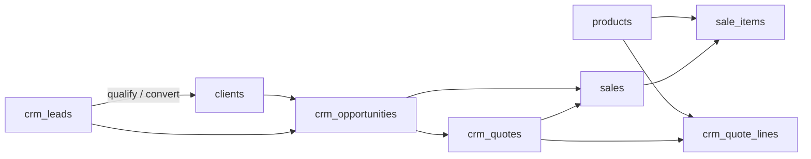

# REMPRES ERP — Phase B1.4
# Vente Data & Entity Model — Sales Data Governance

**Produit :** RemPres ERP  
**Date :** 2026-05-22  
**Mode :** architecture données & modèle entités — **aucun SQL, migration, CRUD, API, workflow, UI**  
**Prérequis verrouillés :** M1 · M1.5 · M2 · M2.5 · M3 · M3.75 · **B1.1** · **B1.2** · **B1.3**  
**Compléments :** `docs/ERP_VENTE_DOMAIN_ARCHITECTURE_B1_1_REPORT.md` · `docs/ERP_VENTE_SIDEBAR_NAVIGATION_B1_2_REPORT.md` · `docs/ERP_VENTE_COCKPIT_ARCHITECTURE_B1_3_REPORT.md`

---

## Synthèse exécutive

| Verdict | Formulation |
|---------|-------------|
| **Mission B1.4** | Verrouiller le **modèle de données Vente** (entités, ownership, relations, lifecycle, SoT) **avant** tout build métier |
| **État data réel** | **Schéma mature** Commerce (`clients`, `products`, `sales`) + **couche CRM enterprise** (`crm_*`, migration 049) — **pas** de tables fantômes pour commandes / prospects |
| **Dette critique** | **3 moteurs KPI** parallèles · **RLS CRM** sans garde `department_key` · **lifecycle `sales`** vs filtres `deleted_at` incohérents · **« Commande »** sémantique B1.1 ≠ table dédiée |
| **Entités futures** | **Objectifs commerciaux** : **absents** en base — **interdits** en duplication improvisée |
| **Scalabilité SaaS** | **Mono-organisation implicite** — pas de `company_id` sur entités Vente/CRM auditées |

**B1.4 ne construit rien.** Il **gouverne** ce que les phases B2+ (CRM, pipeline, cockpit data, workflows) **doivent obéir**.

---

## Méthodologie d’audit (Phases 1 & 9)

Sources **lues** (non exhaustives du repo, mais couvrant le périmètre Vente) :

| Zone | Fichiers / artefacts |
|------|----------------------|
| SQL Commerce | `supabase/sql/002_clients_schema.sql`, `004_products_schema.sql`, `005_vente_schema.sql`, `034_erp_sale_lifecycle_and_audit.sql` |
| SQL CRM | `supabase/sql/049_crm_sales_domain_enterprise.sql` |
| RLS | `022_rls_roles_policies_hardening.sql`, `027_rls_step5_full_security_hardening.sql`, policies dans 005/049 |
| Types | `types/database.types.ts` (tables `clients`, `products`, `sales`, `sale_items`, `crm_*`, `sales_archive`, `v_crm_pipeline_weighted`) |
| Module CRM | `modules/crm/types/domain.ts`, repositories, `crm-overview.ts`, `crm-kpi-bridge.ts`, `constants/module-keys.ts`, `orders/index.ts`, `customers/index.ts` |
| KPI / routes data | `lib/server/dashboard-kpis.ts`, `app/api/dept/[deptKey]/kpis/route.ts` (case `vente`), `getCrmOperationalOverview` |
| Permissions | `003_seed_profiles_permissions.sql`, `049` (`user_has_crm_module_permission`, `is_crm_operator`) |
| UX / nav (impact data routes) | `app/(app)/vente/**`, B1.2 bridge `/vente/clients` vs `/vente/crm/clients` |

**Interdit respecté :** aucune modification M1→B1.3, aucun build SQL/API/workflow dans cette phase.

---

# 1. État data actuel

## 1.1 Cartographie physique (tables & vues)

### Sous-domaine Commerce (transactionnel + référentiels)

| Objet DB | Rôle métier | Schéma d’origine |
|----------|-------------|------------------|
| `public.clients` | Référentiel client unique | 002 |
| `public.products` | Catalogue commercial + stock embarqué | 004 |
| `public.sales` | En-tête vente / commande commerciale canonique | 005 + 034 + 049 (FK CRM) |
| `public.sale_items` | Lignes vente (snapshot produit dénormalisé) | 005 |
| `public.stock_movements` | Historique mouvements stock liés produits | 005 |
| `public.sales_archive` | Archive JSON vente (gouvernance suppression) | 015+ |

### Sous-domaine CRM (relation + conversion)

| Objet DB | Rôle métier | Schéma |
|----------|-------------|--------|
| `public.crm_pipeline_stages` | Référentiel étapes pipeline | 049 |
| `public.crm_leads` | Prospection / lead | 049 |
| `public.crm_opportunities` | Opportunité commerciale | 049 |
| `public.crm_quotes` | Devis commercial | 049 |
| `public.crm_quote_lines` | Lignes devis | 049 |
| `public.crm_activities` | Interactions (polymorphe `related_kind`) | 049 |
| `public.crm_forecast_snapshots` | Agrégats prévision batch | 049 |
| `public.v_crm_pipeline_weighted` | Vue analytics pipeline pondéré | 049 |

### Absents en base (constat audit — pas supposition)

| Concept métier souvent cité | Table dédiée | Constat |
|----------------------------|--------------|---------|
| **Prospect** (entité séparée) | ❌ | Modélisé par **`crm_leads`** (statuts `new`…`converted`) |
| **Commande commerciale** (table `orders`) | ❌ | Alias applicatif → **`sales`** (`modules/crm/orders/index.ts` → `/vente/historique`) |
| **Transaction** (entité distincte de vente) | ❌ | **`sales`** + champs `payment_status`, `amount_paid_gnf` |
| **Objectifs / quotas commerciaux** | ❌ | Cités B1.1/B1.3 — **aucune table** |
| **Catalogue** (hors produits) | ❌ | **`products`** = catalogue |

## 1.2 Couche applicative (types & repositories)

- Types CRM : alignés sur `Database["public"]["Tables"]["crm_*"]` — `modules/crm/types/domain.ts`.
- Repositories : accès direct Supabase (`crm-leads-repository`, `crm-opportunities-repository`, etc.) — **pas** de couche domain entity séparée du row SQL.
- Routes UI Vente : ~48 pages sous `app/(app)/vente/**` — **consommatrices** des tables ci-dessus ; la dette est surtout **navigation double** (B1.2), pas double table clients.

## 1.3 Ownership actuel (résumé)

| Couche | Mécanisme | Limite |
|--------|-----------|--------|
| **Département** | `profiles.department_key = 'VENTE'` | M2 — gouverne accès routes |
| **Module RBAC** | `permissions` : `clients`, `produits`, `vente`, `crm`, `sales`, `products` (historique) | Granularité **≠** ownership entité |
| **RLS Commerce** | `sales` : `created_by` / `seller_id` ; `products` : `created_by` | Pas de filtre dept en SQL |
| **RLS CRM** | `user_has_crm_module_permission` = module `crm` **OU** `vente` | **Sans** `department_key = VENTE` (dette B1.1 D-V2) |
| **Opérateur CRM** | `is_crm_operator()` : admin **OU** dept VENTE | Renforce update owner sur leads/opps |

## 1.4 Routes data & payloads KPI (état réel)

| # | Surface | Consommateur | Tables / vues | Filtres notables |
|---|---------|--------------|---------------|------------------|
| K1 | Cockpit `/vente/dashboard` | `DepartmentCockpitPlaceholder` | **Aucune** | Placeholder `—` |
| K2 | Hub `/vente/crm` | `getCrmOperationalOverview` | `crm_leads`, `crm_opportunities`, `crm_quotes`, `crm_activities`, `v_crm_pipeline_weighted` | Leads : `new/contacted/qualified` ; quotes : `draft/sent` ; opps : **toutes** non supprimées |
| K3 | Supervision `/api/dept/vente/kpis` | Route dept KPI | `clients`, `products`, `sales`, `activity_logs` | Sales : **pas** `lifecycle_status` ; **pas** net annulations |
| K4 | Legacy `/dashboard` | `getDashboardKpis` | `clients`, `sales`, `products`, `activity_logs` | Sales : `deleted_at IS NULL` ; CA **net** via `payment_status = cancelled` |

**Verdict :** la **donnée existe** ; la **gouvernance de consommation** est **fragmentée** (cf. section 7).

---

# 2. Legacy data

| ID | Legacy | Localisation | Impact B1.4 |
|----|--------|--------------|-------------|
| L1 | Module keys multiples (`vente`, `clients`, `produits`, `sales`, `products`, `crm`) | SQL seed + activity_logs | KPI activity filtre hétérogène ; normaliser **tags module** en consommation, pas en tables |
| L2 | `sales.deleted_at` conservé mais **obsolète** pour historique | `034_erp_sale_lifecycle_and_audit.sql` | Requêtes KPI encore sur `deleted_at` (K4) — **conflit lifecycle** |
| L3 | `user_has_crm_module_permission` = CRM **ou** vente | 049 | Permission **sans** dept — risque cross-dept si rôle mal assigné |
| L4 | Double navigation clients | `/vente/clients` (canon) + `/vente/crm/clients` (bridge) | **Zéro** duplication table ; dette **route** uniquement |
| L5 | `CrmOperationalNav` + `CRM_NAV` | module CRM | Doublon liens — pas entité |
| L6 | `getDashboardKpis` multi-départements | `lib/server/dashboard-kpis.ts` | Source **SA / hybrid** — **interdite** comme SoT cockpit Vente (B1.3) |
| L7 | `mapModuleToDepartment` sans `crm` | gouvernance reporting | Logs `module_key=crm` mal rattachés dept |
| L8 | Liaison bidirectionnelle devis ↔ vente | `crm_quotes.sale_id` + `sales.crm_quote_id` | Risque **désynchronisation** si writes non transactionnels |
| L9 | Stock sur `products` + `stock_movements` | 004/005 | Chevauchement futur **Logistique** (B1.1) — Vente **lit** stock commercial, ne possède pas entrepôt |

**Principe :** legacy **cartographié**, **rien supprimé** en B1.4.

---

# 3. Inventaire entités officielles (Phase 2)

Légende statut : **O** = obligatoire · **U** = utile / secondaire référentiel · **S** = secondaire (agrégat, archive, vue) · **I** = interdit (créer une entité parallèle) · **F** = futur (non présent — build dédié post B1.4)

| Entité métier | Représentation officielle | Statut | Sous-domaine | Note audit |
|---------------|---------------------------|--------|--------------|------------|
| **Client** | `clients` | **O** | Commerce | SoT relation client converti |
| **Prospect** | *N/A table* → **`crm_leads`** (pré-conversion) | **O** (via lead) | CRM | **I** : table `prospects` |
| **Lead** | `crm_leads` | **O** | CRM | `converted_client_id` → handoff client |
| **Pipeline (étapes)** | `crm_pipeline_stages` | **O** | CRM | Référentiel seed ; write SA |
| **Opportunité** | `crm_opportunities` | **O** | CRM | Liée stage, client, lead optionnel |
| **Devis** | `crm_quotes` + `crm_quote_lines` | **O** | CRM | Numéro `DEV-YYYY-NNNN` |
| **Ligne devis** | `crm_quote_lines` | **O** | CRM | FK `products` optionnel |
| **Vente / commande / transaction POS** | `sales` + `sale_items` | **O** | Commerce | Réf. `VNT-YYYY-NNNN` ; **commande = sales** |
| **Historique vente archivé** | `sales_archive` | **S** | Commerce | Snapshot gouvernance |
| **Produit (catalogue)** | `products` | **O** | Commerce | Prix + stock **commercial** embarqué |
| **Mouvement stock (commercial)** | `stock_movements` | **U** | Commerce | Pont logistique ; owner futur **Logistique** pour exécution |
| **Activité CRM** | `crm_activities` | **O** | CRM | Polymorphe : lead, opportunity, client, quote, sale |
| **Prévision / forecast** | `crm_forecast_snapshots` | **U** | CRM | Batch ; pas SoT pipeline temps réel |
| **Pipeline pondéré (lecture)** | `v_crm_pipeline_weighted` | **S** | CRM | Vue dérivée — **pas** entité mutable |
| **Catalogue** (abstrait) | `products` | **O** | Commerce | Pas de seconde table catalogue |
| **Commande** (nom métier) | alias → `sales` | **O** (nom) / **I** (table) | Commerce | Corrige ambiguïté B1.1 « commande CRM » |
| **Interaction / historique relation** | `crm_activities` (+ futur timeline client) | **O** | CRM | Pas de table `client_history` séparée |
| **Objectifs commerciaux** | — | **F** | Vente | Build ultérieur avec schéma dédié |
| **Campagne marketing** | — | **I** sous Vente | Marketing | Alimentation leads seulement (S amont) |
| **Facture / paiement comptable** | — | **I** | Finance | Finance consomme ventes validées |
| **Livraison logistique** | `logistics_delivery_orders` (hors scope SQL lu) | **S** pont | Logistique | `sale_id` — consommation Vente |

---

# 4. Ownership matrix (Phase 3)

**Règle B1.4 :** le département **VENTE** possède le **domaine**. Ci-dessous : **propriétaire entité** (qui définit, crée, fait évoluer la vérité métier).

Légende : **P** propriétaire · **R** lecture seule · **W** écriture partagée (handoff) · **X** interdit

| Entité | Propriétaire principal | Lecture partagée | Écriture partagée | Interdit |
|--------|------------------------|------------------|-------------------|----------|
| `clients` | **P** — Commerce (Vente) | Finance (facturation), CRM (référence), Logistique (livraison) | CRM : enrichissement notes via activités — **pas** second client | RH, Marketing owner |
| `crm_leads` | **P** — CRM (Vente) | Marketing (import amont) | Conversion → `clients` (**W** one-way) | Finance owner |
| `crm_pipeline_stages` | **P** — CRM référentiel | Tous modules Vente lecture | **W** Super Admin uniquement | Agents modification libre |
| `crm_opportunities` | **P** — CRM | Finance (montant prévisionnel lecture) | Approvals (**W** gouvernance) | Logistique owner |
| `crm_quotes` | **P** — CRM | Finance (validation comptable **R**) | Conversion → `sales` (**W**) | Double devis SoT Finance |
| `crm_quote_lines` | **P** — CRM (enfant devis) | — | — | Lignes hors devis |
| `sales` / `sale_items` | **P** — Commerce | Finance (CA), CRM (lien opp/devis), Logistique (livraison) | CRM pose FK `crm_*_id` ; Finance enregistre paiement **ailleurs** | CRM possède une 2ᵉ table commande |
| `products` | **P** — Commerce (catalogue prix) | Logistique (stock physique futur) | Logistique ajuste stock réel (**W** aval) — **pas** prix commercial | CRM duplique catalogue |
| `stock_movements` | **P** transitionnel Commerce | Logistique | Logistique devient **P** exécution | Deux historiques stock |
| `crm_activities` | **P** — CRM | — | — | Activités dans `activity_logs` comme SoT relation |
| `crm_forecast_snapshots` | **P** — CRM analytics | Direction (lecture) | Job batch ERP | Recalcul ad hoc UI comme SoT |
| `v_crm_pipeline_weighted` | **P** — dérivé CRM (vue) | Cockpit, reporting | **X** écriture | Agrégation manuelle parallèle |
| `sales_archive` | **P** — Commerce gouvernance | Audit SA | SA / règles suppression | Utilisateur métier write |

### 4.1 Capacités (sous-domaines) — pas des entités

| Capacité B1.1 | Ownership capacité | Tables sous-jacentes |
|---------------|-------------------|----------------------|
| Zone **Commerce** | **P** Vente | `clients`, `products`, `sales`, `sale_items`, `stock_movements` |
| Zone **CRM** | **P** Vente (pas dept séparé) | `crm_*`, vue pipeline |
| Module RBAC `crm` | Granularité permission | **Ne possède pas** les données |

### 4.2 Anti double propriétaire (décisions verrouillées)

1. **Un seul référentiel client :** `clients`. Les leads **ne remplacent pas** un client ; ils **précèdent** (`converted_client_id`).
2. **Une seule commande commerciale exécutée :** `sales`. Le devis **`crm_quotes`** est engagement **amont** ; la vente est **aval** converti.
3. **Un seul catalogue produit commercial :** `products`. Les lignes devis référencent `product_id` ; les lignes vente **snapshot** (`product_name`, `product_sku`).

---

# 5. Relations entités officielles (Phase 4)

| Relation | Cardinalité officielle | FK / mécanisme | Interdit |
|----------|------------------------|----------------|----------|
| Lead → Client | **0..1** après conversion | `crm_leads.converted_client_id` | Lead + Client actifs doublons sans lien |
| Lead → Opportunité | **1 → 0..N** | `crm_opportunities.lead_id` | Opportunité sans lien client/lead quand les deux existent (règle métier future) |
| Client → Opportunité | **1 → 0..N** | `crm_opportunities.client_id` | — |
| Opportunité → Stage | **N → 1** | `stage_id` | Stage libre hors référentiel |
| Opportunité → Devis | **1 → 0..N** | `crm_quotes.opportunity_id` | — |
| Devis → Lignes | **1 → N** | `crm_quote_lines.quote_id` cascade | Lignes orphelines |
| Devis → Vente | **1 → 0..1** | `crm_quotes.sale_id` **et** `sales.crm_quote_id` | **Double write** non coordonné |
| Opportunité → Vente | **1 → 0..N** | `sales.crm_opportunity_id` | — |
| Client → Vente | **1 → 0..N** | `sales.client_id` | — |
| Vente → Lignes | **1 → N** | `sale_items.sale_id` cascade | — |
| Produit → Ligne devis | **1 → 0..N** | `crm_quote_lines.product_id` | Copie prix sans snapshot — **dette** (prix historique devis = ligne au moment write) |
| Produit → Ligne vente | **1 → 0..N** | `sale_items.product_id` + snapshot | — |
| Activité → {Lead,Opp,Client,Quote,Sale} | **N → 1** polymorphe | `related_kind` + `related_id` | **N→N** implicite sans table jonction |
| Pipeline (vue) → Opportunité | **1 → 1** lecture | vue `v_crm_pipeline_weighted` | Écriture via vue |
| Devis → Approval | **0..1** | `approval_request_id` | — |
| Stock movement → Vente | **N → 0..1** | `reference_id` (opaque UUID) | FK stricte absente — **dette** |

### 5.1 Chaîne de conversion officielle (lifecycle métier)



**Règle :** une conversion **avale** le lead (`status=converted`) et **pointe** le client — pas de suppression du lead comme SoT historique.

---

# 6. Data lifecycle (Phase 5)

## 6.1 `clients`

| Phase | Comportement officiel |
|-------|----------------------|
| Création | Insert avec `created_by` ; contrainte nom selon `client_type` |
| Mise à jour | `updated_at` trigger ; email normalisé |
| Archivage | `deleted_at` soft delete — **SoT inactif** |
| Suppression | Soft delete ; monitoring `deletesClientsLast24h` (K4) |
| **Interdit** | Hard delete métier sans gouvernance |

## 6.2 `crm_leads`

| Statut | Signification | Transitions autorisées |
|--------|---------------|------------------------|
| `new` | Création | → `contacted`, `qualified`, `lost` |
| `contacted` | Premier contact | → `qualified`, `lost` |
| `qualified` | Qualifié | → `converted`, `lost` |
| `converted` | **Terminal** — lié `converted_client_id` | Pas retour `new` sans gouvernance |
| `lost` | **Terminal** | `lost_reason` |

| Mécanisme | `deleted_at` soft delete ; RLS masque deleted |

## 6.3 `crm_opportunities`

- Lifecycle porté par **`stage_id`** (référentiel) + `probability_pct` (trigger stage).
- Terminaux : stages `closed_won` / `closed_lost` (`is_terminal_win/loss`).
- Soft delete : `deleted_at`.
- Approbation : `approval_request_id` (gouvernance transverse).

## 6.4 `crm_quotes`

| Statut | Rôle |
|--------|------|
| `draft` | Édition |
| `sent` | Proposition client |
| `accepted` / `rejected` / `expired` | Clôture négociation |
| `converted` | **Terminal** — lié `sale_id` |

Verrouillage : transitions vers `converted` **exigent** cohérence `sales` + `sale_id`.

## 6.5 `sales` (Commerce — lifecycle **dual**)

| Dimension | Champ | Valeurs | Autorité B1.4 |
|-----------|-------|---------|---------------|
| **Lifecycle ERP** | `lifecycle_status` | `validated`, `cancelled`, `archived` | **SoT historique / cockpit CA** (034) |
| **Paiement** | `payment_status` | `pending`, `partial`, `paid`, `overdue`, `cancelled` | SoT encaissement commercial |
| **Legacy soft delete** | `deleted_at` | timestamp | **Obsolète** pour historique — **ne plus utiliser** en nouvelles requêtes |

| Transition | Règle |
|------------|-------|
| Vente validée | `lifecycle_status = validated` (défaut) |
| Annulation | `lifecycle_status = cancelled` ↔ `payment_status = cancelled` (trigger 034) |
| Archivage | `lifecycle_status = archived` — reste visible historique `/vente/historique` |

## 6.6 `crm_activities`

- Ouvert : `completed_at IS NULL`.
- Clôture : `completed_at` renseigné.
- Soft delete : `deleted_at`.

## 6.7 `products`

- Soft delete `deleted_at`.
- Stock : `stock_quantity` / `stock_threshold` — alertes cockpit (B1.3).

## 6.8 `crm_forecast_snapshots`

- Immuables par période (`uq_crm_forecast_period_owner`).
- Recalcul = nouvel insert / upsert batch — **pas** édition UI comme SoT pipeline.

---

# 7. Source of truth governance (Phase 6)

**Principe B1.4 :** **1 indicateur = 1 source officielle = 1 définition de filtre.** Les consommateurs (cockpit, hub CRM, API dept) **réutilisent** un service — ils **ne recalculent pas** avec des filtres divergents.

## 7.1 Matrice SoT — entités

| Donnée métier | Source officielle (table/vue) | Consommation autorisée | Duplication interdite |
|---------------|------------------------------|------------------------|----------------------|
| Client actif | `clients` WHERE `deleted_at IS NULL` | CRM, Commerce, KPI | Comptage parcopie locale |
| Lead actif | `crm_leads` + statuts CRM | Hub CRM, futur cockpit | Table `prospects` |
| Opportunité ouverte | `crm_opportunities` + join stages **non terminal loss** | Pipeline UI, vue pondérée | Comptage « toutes opps » sans filtre stage (état K2) |
| Pipeline pondéré GNF | **`v_crm_pipeline_weighted`** (somme `weighted_amount_gnf`) | CRM hub, analytics bridge | Somme manuelle sur `crm_opportunities` en parallèle |
| Devis ouverts | `crm_quotes` statuts `draft`, `sent` | Hub CRM | — |
| CA jour / mois **net** | `sales` + règles **034** : exclure `cancelled` / `archived` ; net = brut − `payment_status=cancelled` | Cockpit Vente (futur), Finance | K3 brut sans lifecycle |
| CA brut | `sales.total_amount_gnf` agrégé | Reporting audit | Confondre avec net cockpit |
| Ventes du jour (count) | `sales` filtré lifecycle + date | Cockpit | K3 count sans lifecycle |
| Catalogue actif | `products` `deleted_at IS NULL` | Commerce, devis | — |
| Stock bas / rupture | `products.stock_quantity` vs `stock_threshold` | Alertes cockpit | Inventaire logistique futur |
| Activité commerciale récente | **`crm_activities`** (futur feed) + `activity_logs` module vente **secondaire** | Cockpit zone activity | `activity_logs` global SA comme SoT Vente |
| Prévision mensuelle | `crm_forecast_snapshots` | Reporting / forecasting | Snapshot UI éditable |

## 7.2 Matrice SoT — KPI (verrouillage post B1.3)

| KPI cockpit B1.3 | Source officielle B1.4 | État consommateur actuel | Action build futur |
|------------------|------------------------|--------------------------|-------------------|
| Clients actifs | `clients` count | K3, K4 alignés | Unifier via service |
| CA jour net | `sales` + règle net K4 | K4 OK ; K3 **non** | **Interdire** K3 tel quel pour cockpit |
| Ventes jour (count) | `sales` lifecycle `validated` | K3/K4 divergent filtres | Normaliser filtre |
| Pipeline pondéré | `v_crm_pipeline_weighted` | K2 OK | Réutiliser même requête cockpit |
| Leads actifs | `crm_leads` statuts actifs | K2 OK | Idem |
| Devis ouverts | `crm_quotes` | K2 OK | Idem |
| Activités ouvertes | `crm_activities` | K2 OK | Idem |
| Stock alerte | `products` | K3, K4 | Idem |
| Graphique 7j | agrégat `sales` net par jour | K4 ; K3 brut | Service unique |

**Surface autorisée par rôle (B1.3 maintenu) :**

| Rôle / surface | Peut lire SoT | Ne doit pas devenir SoT |
|----------------|---------------|-------------------------|
| `/vente/dashboard` | Agrégats via **futur** `VenteCockpitDataService` | — |
| `/vente/crm` | Détail CRM + mêmes agrégats CRM | Homepage Vente |
| `/api/dept/vente/kpis` | Supervision SA — **même définitions** que cockpit | Manager home |
| `getDashboardKpis` | **Interdit** SoT Vente | Legacy SA |

---

# 8. Security & visibility alignment (Phase 7 — M2)

## 8.1 Modèle cible (non négociable M2)

- Accès données Vente = `role_key` + `department_key = VENTE` **+** `permissions.module_key`.
- Super Admin : lecture gouvernance ; pas d’opération métier vente (B1.1).

## 8.2 Alignement par entité

| Entité | Lecture | Écriture | Historique | Écart audité |
|--------|---------|----------|------------|--------------|
| `clients` | Module `clients` / `vente` | `created_by` + permissions | Soft delete | Pas filtre dept SQL |
| `sales` | Vente module + RLS creator/seller | Insert/update RLS | `lifecycle_status`, `sales_archive` | CRM FK sans RLS dédiée cross-check dept |
| `products` | Module produits | `created_by` RLS | Soft delete | Stock visible tous autorisés lecture |
| `crm_*` | `user_has_crm_module_permission('read')` | create/update + `is_crm_operator` sur owner | `deleted_at` | **Pas** `department_key` dans fonction 049 |
| `crm_pipeline_stages` | Lecture métier | **Super Admin only** write | — | OK référentiel |
| `v_crm_pipeline_weighted` | Hérite RLS opportunités | Vue read-only | — | OK |

## 8.3 Règles de visibilité commerciale (à appliquer builds futurs)

1. **Agent Vente :** lecture/écriture sur ses `owner_id` / `created_by` CRM ; ventes dont il est `seller_id` ou créateur.
2. **Manager Vente :** agrégats dept — **via vues ou policies étendues**, pas requêtes globales sans filtre.
3. **Accountant :** lecture CRM/ventes — pas modification pipeline.
4. **Auditor :** lecture seule — pas delete.
5. **Autre département :** **X** sur tables `crm_*` et `sales` sauf ponts Finance/Logistique documentés (lecture).

## 8.4 Dette sécurité à traiter (hors B1.4 — build gouvernance)

| ID | Risque | Priorité |
|----|--------|----------|
| SEC-1 | `crm` permission sans `department_key` | Haute |
| SEC-2 | KPI API dept sans contrôle dept dans requête | Moyenne |
| SEC-3 | `getCrmOperationalOverview` : opps « ouvertes » incluent stages gagnés/perdus non filtrés | Moyenne (data leak sémantique) |

---

# 9. Scalability review (Phase 8)

| Dimension | État actuel | Verdict B1.4 |
|-----------|-------------|--------------|
| **Multi-entreprises / tenants** | Aucun `company_id` sur `clients`, `sales`, `crm_*` | **Non prêt** SaaS multi-tenant sans migration transverse |
| **Croissance volumétrie** | Index sur FK, dates, status — **OK** PME/ETI mono-org | Acceptable |
| **CRM avancé** | Schéma 049 complet (approvals, metadata jsonb) | **Scalable** fonctionnellement |
| **Rôles futurs** | RBAC module granulaire | OK si SEC-1 corrigé |
| **Analytics** | Vue + snapshots + bridge scopes | OK — **interdire** 4ᵉ moteur KPI |
| **Audit / conformité** | `crm-data-tags.ts` PII tags | Utile — étendre à `clients` |

**Recommandation architecture (documentaire) :** toute future colonne tenant doit être **transverse** (core), pas patchée par table en silo.

---

# 10. Legacy impacts & dette data future

| Domaine | Cleanup / migration futur | Bloqué jusqu’à |
|---------|---------------------------|----------------|
| Filtres `sales.deleted_at` dans K4 | Migrer requêtes → `lifecycle_status` | Service KPI unique |
| Hub CRM comptage opps | Ajouter filtre stages non terminaux | B2 CRM |
| Double FK devis/vente | Contrainte applicative transactionnelle ou trigger | Workflow conversion |
| `stock_movements.reference_id` sans FK | Lier `sales.id` ou document logistique | Logistique |
| Module keys activity_logs | Normaliser `vente` vs `sales` vs `products` | Observabilité |
| Tables objectifs | Créer schéma dédié | Phase RH/Vente objectifs |
| Multi-tenant | Core `organizations` + RLS | Plateforme SaaS |

---

# 11. Liste complète — duplications détectées

| # | Type | Description | Gravité |
|---|------|-------------|---------|
| D1 | **Conceptuelle** | Prospect vs Lead — une seule table, jargon double | Faible |
| D2 | **Navigation** | `/vente/clients` vs `/vente/crm/clients` | Faible (UX) |
| D3 | **KPI** | 3 surfaces (placeholder, K2, K3/K4) | **Haute** |
| D4 | **Sémantique** | Commande (B1.1 CRM) vs `sales` (Commerce) | Moyenne — ** résolu B1.4** : commande = `sales` |
| D5 | **FK** | `crm_quotes.sale_id` ↔ `sales.crm_quote_id` | Moyenne |
| D6 | **Module RBAC** | `vente` vs `crm` vs `clients` vs `produits` | Moyenne |
| D7 | **Stock** | `products.stock_*` vs futur logistique | Moyenne (frontière) |
| D8 | **Lifecycle** | `deleted_at` vs `lifecycle_status` sur `sales` | **Haute** |
| D9 | **Nav CRM** | Rail + `CRM_NAV` + `CrmOperationalNav` | Moyenne (UX, pas data) |
| D10 | **Prix** | Devis ligne vs snapshot vente — comportements différents | Faible (intentionnel si documenté) |

**Pas de duplication :** table clients unique ; pas de second catalogue.

---

# 12. Liste complète — incohérences trouvées

| # | Incohérence | Preuve | Impact |
|---|-------------|--------|--------|
| I1 | K3 `salesThisMonth` somme **brut** sans `lifecycle_status` | `app/api/dept/[deptKey]/kpis/route.ts` | KPI dept ≠ cockpit futur |
| I2 | K4 filtre `deleted_at` ; 034 dit **obsolète** | `dashboard-kpis.ts` vs `034` | Historique / CA faux si archived |
| I3 | K2 opportunités « ouvertes » = toutes non deleted | `crm-overview.ts` | Surcomptage pipeline |
| I4 | B1.1 « commandes » owner CRM vs code `sales` Commerce | `orders/index.ts` | Ambiguïté ownership — **corrigé B1.4** |
| I5 | `payment_status=cancelled` vs `lifecycle_status=cancelled` | 034 trigger | Double mécanisme — **documenté**, pas unifier sans migration |
| I6 | Permissions `crm` sans dept guard | 049 | Fuite cross-dept théorique |
| I7 | `getDashboardKpis` global pour vente | usage SA | Mauvais SoT si réutilisé cockpit |
| I8 | Finance consomme aussi `sales` (route finance kpis) | même table, filtres à harmoniser | Écart CA inter-dept |

---

# 13. Liste complète — risques futurs

| # | Risque | Si non traité avant build |
|---|--------|---------------------------|
| R1 | Cockpit branché sur K3 ou K4 sans service unifié | KPI contradictoires managers |
| R2 | Création table `orders` parallèle à `sales` | **Chaos entité** |
| R3 | CRM duplique clients « pour aller plus vite » | Double SoT PII |
| R4 | Analytics recalcul pipeline sans vue | Chiffres ≠ CRM hub |
| R5 | Multi-tenant ajouté table par table | RLS ingérable |
| R6 | Workflow conversion devis sans transaction | D5 désynchronisation |
| R7 | Objectifs stockés dans `metadata` jsonb | Non requêtable, non gouverné |
| R8 | Agent autre dept reçoit `crm` permission | SEC-1 exploitation |

---

# 14. Dette data future (priorisée)

| Priorité | Item | Phase suggérée |
|----------|------|----------------|
| P0 | Service SoT KPI Vente unique (définitions 7.2) | B2 cockpit data |
| P0 | Requêtes `sales` → `lifecycle_status` uniquement | B2 + migration requêtes |
| P1 | Garde SQL `department_key` sur CRM | Gouvernance RBAC |
| P1 | Filtre opportunités ouvertes (stages) dans overview | B2 CRM |
| P2 | Contrainte cohérence `crm_quotes.sale_id` ↔ `sales.crm_quote_id` | Workflow conversion |
| P2 | Pont `stock_movements` → FK `sales` | Logistique |
| P3 | Schéma `sales_targets` / objectifs | Vente + RH lecture |
| P3 | Tenant `organization_id` core | Plateforme |

---

# 15. Confirmation officielle — Sales Data Model

## 15.1 Déclaration B1.4

Le **Sales Data Model** REMPRES ERP est **officiellement défini** par :

1. **Inventaire entités** section 3 (tables existantes + statuts O/U/S/I/F).  
2. **Ownership matrix** section 4 (anti double propriétaire).  
3. **Relations** section 5 (cardinalités + chaîne conversion).  
4. **Lifecycle** section 6 (`lifecycle_status` prioritaire sur `sales`).  
5. **Source of truth** section 7 (1 KPI = 1 source + 1 filtre).  
6. **Sécurité alignée M2** section 8 (avec dettes SEC-* explicites).  
7. **Scalabilité** section 9 (mono-org OK ; multi-tenant = travail core futur).

## 15.2 Grille de conformité (honnête)

| Critère | Statut | Commentaire |
|---------|--------|-------------|
| Clair | **Oui** | Schéma 002/004/005/049 + alias commande documentés |
| Gouverné | **Partiel → Oui après B1.4** | Gouvernance **définie** ; enforcement code **pas encore** |
| Non hybride | **Non aujourd’hui** | 3 moteurs KPI — **hybride jusqu’à B2** |
| Non dupliqué (tables) | **Oui** | Pas de double client/catalogue/commande |
| Non dupliqué (consommation) | **Non** | D3/D8 — dette consommation |
| Scalable (fonctionnel) | **Oui** | CRM enterprise prêt |
| Scalable (SaaS multi-org) | **Non** | Sans tenant core |
| Enterprise-grade | **En chemin** | Fondation SQL solide ; gouvernance consommation à finaliser |

## 15.3 Verdict final

**B1.4 VERROUILLÉ** comme **contrat data** pour tout build ultérieur (CRM, clients, pipeline, devis, transactions, KPI, workflows).

**Ce n’est pas** un « 100 % parfait » opérationnel : les **incohérences I1–I8** et **SEC-1** restent **réelles** et doivent être traitées par les phases **build** en **obéissant** à ce document — **sans** réinventer d’entités.

---

## Annexe A — Référentiel tables (quick reference)

```
Commerce:  clients, products, sales, sale_items, stock_movements, sales_archive
CRM:       crm_pipeline_stages, crm_leads, crm_opportunities, crm_quotes,
           crm_quote_lines, crm_activities, crm_forecast_snapshots
Vue:       v_crm_pipeline_weighted
```

## Annexe B — Permissions modules Vente (audit)

| module_key | Rôles seed (extrait) | Périmètre |
|------------|---------------------|-----------|
| `clients` | manager, agent… | Référentiel client |
| `produits` | manager, agent… | Catalogue |
| `vente` | manager, agent… | Fallback historique + CRM SQL OR |
| `crm` | super_admin, manager, agent, accountant, auditor | Tables `crm_*` |

## Annexe C — Chaîne SoT revenus (Finance alignment)

- **CA commercial net Vente :** `sales` + règles lifecycle 034 + annulations `payment_status`.  
- **Finance** consomme les **mêmes lignes** — doit **importer la définition** section 7.2 (pas recréer une table CA).

---

*Document généré en mode architecture stricte — Phase B1.4. Aucun artefact de build (SQL, API, UI, workflow) produit.*
