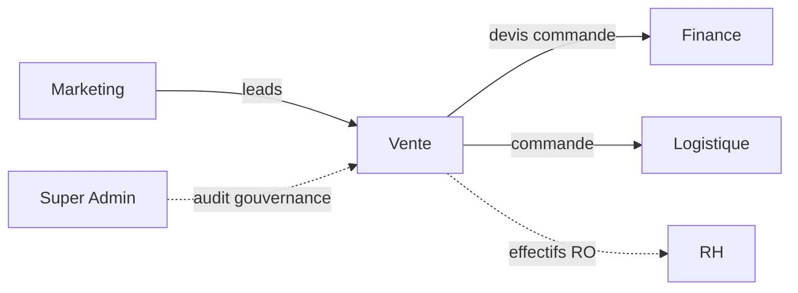

# REMPRES ERP — Phase B1.1
# Vente Domain Architecture — Sales Domain Governance

**Produit :** RemPres ERP  
**Date :** 2026-05-22  
**Mode :** architecture métier — **aucun code, aucune UI, aucun workflow, aucun SQL**  
**Prérequis verrouillés :** M1 · M1.5 · M2 · M2.5 · M3 · M3.75  
**Périmètre :** mission · ownership · CRM · frontières · relations · scalabilité · legacy

---

## Synthèse exécutive

| Verdict | Formulation |
|---------|-------------|
| **Département** | `VENTE` est le **seul** propriétaire métier de l’activité commerciale. |
| **CRM** | **Sous-domaine / zone de capacité** de Vente — **pas** département, **pas** domaine autonome. |
| **Commerce** | **Sous-domaine transactionnel** de Vente (catalogue, POS, historique) — **pas** département parallèle. |
| **Territoire URL** | Préfixe unique **`/vente/*`** (incluant `/vente/crm/*`). |
| **Statut code** | Alignement **partiel** : routes et `CRM_DEPARTMENT_KEY` convergent ; dettes RBAC, reporting et nav partielle subsistent. |

**Ce que B1.1 verrouille :** le **contrat métier** que tout build futur (sidebar Vente, cockpit Vente, CRM, clients, pipeline, devis) doit respecter.

**Ce que B1.1 ne fait pas :** implémenter, migrer, ou modifier M1–M3.75.

---

## 1. État Vente actuel (audit phase 1)

### 1.1 Sources auditées

| Source | Rôle dans l’audit |
|--------|-------------------|
| `docs/CONTEXTE-PROJET-CDC.md` | Périmètre CDC Vente (clients, produits, vente, historique, reçus) |
| `docs/ERP_DEPARTMENTS_*` M1 / M1.5 | Carte départements, CRM ⊆ Vente |
| `docs/ERP_ROLES_ACCESS_MATRIX_M2_REPORT.md` | MANAGER_VENTE, modules `clients`/`produits`/`vente`/`crm` |
| `docs/ERP_*_M2_5`, M3, M3.75 | Visibilité, sidebar, lock UX |
| `lib/departments/department-config.ts` | `VENTE`, routes, supervision |
| `lib/navigation/erp-ux-architecture.ts` | Groupes Commerce + CRM |
| `lib/navigation/vente-rail-lock.ts` | Contrat rail unique `/vente` |
| `modules/crm/` (~80 fichiers) | Domaine CRM technique sous Vente |
| `app/(app)/vente/**` (48 fichiers routes) | Surface opérationnelle + CRM |
| `supabase/sql/049_crm_sales_domain_enterprise.sql` | Tables `crm_*`, permissions module `crm` |

### 1.2 Cartographie fonctionnelle actuelle

```
DÉPARTEMENT (M1)          VENTE
│
├── Zone Commerce (transactionnel)
│   ├── Clients          /vente/clients (+ archives, fiches)
│   ├── Produits         /vente/produits (+ archives)
│   ├── Nouvelle vente   /vente/nouvelle-vente (POS)
│   ├── Historique       /vente/historique
│   └── Reçus            /vente/recu/[saleId]
│
└── Zone CRM (relation & conversion)     préfixe /vente/crm/*
    ├── Pilotage         /vente/crm
    ├── Leads            /vente/crm/leads
    ├── Pipeline         /vente/crm/pipeline
    ├── Opportunités     /vente/crm/opportunities
    ├── Devis            /vente/crm/quotes
    ├── Commandes        /vente/crm/orders
    ├── Activités        /vente/crm/activities
    ├── Prévisions       /vente/crm/forecasting
    ├── Analytics        /vente/crm/analytics
    ├── Reporting        /vente/crm/reporting
    ├── Gouvernance      /vente/crm/governance
    ├── Visual           /vente/crm/visual
    └── Pont clients     /vente/crm/clients → référentiel /vente/clients
```

### 1.3 Logique métier réelle observée

| Flux | Propriétaire effectif | Preuve |
|------|----------------------|--------|
| Encaissement / ticket vente | Vente (Commerce) | `nouvelle-vente`, tables sales legacy (CDC 005) |
| Référentiel client unique | Vente | `/vente/clients` ; pont CRM explicite « pas de duplication » |
| Pipeline commercial | Vente (CRM) | Tables `crm_*`, routes `/vente/crm/*` |
| Permissions CRM | Module `crm` + garde SQL `is_crm_operator()` → dept `VENTE` | Migration 049 |
| Accès route | `department_key = VENTE` → préfixes `/vente` | `canAccessPathForProfile` |

### 1.4 Dette domaine / confusion historique

| ID | Constat | Gravité |
|----|---------|---------|
| D-V1 | Langage **« Commerce »** et **« CRM »** au même niveau sémantique que le département — risque lecture « 2 départements » | Moyenne (organisationnelle) |
| D-V2 | `permissions.module_key = crm` **sans** contrainte DB `department_key = VENTE` | Haute (sécurité M2) |
| D-V3 | `mapModuleToDepartment` : **pas** d’entrée `crm` → `VENTE` | Moyenne (reporting gouvernance) |
| D-V4 | `modules/department-dashboards/crm` : vertical `"crm"` vs `primaryDeptKey: "vente"` | Moyenne (double langage) |
| D-V5 | Sidebar M3 (6 liens CRM) vs `CRM_NAV` (12 entrées) — **écart navigation contractuelle** | Moyenne (build futur) |
| D-V6 | Fichiers shell legacy (`PrimarySidebar`, `useActiveNav` commerce/crm) — orphelins post M3.5 | Faible (technique) |
| D-V7 | Clients dupliqués **en navigation** (`/vente/clients` et `/vente/crm/clients`) — pas en données | Faible (UX) |

**Conclusion audit :** le **territoire** Vente est déjà **unifié en URL et en département** ; la dette est surtout **sémantique, RBAC transversal, et complétude nav/reporting**.

---

## 2. Legacy Vente

| Zone legacy | État | Impact futur |
|-------------|------|--------------|
| Rail double `commerce` + `crm` (shell pre-M3.5) | Remplacé par rail unique M3.5 | Cleanup fichiers, pas de remise du double rail |
| `DashboardClient` hybride multi-modules | Non routé pour métiers (redirect cockpit) | Code mort à purger plus tard |
| Rôles `responsable_vente` | Mappé → `manager` + `VENTE` (035) | OK |
| Module permissions `vente` vs `clients`/`produits` | Coexistence SQL | Granularité utile ; documenter dans RBAC Vente |
| CRM enterprise SQL 049 | Actif | Source de vérité pipeline/devis |
| Pages CRM « stub » / placeholders | Présentes sur routes étendues | Build métier B2+ |
| Super Admin | Opérations `/vente` bloquées ; lecture archives/historique autorisée | Conforme gouvernance |

---

## 3. Mission officielle Vente

### 3.1 Définition normative (B1.1)

> **Le département Vente** est responsable de **générer et sécuriser le revenu** de l’entreprise sur le marché : depuis la **prospection et la relation client** jusqu’à la **conversion commerciale** (devis, commande, vente comptoir), en maintenant un **référentiel client et offre commerciale** cohérent pour l’ERP.

### 3.2 Raison d’être

| Dimension | Vente apporte |
|-----------|---------------|
| **Business** | Croissance CA, conversion opportunités, fidélisation |
| **ERP** | Données clients, transactions commerciales, pipeline prévisionnel |
| **Gouvernance** | Traçabilité commerciale vers Finance et Logistique |

### 3.3 Ce que Vente n’est pas

| Entité | Pourquoi ce n’est pas Vente |
|--------|----------------------------|
| Finance | Comptabilisation, paiements, fiscalité |
| Marketing | Notoriété, campagnes, leads amont (sans closing) |
| RH | Contrats, paie, recrutement |
| Logistique | Stock physique, entrepôts, livraisons |
| Formation | Parcours pédagogiques / consulting livrable |
| Super Admin | Gouvernance plateforme, pas opérations commerciales |

### 3.4 Objectif métier ERP (une phrase)

**Convertir la demande marché en engagements commerciaux traçables** (lead → opportunité → devis → commande / vente) **sans posséder** la chaîne financière ni logistique finale.

---

## 4. Ownership matrix

Légende : **P** = propriétaire exclusif · **S** = partagé (consommation / handoff) · **I** = interdit (autre dept owner)

| Entité métier | Ownership | Notes B1.1 |
|---------------|-----------|------------|
| **Département Vente (`VENTE`)** | **P** | Seule clé département commerciale |
| **Zone CRM (capacité)** | **P** (sous Vente) | Pas de `department_key` CRM |
| **Zone Commerce (capacité)** | **P** (sous Vente) | Transactionnel + catalogue |
| **Clients (référentiel)** | **P** | Unique : `/vente/clients` |
| **Prospects / Leads** | **P** (CRM) | Marketing peut **alimenter** (S amont) |
| **Pipeline / étapes** | **P** (CRM) | |
| **Opportunités** | **P** (CRM) | |
| **Devis commerciaux** | **P** (CRM) | Finance **valide/comptabilise** (S) |
| **Commandes commerciales** | **P** (CRM) | Logistique **exécute** (S aval) |
| **Transactions / ventes POS** | **P** (Commerce) | |
| **Historique relation / activités CRM** | **P** (CRM) | |
| **Catalogue produits commercial** | **P** (Commerce) | Logistique détient **stock réel** (S) |
| **Objectifs / quotas commerciaux** | **P** | RH peut afficher agrégats (S lecture) |
| **Paiements / factures comptables** | **I** | **Finance** |
| **Stock entrepôt / mouvements** | **I** | **Logistique** |
| **Campagnes marketing** | **I** | **Marketing** |
| **Contrats employés** | **I** | **RH** |
| **Paramètres plateforme** | **I** | **Super Admin** |

### 4.1 Règle anti-duplication

- **Un seul propriétaire** par entité métier.
- **CRM ne possède pas** un second référentiel clients — il **référence** Commerce/Vente clients.
- **Finance ne possède pas** le devis commercial — elle **reçoit** l’engagement validé.

---

## 5. CRM governance (M1.5 verrouillé)

### 5.1 Position officielle

| Affirmation | Statut |
|-------------|--------|
| CRM ∈ Vente | **Non négociable** (M1.5, réaffirmé B1.1) |
| CRM = département | **Interdit** |
| CRM = domaine autonome ERP | **Interdit** |
| `permissions.module_key = crm` | **Autorisé** comme **granularité RBAC** sous règle `department_key = VENTE` |

### 5.2 Rôle du CRM dans Vente

Le CRM est la **couche de gestion de la relation et de la conversion** :

| Fonction CRM | Finalité |
|--------------|----------|
| Relation client | Vue 360°, historique interactions |
| Suivi commercial | Leads, pipeline, opportunités |
| Proposition | Devis, négociation |
| Prévision | Forecast, analytics commerciaux |
| Coordination | Handoff vers commande / vente POS |

### 5.3 Frontières CRM

| CRM fait | CRM ne fait pas |
|----------|-----------------|
| Qualifier leads, avancer pipeline | Campagnes acquisition (Marketing) |
| Émettre / suivre devis **commerciaux** | Comptabiliser, encaisser (Finance) |
| Créer commande **commerciale** | Préparer expédition stock (Logistique) |
| Pont vers clients Vente | Dupliquer fiche client |

### 5.4 Interaction CRM ↔ Commerce (intra-Vente)

```
Lead (CRM) → Opportunité → Devis → Commande commerciale
                                      ↓
                            Vente POS / Historique (Commerce)
                                      ↓
                         Handoff Finance (facturation) + Logistique (fulfillment)
```

**Règle :** Commerce et CRM sont **complémentaires**, **même propriétaire** (`VENTE`). La frontière est **cycle de vie** (conversion vs transaction), pas **ownership**.

---

## 6. Frontières Vente (ce que Vente ne fait pas)

### 6.1 Frontières par département

| Département | Vente peut… | Vente ne doit pas… |
|-------------|-------------|---------------------|
| **Finance** | Générer devis, enregistrer vente commerciale | Comptabiliser, payer fournisseurs, clôturer fiscal |
| **Marketing** | Convertir leads reçus, attribuer opportunités | Posséder campagnes, branding, MKT analytics globaux |
| **Logistique** | Demander dispo / déclencher commande | Gérer stock entrepôt, mouvements, inventaire physique |
| **RH** | Lier commercial à objectifs (lecture) | Gérer contrats, paie, congés |
| **Formation** | Vendre offre formation (lien commercial) | Produire parcours, consulting delivery |
| **Super Admin** | — | Modifier gouvernance plateforme, tenants, policies globales |

### 6.2 Exemples normatifs (B1.1)

| Action | Vente |
|--------|-------|
| Créer devis client | ✅ |
| Négocier remise commerciale | ✅ |
| Enregistrer vente comptoir | ✅ |
| Suivre pipeline | ✅ |
| Valider paiement client | ❌ Finance |
| Écrire écriture comptable | ❌ Finance |
| Recruter commercial | ❌ RH |
| Ajuster stock entrepôt | ❌ Logistique |
| Lancer campagne email | ❌ Marketing |

---

## 7. Relations inter-départements

**Principe :** relation ≠ ownership. Vente **collabore** sans **annexer**.

| Partenaire | Type relation | Flux information | Validation |
|------------|---------------|------------------|------------|
| **Finance** | Aval facturation | Devis/commande validés → facture, paiement | Finance valide montants / imputation |
| **Logistique** | Aval fulfillment | Commande commerciale → préparation / livraison | Logistique confirme dispo & expédition |
| **Marketing** | Amont leads | Campagne → lead → **handoff Vente** | Vente accepte / qualifie lead |
| **Formation** | Offre commerciale | Opportunité formation → commande | Formation livre (hors closing) |
| **RH** | Support | Effectif commercial, objectifs | RH source vérité RH |
| **Super Admin** | Gouvernance | Audit, paramètres, pas POS | SA lecture traçabilité Vente autorisée |

### 7.1 Modèle de coordination (schéma)



---

## 8. Scalability review

| Dimension | Évaluation B1.1 | Recommandation build |
|-----------|-------------------|----------------------|
| **Nouvelles fonctions Vente** | ✅ Sous-domaines Commerce/CRM extensibles | Ajouter routes sous `/vente` ou `/vente/crm` |
| **Nouveaux rôles** | ✅ `manager`/`agent` + `VENTE` (M2) | Profils `MANAGER_VENTE`, `AGENT_VENTE` dérivés |
| **Permissions fines** | ✅ Modules `clients`, `produits`, `vente`, `crm` | Toujours conditionner `crm` par dept VENTE |
| **Multi-entreprises / tenants** | ⚠️ Prévu plateforme admin, pas isolé dans audit Vente | `tenant_id` sur entités commerciales au build |
| **30+ départements** | ✅ Un seul dept commercial évite explosion | Ne pas créer dept par sous-module |
| **Internationalisation** | ✅ Routes stables, labels i18n existants | Conserver préfixe `/vente` |

**Verdict scalabilité :** architecture **suffisamment modulaire** si les builds futurs respectent **dept unique + sous-zones**, sans ressusciter CRM comme rail ou département.

---

## 9. Legacy impacts (cartographie — rien supprimé)

| Legacy | Impact migration futur | Action future (hors B1.1) |
|--------|------------------------|---------------------------|
| Permissions `crm` globales par rôle | Agent autre dept avec `crm` read théorique | Garde `department_key` en M2 impl |
| `mapModuleToDepartment` sans `crm` | KPI gouvernance sous-comptent Vente | Ajouter mapping `crm` → `VENTE` |
| Vertical dashboard `crm` | Rapports exec séparés de `vente` | Unifier langage : `vertical` = zone, `dept` = VENTE |
| Sidebar M3 ⊂ `CRM_NAV` | 6 liens contractuels vs 12 réels | Étendre contrat M3 ou réduire nav au build sidebar |
| Pont `/vente/crm/clients` | Navigation double | Garder pont ou fusionner entrée sidebar |
| Tables `crm_*` + sales legacy | Deux modèles données commerciales | Stratégie intégration commande ↔ vente POS (B2+) |
| Fichiers shell orphelins | Confusion contributeurs | Purge technique post-lock |

---

## 10. Overlaps détectés (liste complète)

| # | Overlap | Parties | Sévérité | Résolution B1.1 |
|---|---------|---------|----------|-----------------|
| O-1 | Commerce vs CRM **perçus** comme départements | Navigation sémantique | Moyenne | Labels = **zones**, dept = **Vente** |
| O-2 | Clients `/vente/clients` vs `/vente/crm/clients` | Nav CRM + Commerce | Faible | Référentiel unique Commerce |
| O-3 | Module `crm` permissions vs dept `VENTE` | RBAC SQL | **Haute** | Règle : `crm` ⊆ `VENTE` only |
| O-4 | Marketing leads vs CRM leads | MKT / Vente | Moyenne | Marketing amont ; Vente qualifie |
| O-5 | Finance dépenses vs vente | Finance / Vente | Faible | Frontière §6 respectée |
| O-6 | Logistique stock vs produits vente | LOG / Vente | Moyenne | Catalogue Vente ; stock LOG |
| O-7 | Executive vertical `crm` vs dept `vente` | Dashboards | Moyenne | Unifier sémantique reporting |
| O-8 | `shellRail.commerce` + `shellRail.crm` | Visibilité M2.5 | Faible (post M3.5) | Flags **visibilité**, pas ownership |

---

## 11. Incohérences trouvées (liste complète)

| # | Incohérence | Preuve | Priorité correction |
|---|-------------|--------|---------------------|
| I-1 | Activités `module_key=crm` non rattachées Vente en reporting | `activity-summary.ts` sans `crm` | P1 (gouvernance) |
| I-2 | Permission `crm` lisible hors dept Vente (théorique) | SQL 049 par `role_key` seul | P1 (sécurité) |
| I-3 | Contrat sidebar M3 incomplet vs routes CRM réelles | 6 vs 12 liens | P2 (UX build) |
| I-4 | `shouldShowDashboardModuleShortcut` sépare `vente` et `crm` | `shell-visibility.ts` | P2 (sémantique) |
| I-5 | `useActiveNav` legacy commerce/crm encore présent | Fichier orphelin | P3 (cleanup) |
| I-6 | Consultation encore dans `MODULE_TO_DEPARTMENT` | mapping legacy | P3 (hors Vente, lié M1.5) |

---

## 12. Risques futurs

| Risque | Scénario | Mitigation B1.1 |
|--------|----------|-----------------|
| **R-B1** | Recréation département CRM | Pression feature CRM autonome | Verrou M1.5 + B1.1 |
| **R-B2** | Double référentiel client | Build CRM autonome | Règle référentiel unique §4 |
| **R-B3** | Manager Finance accède pipeline | RBAC `crm` sans garde dept | Implémenter garde M2 |
| **R-B4** | Sidebar rebuild casse M3.75 | Nouveau double rail | Obey `vente-rail-lock.ts` |
| **R-B5** | Cockpit Vente KPI Finance | Mélange widgets | Cockpit Vente = KPI commerciaux only |
| **R-B6** | Marketing « possède » conversion | Funnel dupliqué | Handoff explicite §7 |

---

## 13. Dette domaine future (hors B1.1)

1. Implémentation garde RBAC `crm` → `department_key = VENTE`.  
2. Mapping gouvernance `crm` → `VENTE` dans analytics.  
3. Alignement contrat navigation M3 ↔ `CRM_NAV` complet.  
4. Stratégie données : fusion commande CRM ↔ vente POS.  
5. Cockpit Vente métier (données réelles, KPI B1.1).  
6. Sidebar Vente build (obey M3 + B1.1).  
7. Purge shell legacy.  
8. Tests domaine : règles ownership en CI (comme `vente-rail-lock` UX).

---

## 14. Confirmation officielle B1.1

| Critère | Statut |
|---------|--------|
| Clair | **Oui** — mission, territoire `/vente`, dept `VENTE` |
| Gouverné | **Oui** — ownership matrix + CRM governance |
| Non hybride | **Oui** — un dept ; CRM/Commerce = zones |
| Non dupliqué | **Oui** — client unique ; pas dept CRM |
| Scalable | **Oui** — sous-domaines + permissions modulaires |
| Enterprise-grade | **Oui** — comme contrat d’architecture |
| 100 % parfait code/SQL | **Non** — dettes I-1 à I-6 documentées |

### Verdict final

# SALES DOMAIN (VENTE) — VERROUILLÉ B1.1

Tout build futur listé par le cahier de phase :

- Sidebar Vente  
- Cockpit Vente  
- CRM (leads, pipeline, devis, opportunités)  
- Clients, transactions, historique  

**doit obéir** à ce document et aux phases M1 → M3.75 **sans les modifier**.

---

## Annexe A — Contrat de référence (résumé une page)

```
department_key     = VENTE (seul)
route_prefix       = /vente
crm_route_prefix   = /vente/crm
crm_department     = INTERDIT
commerce_department= INTERDIT

zones:
  - commerce: clients, produits, pos, historique
  - crm: leads, pipeline, opportunities, quotes, orders, activities, ...

forbidden_owners:
  - payments, accounting → FINANCE
  - warehouse_stock → LOGISTIQUE
  - campaigns → MARKETING
  - payroll → RH
```

## Annexe B — Fichiers code de référence (non modifiés en B1.1)

| Fichier | Rôle |
|---------|------|
| `lib/departments/department-config.ts` | VENTE navigation canonique |
| `modules/crm/constants/module-keys.ts` | `CRM_DEPARTMENT_KEY = VENTE` |
| `lib/navigation/vente-rail-lock.ts` | Lock UX rail |
| `lib/navigation/erp-ux-architecture.ts` | Groupes Commerce/CRM |
| `supabase/sql/049_crm_sales_domain_enterprise.sql` | Modèle données CRM |

---

*Document généré en mode architecture stricte — Phase B1.1. Aucun artefact d’implémentation produit.*
