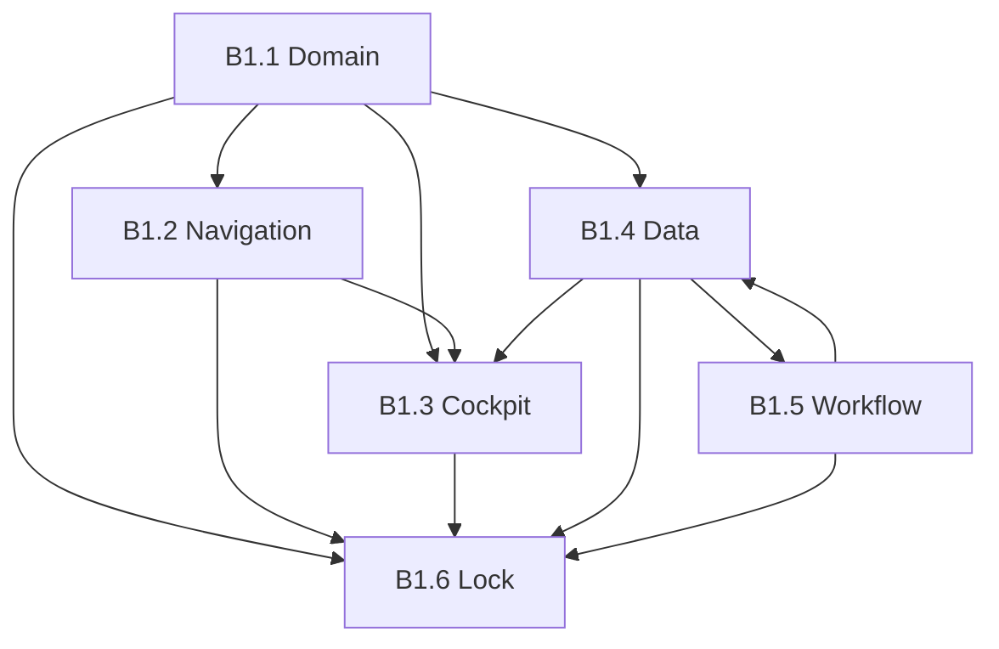

# REMPRES ERP — Phase B1.6
# Vente Final Foundation Lock — Sales Foundation Governance

**Produit :** RemPres ERP  
**Date :** 2026-05-22  
**Mode :** audit final & verrouillage fondation — **aucun code, build, SQL, API, workflow, feature**  
**Prérequis ERP :** M1 · M1.5 · M2 · M2.5 · M3 · M3.75  
**Prérequis Vente :** **B1.1** · **B1.2** · **B1.3** · **B1.4** · **B1.5**  
**Documents sources :** `docs/ERP_VENTE_DOMAIN_ARCHITECTURE_B1_1_REPORT.md` · `ERP_VENTE_SIDEBAR_NAVIGATION_B1_2_REPORT.md` · `ERP_VENTE_COCKPIT_ARCHITECTURE_B1_3_REPORT.md` · `ERP_VENTE_DATA_ENTITY_MODEL_B1_4_REPORT.md` · `ERP_VENTE_WORKFLOW_ARCHITECTURE_B1_5_REPORT.md`

---

## Synthèse exécutive — verdict B1.6

| Question | Réponse honnête |
|----------|-----------------|
| **La fondation Vente est-elle verrouillée ?** | **Oui** — comme **contrat d’architecture et de gouvernance** (B1.1→B1.5). |
| **Le code est-il 100 % conforme ?** | **Non** — dettes **connues, listées, non masquées**. |
| **Peut-on démarrer le premier build métier ?** | **Oui, de manière contrôlée** — avec **obéissance B1** et traitement **P0** en parallèle du build. |
| **Faux green ?** | **Refusé** — ce rapport distingue **LOCK documentaire** vs **READINESS opérationnelle**. |

### Verdict final (section 15)

# SALES FOUNDATION — **LOCKED** (gouvernance) · **PARTIALLY READY** (exécution)

| Critère | Statut B1.6 |
|---------|-------------|
| Cohérente | **Oui** — B1.1→B1.5 compatibles après résolution documentée commande=`sales` |
| Gouvernée | **Oui** — ownership, routes, SoT, workflow contractuels |
| Non hybride | **Non** (runtime) — KPI triple, nav CRM triple, POS/CRM non reliés |
| Non contradictoire | **Oui** (documents) · **Partiel** (code vs B1.4/5) |
| Scalable | **Oui** (conception) · **Non** (multi-tenant) |
| Enterprise-grade | **Oui** (fondation) · build métier **en chemin** |
| Prête pour build | **Partiellement** — voir §8 |

**Après B1.6 :** tout build **CRM · Pipeline · Clients · Devis · POS · Validation · Automation** doit **OBEY** la fondation B1 (B1.1→B1.5 + ce lock). **Interdit** de rouvrir M1→M3.75 ou de « reconstruire Vente » sans décision de gouvernance explicite.

---

## Méthodologie B1.6

| Phase | Méthode |
|-------|---------|
| 1 — Audit global B1 | Relecture croisée des 5 rapports + extraction dettes / verdicts |
| 2–6 — Locks par couche | Validation invariants vs code (grep, tests unitaires M3.5/M3.75) |
| 7 — Cross-layer | Matrice compatibilité Domain ↔ Nav ↔ Cockpit ↔ Data ↔ Workflow |
| 8 — Readiness | Grille par type de build futur |
| 9 — Risques | Consolidation IDs B1 + risques nouveaux cross-layer |
| 10 — Rapport | Ce document = **seule** autorité de lock post-B1 |

**Vérifications runtime (2026-05-22) :**

- `npm test` : **77/77** passed (18 fichiers), dont `m3-5-ux-alignment`, `m3-75-final-lock`.
- Code : `vente-rail-lock.ts`, `erp-ux-architecture.ts`, `DepartmentCockpitPlaceholder`, `getCrmOperationalOverview`, `getDashboardKpis`, pages `vente/**`.

**Interdit respecté :** aucune modification M1→B1.5, aucun build.

---

# 1. Audit global B1 (Phase 1)

## 1.1 Synthèse par phase

| Phase | Objet verrouillé | Verdict document | Alignement code (échantillon) | Dette majeure héritée |
|-------|------------------|------------------|-------------------------------|------------------------|
| **B1.1** | Domaine VENTE, CRM⊂Vente, Commerce capacité | **LOCK** métier | Routes `/vente/*`, `CRM_DEPARTMENT_KEY=VENTE` | D-V2 RBAC `crm` sans dept ; D-V3 reporting |
| **B1.2** | 1 rail, 2 groupes, cockpit entry | **LOCK** nav | `FORBIDDEN_VENTE_TOP_LEVEL` testé ; rail M3.75 | Triple nav CRM (`CRM_NAV`, hub, `CrmOperationalNav`) |
| **B1.3** | Cockpit `/vente/dashboard`, zones M3, KPI contract | **LOCK** cockpit | Placeholder seul ; hub CRM séparé | 3 surfaces KPI |
| **B1.4** | Entités, SoT, ownership, relations | **LOCK** data | Tables 002/004/005/049 présentes | KPI filters ; SEC-1 ; pas multi-tenant |
| **B1.5** | Processus, états, transitions, automation logic | **LOCK** workflow | Commerce RPC/triggers actifs ; CRM read-only | Pas transitions CRM ; conversion devis absente |

## 1.2 Cohérence inter-documents B1

| Thème | B1.1 | B1.4 | B1.5 | B1.6 résolution |
|-------|------|------|------|-----------------|
| Commande commerciale | Owner CRM (texte) | `sales` Commerce | `sales` Commerce | **Officiel : `sales` (Commerce)** — B1.1 libellé **supersédé** par B1.4/5 |
| Homepage Vente | Cockpit dept | — | — | **`/vente/dashboard`** (B1.2/3) |
| Client SoT | `/vente/clients` | `clients` table | — | **Unique** |
| CRM département | Interdit | — | — | **Confirmé** |
| KPI revenus | — | `sales` + lifecycle | — | **Aligné B1.3** via service futur unique |

**Contradiction résolue (lock) :** « commandes CRM » en B1.1 = **capacité navigation** `/vente/crm/orders` → table **`sales`** — **pas** de table `orders`.

## 1.3 Overlaps & dépendances

**Règle de dépendance :** un build ne peut pas violer une couche amont (ex. KPI cockpit sans respect SoT B1.4).

## 1.4 Stabilité architecture — jugement

| Dimension | Stable ? | Preuve |
|-----------|----------|--------|
| Territoire URL `/vente` | **Oui** | Tests M3.5 post-login → `/vente/dashboard` |
| Schéma SQL Commerce+CRM | **Oui** | Migrations 002–005, 034, 049 |
| UX shell M3 | **Oui** | Tests M3.75, pas de secondary sidebar métier |
| Consommation KPI / workflow CRM | **Non** | Fragmentation documentée |

**Conclusion phase 1 :** fondation **architecturalement stable** ; **exécution métier CRM/cockpit** **incomplète** — **pas** un échec de B1, **intention** de la phase foundation-first.

---

# 2. Domain consistency lock (Phase 2 — B1.1)

## 2.1 Invariants verrouillés (non négociables)

| # | Invariant | Statut lock |
|---|-----------|-------------|
| D-L1 | Un seul département commercial : `VENTE` | **LOCKED** |
| D-L2 | CRM = sous-domaine (zone capacité), pas `department_key` CRM | **LOCKED** |
| D-L3 | Commerce = capacité transactionnelle sous Vente | **LOCKED** |
| D-L4 | Préfixe URL unique `/vente/*` | **LOCKED** |
| D-L5 | Finance / Logistique / RH / Marketing **ne possèdent pas** clients, pipeline, devis | **LOCKED** |

## 2.2 Vérification code

| Élément | Attendu B1.1 | Observé |
|---------|--------------|---------|
| `modules/crm/constants/module-keys.ts` | `CRM_DEPARTMENT_KEY = "VENTE"` | Conforme |
| Top-level modules `commerce`/`crm` | Interdit | `FORBIDDEN_VENTE_TOP_LEVEL_MODULE_IDS` + tests |
| Super Admin opérationnel vente | Bloqué | `assertOperationalMutationAllowed` |

## 2.3 Risque régression domaine

| Risque | Mitigation B1.6 |
|--------|-----------------|
| CRM redevient département | Interdit M1.5 + B1.1 ; revue PR sur `department_key` |
| Route hors `/vente` pour métier commercial | B1.2 route ownership |

**Domain lock : CONFIRMED**

---

# 3. Navigation consistency lock (Phase 3 — B1.2)

## 3.1 Invariants verrouillés

| # | Invariant | Statut |
|---|-----------|--------|
| N-L1 | **1 rail** sidebar métier Vente | **LOCKED** |
| N-L2 | **2 groupes** : Commerce + CRM (repliables) | **LOCKED** |
| N-L3 | Accueil fixe → `/vente/dashboard` | **LOCKED** |
| N-L4 | CRM **pas** top-level shell | **LOCKED** |
| N-L5 | Clients canon → `/vente/clients` | **LOCKED** |

## 3.2 Audit code navigation

| Surface | Conforme B1.2 ? | Note |
|---------|-----------------|------|
| `DepartmentBusinessSidebar` + `erp-ux-architecture.ts` | **Oui** | 5 liens CRM contract M3 ; runtime étend via `CRM_NAV` |
| `CRM_NAV` (12 entrées) | **Partiel** | Enrichissement autorisé **si** sous `/vente/crm/*` |
| `CrmOperationalNav` sur hub `/vente/crm` | **Non** | Duplication P0 — **ne pas** étendre |
| `/vente/crm/clients` | **Pont** | Dette route, pas data |
| `/dept/vente` | **Hors rail** | Supervision SA — **pas** cockpit manager |

## 3.3 Tests de non-régression

- `m3-75-final-lock.test.ts` : `FORBIDDEN_VENTE_TOP_LEVEL_MODULE_IDS`, cockpit `departmentKey`.
- `m3-5-ux-alignment.test.ts` : `MANAGER` VENTE → `/vente/dashboard`.

**Navigation lock : CONFIRMED** (contrat) · **dette UX P0** : triple CRM nav.

---

# 4. Cockpit consistency lock (Phase 4 — B1.3)

## 4.1 Invariants verrouillés

| # | Invariant | Statut |
|---|-----------|--------|
| C-L1 | Entry unique manager : `/vente/dashboard` | **LOCKED** |
| C-L2 | Cockpit **≠** hub CRM `/vente/crm` | **LOCKED** |
| C-L3 | Zones `COCKPIT_ZONE_ORDER` (6) | **LOCKED** |
| C-L4 | Mission : pilotage décisionnel, pas help center | **LOCKED** |
| C-L5 | 1 KPI = 1 SoT (B1.4) au build | **LOCKED** |

## 4.2 Audit surfaces

| Surface | Rôle B1.3 | État |
|---------|-----------|------|
| `/vente/dashboard` | **Cockpit officiel** | Placeholder — structure M3 OK |
| `/vente/crm` | Sous-espace CRM | KPI réels — **interdit** comme home |
| `/dept/vente` + API kpis | Supervision | **Interdit** manager home |
| `/dashboard` + `getDashboardKpis` | Legacy SA | Redirect métiers — **interdit** SoT Vente |

## 4.3 Cockpit ≠ CRM — confirmé

Le hub CRM expose `getCrmOperationalOverview` (leads, pipeline, devis) — **complémentaire**, pas **substitut** du cockpit Commerce+global défini B1.3 §4.

**Cockpit lock : CONFIRMED** (spec) · **build data : BLOCKED** jusqu’à service KPI unique (B1.4 P0).

---

# 5. Data model consistency lock (Phase 5 — B1.4)

## 5.1 Invariants verrouillés

| # | Invariant | Statut |
|---|-----------|--------|
| DM-L1 | 1 référentiel `clients` | **LOCKED** |
| DM-L2 | 1 catalogue `products` | **LOCKED** |
| DM-L3 | 1 commande / vente `sales` + `sale_items` | **LOCKED** |
| DM-L4 | CRM `crm_*` sans duplication client | **LOCKED** |
| DM-L5 | Pipeline pondéré SoT = `v_crm_pipeline_weighted` | **LOCKED** |
| DM-L6 | `sales.lifecycle_status` prioritaire sur `deleted_at` | **LOCKED** |

## 5.2 Multi-source KPI — statut

| Source | Usage actuel | Verdict B1.6 |
|--------|--------------|--------------|
| Placeholder cockpit | Aucune data | OK temporaire |
| `getCrmOperationalOverview` | Hub CRM | **Lecture CRM only** |
| `/api/dept/vente/kpis` | Supervision | **Pas** cockpit |
| `getDashboardKpis` | SA / hybrid | **Pas** Vente |

**Data lock : CONFIRMED** · **hybridation consommation : OPEN P0**

## 5.3 Sécurité data (alignement B1.4 §8)

- SEC-1 (`crm` permission sans `department_key`) : **OPEN** — bloquant gouvernance stricte, pas bloquant lock documentaire.

**Data lock : CONFIRMED**

---

# 6. Workflow consistency lock (Phase 6 — B1.5)

## 6.1 Invariants verrouillés

| # | Invariant | Statut |
|---|-----------|--------|
| W-L1 | Processus CRM complet + variante POS documentés | **LOCKED** |
| W-L2 | États = enums DB (pas statuts libres) | **LOCKED** |
| W-L3 | Matrices transitions A/C/X | **LOCKED** |
| W-L4 | Validation ≠ workflow ; approvals séparés | **LOCKED** |
| W-L5 | Conversion devis→vente **transactionnelle** (futur) | **LOCKED** |
| W-L6 | Commerce : create / pay / cancel / archive gouvernés | **LOCKED** |

## 6.2 Réalité vs contrat

| Flux | Contrat B1.5 | Code |
|------|--------------|------|
| POS create | RPC atomique | **Implémenté** |
| Paiement | `updatePaymentStatus` + lifecycle guard | **Implémenté** |
| Annulation | Triggers 034 | **Implémenté** |
| Archivage | RPC + `SALE_DELETED` approval | **Implémenté** |
| Lead→Client, Opp stage, Devis→Vente | Définis | **Non implémenté** (read-only UI) |

**Workflow lock : CONFIRMED** (spec) · **CRM workflow : NOT OPERATIONAL**

---

# 7. Cross-layer compatibility audit (Phase 7)

## 7.1 Matrice de compatibilité

|  | Navigation | Cockpit | Data | Workflow |
|--|------------|---------|------|----------|
| **Domain** | Compatible | Compatible | Compatible | Compatible |
| **Navigation** | — | Compatible (entry) | Compatible (routes→tables) | Compatible |
| **Cockpit** | Compatible | — | **Tension** KPI triple | Compatible (processus affiché) |
| **Data** | Compatible (pont clients) | **Tension** SoT | — | Compatible (FK chain) |
| **Workflow** | Compatible (orders→historique) | Compatible | Compatible | — |

## 7.2 Contradictions cross-layer (consolidées)

| ID | Couches | Description | Sévérité |
|----|---------|-------------|----------|
| XL-1 | Cockpit + Data | 3 moteurs KPI | **Haute** |
| XL-2 | Nav + Data | `/vente/crm/clients` vs `/vente/clients` | Faible |
| XL-3 | Domain + Data | B1.1 commande wording vs `sales` | **Résolu** lock B1.6 |
| XL-4 | Workflow + Data | `deleted_at` vs `lifecycle_status` requêtes | **Haute** |
| XL-5 | Cockpit + Nav | Hub CRM ressemble home | Moyenne — gouverné B1.3 |
| XL-6 | Workflow + Security | CRM mutations absentes → RLS non exercée | Moyenne |
| XL-7 | Data + Workflow | FK bidirectionnelle devis/vente sans orchestration | **Haute** au build conversion |

## 7.3 Dépendances build futur (ordre recommandé)

1. **P0** Service KPI + filtres `lifecycle_status` (Data + Cockpit).  
2. **P0** State machine CRM + conversion devis (Workflow + Data).  
3. **P1** Nettoyage nav CRM duplicate (Navigation).  
4. **P1** SEC-1 dept guard (Data + Workflow security).  
5. **P2** Cockpit branché (Cockpit).  
6. **P3** Automation jobs (Workflow §7 B1.5).

**Cohérence globale : ACCEPTABLE pour lock** · **7 tensions** traçables, **aucune** invalidant le contrat B1.

---

# 8. Sales build readiness review (Phase 8)

Légende : **Prêt** = peut démarrer en respectant B1 · **Partiel** = sous-ensemble seulement · **Bloqué** = prérequis P0 manquant

| Build futur | Readiness | Prérequis | Risque principal |
|-------------|-----------|-----------|------------------|
| **POS / nouvelle-vente** | **Partiel** | B1.4 SoT CA ; B1.5 POS flow | KPI cockpit incohérents si branchés sur mauvaise source |
| **Historique ventes** | **Partiel** | lifecycle filters (XL-4) | Commentaire soft-delete legacy |
| **Clients** | **Partiel** | CRUD existant ; pont nav | Double route CRM |
| **Produits / stock commercial** | **Partiel** | Logistique frontière B1.1 | Stock dual ownership long terme |
| **CRM — lecture** | **Prêt** | Listes OK | — |
| **CRM — mutations** | **Bloqué** | State machine B1.5 P0 | États invalides en DB |
| **Pipeline** | **Bloqué** | Transitions stage | Read-only |
| **Devis** | **Bloqué** | CRUD + statuts + conversion | Pas de write path |
| **Conversion devis→vente** | **Bloqué** | Transaction unique XL-7 | Désync FK |
| **Cockpit Vente data** | **Bloqué** | `VenteCockpitDataService` P0 | Triple KPI |
| **Validations CRM** | **Bloqué** | Brancher `CRM_APPROVAL_ENTITY_TYPES` | Colonnes dormantes |
| **Automation CRM** | **Bloqué** | Workflow ops + règles §7 B1.5 | Spam / opaque |
| **Notifications métier** | **Bloqué** | Owner-scoped rules | Infra stub |

### 8.1 Ordre de build métier recommandé (post-lock)

1. **B2.0** — Gouvernance exécution : KPI service + lifecycle queries + SEC-1.  
2. **B2.1** — CRM write path (leads, opp, quotes) state machine.  
3. **B2.2** — Conversion devis → vente.  
4. **B2.3** — Cockpit `/vente/dashboard` data.  
5. **B2.4** — Automation & notifications.

**Readiness globale : PARTIELLEMENT PRÊT** — **POS/Commerce** oui en maintenance ; **CRM/Pipeline/Devis** **non** sans B2.0–B2.1.

---

# 9. Sales foundation risk matrix (Phase 9)

| ID | Catégorie | Risque | Prob. | Impact | Mitigation |
|----|-----------|--------|-------|--------|------------|
| R-B1 | Gouvernance | Violation M1.5 (CRM dept) | Faible | Critique | PR checklist B1.6 |
| R-B2 | Sécurité | SEC-1 cross-dept CRM perm | Moyenne | Haute | SQL guard P1 |
| R-B3 | Data | KPI contradictoires managers | Haute | Haute | P0 service unique |
| R-B4 | Workflow | Saut conversion sans transaction | Haute | Critique | B2.2 spec B1.5 |
| R-B5 | UX | Hub CRM perçu comme home | Moyenne | Moyenne | B1.3 + copy UI |
| R-B6 | UX | Triple navigation CRM | Haute | Moyenne | Retirer `CrmOperationalNav` P1 |
| R-B7 | Tech | `deleted_at` sur ventes | Moyenne | Moyenne | Requêtes lifecycle only |
| R-B8 | Scalabilité | Multi-tenant absent | Moyenne | Haute | Core org future |
| R-B9 | Process | ERP_APPROVAL_STRICT=false soft-pass | Moyenne | Moyenne | Activer prod |
| R-B10 | Dette | Fichiers shell legacy orphelins | Faible | Faible | Cleanup post-B2 |

---

# 10. Dette restante (consolidée)

| Priorité | ID(s) | Couche | Description |
|----------|-------|--------|-------------|
| **P0** | XL-1, D-C1, P0 B1.4 | Cockpit/Data | Service KPI unique + définitions net/lifecycle |
| **P0** | XL-4, I1–I2 B1.4 | Data | Aligner toutes requêtes `sales` sur `lifecycle_status` |
| **P0** | B2.5 P0 | Workflow | State machine CRM + server actions |
| **P0** | XL-7 | Workflow/Data | Conversion devis transactionnelle |
| **P1** | D-V2, SEC-1 | Security | `department_key` sur CRM permissions |
| **P1** | N-P0 B1.2 | Navigation | Supprimer duplication `CrmOperationalNav` |
| **P1** | WI3 B1.5 | Workflow | Job expiration devis |
| **P2** | D-V3, D-V5 | Domain/Nav | Reporting `crm` module mapping |
| **P2** | L4 B1.4 | Nav | Pont `/vente/crm/clients` |
| **P3** | Multi-tenant B1.4 | Scalability | `organization_id` core |

---

# 11. Legacy restant (cartographie — rien supprimé)

| Zone | Type | Action future |
|------|------|---------------|
| `PrimarySidebar`, `SecondarySidebar`, `MobileSidebar` | UX orphelin | Cleanup |
| `DashboardClient` hybrid | Route legacy | Purge si unused |
| `getDashboardKpis` global | KPI legacy | SA only |
| `sales.deleted_at` | Colonne obsolète | Requêtes → lifecycle |
| `historique/actions.ts` comment soft-delete | Doc | Aligner B1.5 |
| `CRM_NAV` vs M3 5 liens | Nav | Documenter écart officiel |
| `constants/departments` → `/dept/vente` | Supervision | Garder hors manager |
| `CrmWorkflowShell` vide | Workflow | Brancher B2 |
| `modules/automation/*` stubs | Automation | B2.4 |

---

# 12. Liste complète — incohérences détectées (B1.6 consolidé)

| # | Incohérence | Source | Statut post-lock |
|---|-------------|--------|------------------|
| 1 | Triple surface KPI (placeholder, dept API, CRM hub) | B1.3, B1.4 | **OPEN P0** |
| 2 | Filtres `sales` : lifecycle vs `deleted_at` vs brut | B1.4, B1.5 | **OPEN P0** |
| 3 | CRM UI read-only vs workflow B1.5 défini | B1.5 | **OPEN P0** |
| 4 | `approval_request_id` CRM non branché | B1.5 | **OPEN P1** |
| 5 | Triple nav CRM | B1.2 | **OPEN P1** |
| 6 | `getCrmOperationalOverview` opps sans filtre terminal | B1.4, B1.5 | **OPEN P1** |
| 7 | Double FK devis↔vente sans orchestration | B1.4, B1.5 | **OPEN P0** (au conversion build) |
| 8 | Permission `crm` sans dept guard | B1.1, B1.4 | **OPEN P1** |
| 9 | Hub `/vente/crm` vs cockpit entry | B1.3 | **GOUVERNÉ** — pas bug si règles respectées |
| 10 | B1.1 « commandes » owner CRM | B1.1 vs B1.4 | **CLOSED** — `sales` Commerce |
| 11 | Devis `expired` jamais auto | B1.5 | **OPEN P1** |
| 12 | Commentaire archivage soft-delete | B1.5 | **OPEN P2** |

---

# 13. Liste complète — risques futurs (B1.6)

| # | Risque | Si build ignore B1 |
|---|--------|-------------------|
| 1 | Table `orders` parallèle à `sales` | Chaos entité |
| 2 | Second référentiel clients CRM | PII duplicate |
| 3 | Cockpit sur `getDashboardKpis` | KPI faux + hybrid dept |
| 4 | CRM top-level module | Violation M1.5 |
| 5 | Statuts hors CHECK SQL | DB corruption |
| 6 | Automation sans owner scope | Fuite M2 |
| 7 | Build pipeline sans stage référentiel | Pipeline invalide |
| 8 | POS obligatoire sans variante documentée | Process non conforme |
| 9 | Réouverture M1→B1.x sans change control | Foundation regression |
| 10 | Multi-tenant patch par table | RLS ingérable |

---

# 14. Liste complète — problèmes encore ouverts

| # | Problème | Owner phase build | Bloquant ? |
|---|----------|-------------------|------------|
| O-1 | Cockpit sans données métier | B2.3 | Non pour Commerce seul |
| O-2 | CRM mutations absentes | B2.1 | **Oui** pour CRM build |
| O-3 | Conversion devis→vente | B2.2 | **Oui** pour parcours B2B |
| O-4 | KPI service unique | B2.0 | **Oui** pour cockpit fiable |
| O-5 | SEC-1 dept guard | B2.0 | **Oui** prod stricte |
| O-6 | Nav CRM triple | B2.x UX | Non fonctionnel |
| O-7 | Multi-tenant | Plateforme | Non PME mono-org |
| O-8 | Objectifs commerciaux (entité F) | Futur | Non MVP |
| O-9 | Soft-pass approvals si strict off | Ops | Moyen |
| O-10 | Fichiers legacy shell | Maintenance | Non |

---

# 15. Verdict final — Sales Foundation Lock

## 15.1 Déclaration officielle B1.6

À la date **2026-05-22**, la **fondation Vente REMPRES ERP (B1)** est :

### **FOUNDATION LOCKED**

Les documents suivants constituent la **loi** pour tout build métier Vente :

| Document | Rôle |
|----------|------|
| `ERP_VENTE_DOMAIN_ARCHITECTURE_B1_1_REPORT.md` | Domain & ownership |
| `ERP_VENTE_SIDEBAR_NAVIGATION_B1_2_REPORT.md` | Navigation |
| `ERP_VENTE_COCKPIT_ARCHITECTURE_B1_3_REPORT.md` | Cockpit |
| `ERP_VENTE_DATA_ENTITY_MODEL_B1_4_REPORT.md` | Data & SoT |
| `ERP_VENTE_WORKFLOW_ARCHITECTURE_B1_5_REPORT.md` | Workflow |
| **`ERP_VENTE_FINAL_FOUNDATION_LOCK_B1_6_REPORT.md`** | **Lock final & readiness** |

**Modifications interdites** sans processus de change : M1, M1.5, M2, M2.5, M3, M3.75, B1.1→B1.5.

## 15.2 Grille verdict (sans faux 100 %)

| Critère | Verdict |
|---------|---------|
| **Cohérente** | **Oui** — B1 cross-validé ; 1 contradiction B1.1 textuelle **close** |
| **Gouvernée** | **Oui** — matrices ownership, nav, SoT, workflow |
| **Non hybride** | **Non (runtime)** — hybrides **bornés** et listés |
| **Non contradictoire** | **Oui (documents)** · code partiellement en retard |
| **Scalable** | **Oui** design · **non** multi-tenant |
| **Enterprise-grade** | **Oui** fondation · exécution CRM **immature** |
| **Prête pour build** | **PARTIELLEMENT** — Commerce **oui** ; CRM/Pipeline/Devis/Cockpit data **non** sans B2.0–B2.1 |

## 15.3 Formulation pour les équipes build

> **Tu peux coder** tant que tu **obéis B1**.  
> **Tu ne peux pas** improviser entités, routes, KPI, états, ou homepage.  
> **Tu dois traiter P0** si ton build touche cockpit KPI, lifecycle ventes, ou écriture CRM.

## 15.4 Sign-off technique (audit B1.6)

| Contrôle | Résultat |
|----------|----------|
| Rapports B1.1–B1.5 présents | **OK** |
| Tests fondation UX (77) | **OK** |
| Régression M3.75 rail Vente | **OK** |
| Schéma SQL Commerce+CRM | **OK** |
| Workflow CRM opérationnel | **KO** (attendu) |
| KPI cockpit unifié | **KO** (attendu) |

---

## Annexe A — Checklist PR (obligatoire post-B1.6)

- [ ] Routes sous `/vente/*` uniquement (sauf supervision `/dept/vente` SA)
- [ ] Pas de `department_key` CRM
- [ ] Cockpit manager → `/vente/dashboard` data via futur service SoT
- [ ] Pas de nouvelle table client/commande/catalogue
- [ ] Transitions CRM respectent matrices B1.5
- [ ] `sales` queries utilisent `lifecycle_status`
- [ ] Pas de `CrmOperationalNav` duplication ajoutée
- [ ] Tests M3.5 / M3.75 passent

## Annexe B — Référence rapide entry points

| Rôle | Entry officielle |
|------|------------------|
| Manager / Agent Vente | `/vente/dashboard` |
| Opération POS | `/vente/nouvelle-vente` |
| CRM opérationnel | `/vente/crm/*` (sous-pages) |
| Super Admin supervision | `/dept/vente` (pas home métier) |

---

*Document généré en mode Foundation Lock strict — Phase B1.6. Aucun artefact de build produit. La fondation Vente est **verrouillée** ; le premier build métier autorisé est **conditionnel** aux règles §8 et checklist Annexe A.*
