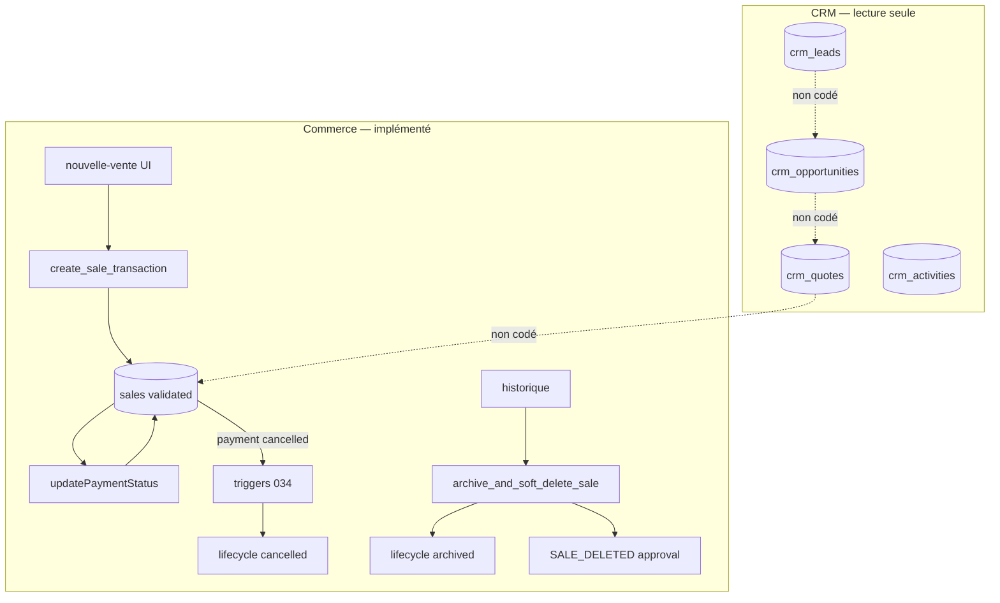
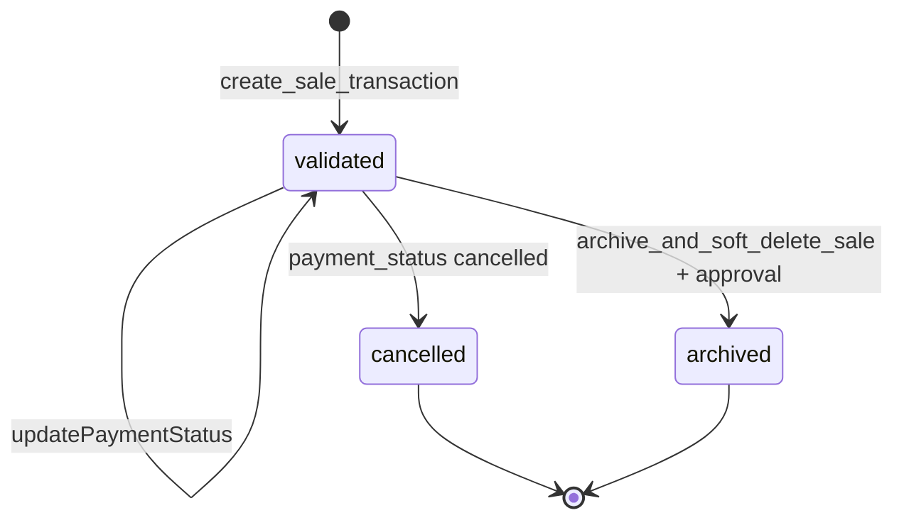
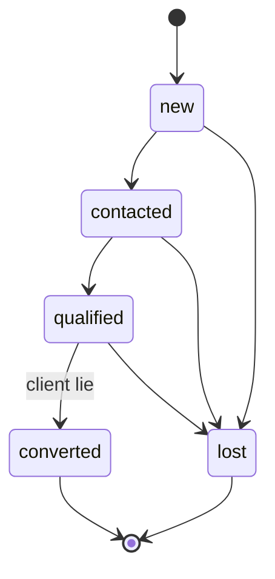

# REMPRES ERP — Phase B1.5
# Vente Workflow Architecture — Sales Workflow Governance

**Produit :** RemPres ERP  
**Date :** 2026-05-22  
**Mode :** architecture workflow & processus — **aucun code, API, SQL, trigger, automation build, UI**  
**Prérequis verrouillés :** M1 · M1.5 · M2 · M2.5 · M3 · M3.75 · **B1.1** · **B1.2** · **B1.3** · **B1.4**  
**Compléments :** `docs/ERP_VENTE_DATA_ENTITY_MODEL_B1_4_REPORT.md` · rapports B1.1–B1.3

---

## Synthèse exécutive

| Verdict | Formulation |
|---------|-------------|
| **Mission B1.5** | Verrouiller le **workflow Vente** (processus, états, transitions, validations, logique d’automation) **avant** build métier |
| **Workflow Commerce (`sales`)** | **Partiellement implémenté** — RPC `create_sale_transaction`, lifecycle 034, paiement, archivage + gouvernance `SALE_DELETED` |
| **Workflow CRM (`crm_*`)** | **Schéma + lecture seule UI** — statuts DB définis, **aucune** server action de transition ; colonnes `approval_request_id` **non branchées** |
| **Dette critique** | Pas de workflow conversion Lead→Client, Devis→Vente ; **double dimension** vente (`lifecycle_status` + `payment_status`) ; approvals CRM **dormants** ; automation CRM **inexistante** |
| **Processus officiel** | **Deux voies** : parcours CRM complet **et** vente directe POS (légitime, non bypass frauduleux) |

**B1.5 ne construit rien.** Il impose le **contrat opérationnel** que CRM, pipeline, devis, ventes, notifications et automations futures **doivent obéir**.

---

## Méthodologie d’audit (Phases 1 & 9)

| Zone | Artefacts audités |
|------|-------------------|
| SQL lifecycle / triggers | `005_vente_schema.sql`, `009_fix_sale_transaction.sql`, `034_erp_sale_lifecycle_and_audit.sql`, `049_crm_sales_domain_enterprise.sql` |
| Server workflow Commerce | `lib/server/sales.ts`, `app/(app)/vente/nouvelle-vente/actions.ts`, `app/(app)/vente/historique/actions.ts` |
| Gouvernance approvals | `lib/approvals/*`, `lib/governance/approvals/*`, `036_governance_approval_requests.sql` |
| CRM module | `modules/crm/server/repositories/*`, `crm-overview.ts`, `crm-audit-hook.ts`, `approval-entities.ts`, pages `app/(app)/vente/crm/**` |
| Automation / notifications | `modules/automation/*`, `modules/crm/realtime/crm-channel-policy.ts`, settings notifications (gouvernance transverse) |

**Constat méthodologique :** les repositories CRM ne font que **`select`** — **aucun** `insert`/`update` métier CRM dans le code applicatif audité.

---

# 1. Workflow actuel (audit phase 1)

## 1.1 Commerce — vente POS / historique (workflow **réel** partiel)

| Étape | Implémentation observée | Automatisation |
|-------|------------------------|----------------|
| Création vente | RPC `create_sale_transaction` (stock lock, items, mouvements, FT via `record_financial_transaction`) | **DB** atomique |
| Référence | Trigger `generate_sale_reference` → `VNT-YYYY-NNNN` | **DB** |
| Lifecycle initial | `lifecycle_status = validated` (défaut 034) | **DB** |
| Paiement | `updatePaymentStatus` TS — garde `lifecycle_status = validated` | **Manuel** |
| Annulation | `payment_status = cancelled` → trigger → `lifecycle_status = cancelled` + FT cancelled | **DB** sync |
| Archivage | RPC `archive_and_soft_delete_sale` + action `archiveAndDeleteSaleAction` | **Manuel** + approval |
| Liste historique | Filtre `lifecycle_status != archived` | **Lecture** |

**Validations actives (Commerce) :**

- Zod `createSaleSchema` / `updatePaymentStatusSchema` (TS).
- RPC : panier non vide, stock, remises 0–100 %, modes paiement (subset dans 009).
- Permission `vente`/`produits` + `assertOperationalMutationAllowed` (bloque super_admin opérationnel).
- RLS : update vente **uniquement** si `lifecycle_status = validated` (034).

## 1.2 CRM — leads, pipeline, devis, activités (workflow **schéma seulement**)

| Entité | Statuts / mécanisme DB | Code applicatif transition |
|--------|------------------------|----------------------------|
| `crm_leads` | `new`, `contacted`, `qualified`, `converted`, `lost` | **Lecture** tables pages — **pas de mutation** |
| `crm_opportunities` | Progression par `stage_id` → référentiel `crm_pipeline_stages` | **Lecture** ; trigger probabilité sur changement stage |
| `crm_quotes` | `draft`, `sent`, `accepted`, `rejected`, `expired`, `converted` | **Lecture** ; auto `quote_number` ; total lignes par trigger |
| `crm_activities` | Types + `related_kind` polymorphe | **Lecture** |
| Approvals CRM | Colonnes `approval_request_id` sur opp/devis | **Constantes** `CRM_APPROVAL_ENTITY_TYPES` — **aucun** branchement workflow TS |

**Pages CRM :** affichage listes (leads, quotes, pipeline, opportunities) — **pas** de boutons transition, **pas** de server actions dédiées.

## 1.3 Gouvernance transverse (approvals & audit)

| Mécanisme | Périmètre Vente observé |
|-----------|-------------------------|
| `isSensitiveAction` | `SALE_DELETED` (archivage vente), `CLIENT_DELETED`, `PRODUCT_ARCHIVED` |
| `enforceGovernanceApproval` | Crée `approval_requests` + alerte gouvernance si rôle non autorisé et mode strict |
| `APPROVAL_RULES` | `SALE_DELETED` → super_admin ; soft-pass si `ERP_APPROVAL_STRICT` ≠ true |
| `recordCrmGovernanceAudit` | Hook prêt — **appels mutation CRM absents** |
| `activity_logs` | Vente create/update ; filtre KPI hétérogène |

## 1.4 Notifications & automation

| Capacité | État |
|----------|------|
| Notifications métier Vente (relance lead, devis expiré…) | **Non implémentées** |
| `modules/automation/notifications` | Stub — réutiliser canaux gouvernance |
| `CRM_REALTIME_SCOPE_PREFIX` | Constante — **pas** de subscriptions actives auditées sur tables CRM |
| Jobs batch forecast | Table `crm_forecast_snapshots` — **pas** de job applicatif audité |
| Centre `/settings/notifications` | Gouvernance transverse, pas workflow Vente |

## 1.5 Diagramme — workflow **réel** aujourd’hui



---

# 2. Legacy workflow

| ID | Legacy | Localisation | Impact |
|----|--------|--------------|--------|
| W-L1 | Commentaire action archive « soft delete » vs RPC **sans** `deleted_at` | `historique/actions.ts` vs `034` | Documentation code ≠ vérité B1.4 |
| W-L2 | `getDashboardKpis` / dept KPI — filtres vente hétérogènes | B1.4 I1–I2 | Pas workflow mais incohérence « clôture » CA |
| W-L3 | `user_has_crm_module_permission` sans dept | 049 | Transition CRM par rôle hors Vente théorique |
| W-L4 | `permissions.module_key = crm` parallèle `vente` | 049 | Même périmètre, deux clés |
| W-L5 | `CrmWorkflowShell` | composant vide coque | Promesse workflow sans moteur |
| W-L6 | `approval_request_id` CRM | colonnes SQL | Préparation RH/Finance-like non activée Vente |
| W-L7 | `sales.deleted_at` | obsolète 034 | Risque requêtes legacy |
| W-L8 | Devis `valid_until` sans job expiration | 049 | Statut `expired` **jamais** appliqué auto |

---

# 3. Processus officiel Vente (Phase 2)

## 3.1 Processus principal (normatif B1.5)

> **Parcours CRM complet** — obligatoire lorsque la vente est précédée d’une relation structurée (B2B, cycle long, devis formel).

```
[Entrée lead]
    → qualification
    → opportunité (pipeline)
    → devis
    → validation commerciale / gouvernance (si seuils)
    → conversion vente (sales)
    → suivi paiement
    → suivi relation (activités)
    → clôture / archivage gouverné
```

## 3.2 Variante officielle — **vente directe** (POS)

> **Autorisée** — ne constitue **pas** un bypass si le client existe ou est créé via `clients` / quick client.

```
[Client existant ou création rapide]
    → nouvelle-vente (create_sale_transaction)
    → suivi paiement
    → (optionnel) rattachement CRM a posteriori via FK crm_* sur sales
```

**Règle :** la vente directe **ne supprime pas** l’obligation de référentiel client unique (`clients`). Elle **court-circuite** seulement lead/opportunité/devis **quand** le contexte commercial ne les exige pas.

## 3.3 Variante — **lead converti sans devis**

```
Lead qualified → converted + clients
    → opportunité (recommandé)
    → vente directe OU devis selon politique interne
```

## 3.4 Exclusions explicites (hors processus Vente)

| Processus | Owner | Raison |
|---------|-------|--------|
| Comptabilisation / lettrage | Finance | Aval financier |
| Livraison / tournée | Logistique | Exécution physique |
| Campagne acquisition | Marketing | Amont non converti |
| Paie / objectifs RH | RH | Hors closing |
| Paramétrage plateforme | Super Admin | Gouvernance |

## 3.5 Limites du processus officiel (honnêtes)

- Les transitions CRM **ne sont pas encore exécutables** dans l’app — le processus §3.1 est **contractuel**, pas opérationnel.
- La **conversion devis → vente** doit être **transactionnelle** (B1.4 D5) — non existante.
- Le **suivi relation** post-vente repose sur `crm_activities` — pas de workflow « clôture relation » distinct.

---

# 4. États officiels — gouvernance (Phase 3)

**Principe B1.5 :** un état officiel = **valeur persistée** (colonne ou stage FK) **ou** dérivation normée documentée. **Interdit** : statuts libres hors enum / hors référentiel.

## 4.1 Lead (`crm_leads.status`)

| État DB | Libellé métier officiel | Officiel | Interdit alias |
|---------|----------------------|----------|----------------|
| `new` | Nouveau | **Oui** | — |
| `contacted` | Contacté | **Oui** | — |
| `qualified` | Qualifié | **Oui** | « Actif » vague |
| `converted` | Converti (terminal succès) | **Oui** | Suppression lead |
| `lost` | Rejeté / perdu (terminal échec) | **Oui** | `deleted` comme statut métier |

**États demandés phase → mapping :**

| Demandé | Officiel B1.5 |
|---------|---------------|
| nouveau | `new` |
| qualifié | `qualified` (+ `contacted` étape intermédiaire) |
| rejeté | `lost` |
| converti | `converted` |

## 4.2 Opportunité — **états = étapes pipeline** (`crm_pipeline_stages`)

Les opportunités **n’ont pas** de colonne `status` libre. L’état officiel est **`stage_id`** → `code` référentiel.

| Stage code (seed 049) | État métier officiel | Terminal |
|----------------------|----------------------|----------|
| `prospecting` | Ouverte — prospection | Non |
| `qualification` | Active — qualification | Non |
| `proposal` | Active — proposition | Non |
| `negotiation` | Active — négociation | Non |
| `closed_won` | Gagnée | **Oui** (win) |
| `closed_lost` | Perdue | **Oui** (loss) |

| Concept demandé | Officiel B1.5 |
|-----------------|---------------|
| ouverte | stages non terminaux |
| active | `qualification` … `negotiation` |
| bloquée | **`approval_request_id` IS NOT NULL** AND demande `pending` (dérivé, pas colonne) |
| gagnée | `closed_won` |
| perdue | `closed_lost` |

**Interdit :** champ `status` texte parallèle sur `crm_opportunities`.

## 4.3 Devis (`crm_quotes.status`)

| État DB | Officiel | Terminal |
|---------|----------|----------|
| `draft` | Brouillon | Non |
| `sent` | Envoyé | Non |
| `accepted` | Accepté | Non (pré-conversion) |
| `rejected` | Refusé / annulé négociation | **Oui** |
| `expired` | Expiré | **Oui** |
| `converted` | Converti en vente | **Oui** (succès) |

| Demandé | Officiel |
|---------|----------|
| brouillon | `draft` |
| envoyé | `sent` |
| accepté | `accepted` |
| expiré | `expired` |
| annulé | `rejected` (pas de valeur `cancelled` séparée) |

## 4.4 Vente (`sales`) — **double dimension officielle**

B1.5 **verrouille deux axes** — **ne pas fusionner** :

### Axe A — `lifecycle_status` (cycle de vie ERP / historique)

| Valeur | Libellé officiel | Opérationnel |
|--------|------------------|--------------|
| `validated` | Validée (en cours) | **Oui** |
| `cancelled` | Annulée | Non — trace conservée |
| `archived` | Archivée | Non — hors vues opérationnelles |

### Axe B — `payment_status` (encaissement commercial)

| Valeur | Libellé |
|--------|---------|
| `pending` | En attente |
| `partial` | Partiel |
| `paid` | Payé |
| `overdue` | En retard |
| `cancelled` | Paiement annulé |

| Demandé utilisateur | Mapping officiel B1.5 |
|--------------------|----------------------|
| créée | Instant T0 : `lifecycle_status=validated` + `payment_status=pending` (post-RPC) |
| validée | `lifecycle_status=validated` |
| clôturée (métier) | `payment_status=paid` **ET** `lifecycle_status=validated` |
| archivée | `lifecycle_status=archived` |
| (annulée) | `lifecycle_status=cancelled` (+ sync `payment_status`) |

**Interdit :**

- Utiliser `deleted_at` comme état workflow.
- Introduire `lifecycle_status=closed` sans migration gouvernée.
- « Clôturée » = `archived` (erreur sémantique courante).

---

# 5. Transitions officielles (Phase 4)

Légende : **A** = autorisée · **C** = conditionnelle · **X** = interdite

## 5.1 Lead

| De → À | Code | Règle |
|--------|------|-------|
| `new` → `contacted` | **A** | Agent CRM update |
| `new` → `qualified` | **C** | Qualification directe autorisée si règle métier |
| `*` → `lost` | **A** | `lost_reason` recommandé |
| `qualified` → `converted` | **C** | **Exige** `converted_client_id` renseigné + client créé/liaison |
| `converted` → `*` | **X** | Terminal — correction = gouvernance |
| `lost` → `*` | **X** | Terminal — réouverture = nouveau lead (nouvel enregistrement) |
| `*` → `deleted_at` | **C** | Soft delete — audit, pas transition métier |

## 5.2 Opportunité (changement `stage_id`)

| Transition | Code | Condition |
|------------|------|-----------|
| Stage avant → stage suivant (ordre `sort_order`) | **A** | Non terminal |
| Saut avant → `closed_won` | **C** | Manager ou règle montant ; approval si seuil |
| Saut → `closed_lost` | **A** | `lost_reason` |
| `closed_won` → autre | **X** | Terminal |
| `closed_lost` → autre | **X** | Terminal |
| Toute transition si approval pending bloquant | **X** | Statut dérivé « bloquée » |

**Trigger existant :** changement `stage_id` → recalcul `probability_pct` (049) — **automation autorisée** B1.5.

## 5.3 Devis

| De → À | Code | Condition |
|--------|------|-----------|
| `draft` → `sent` | **A** | Lignes > 0, client valide |
| `sent` → `accepted` | **A** | — |
| `sent` → `rejected` | **A** | — |
| `sent` → `expired` | **A** | `valid_until < today` (manuel ou **job futur**) |
| `accepted` → `converted` | **C** | **Exige** création/liaison `sales` + cohérence FK bidirectionnelle |
| `converted` → `*` | **X** | Terminal |
| `draft` → `converted` | **X** | Bypass envoi — **interdit** |
| `*` → `draft` après `sent` | **X** | Rétrogradation — nouvelle version devis (futur) |

## 5.4 Vente — lifecycle & paiement

| Action | Transition | Code | Acteur |
|--------|------------|------|--------|
| Création POS | → `validated` + payment initial | **A** | Agent Vente (RPC) |
| Mise à jour paiement | payment `pending/partial/paid/overdue` | **A** | Si `lifecycle=validated` |
| Annulation | payment → `cancelled` → lifecycle `cancelled` | **A** | Manager / règle ; sync FT trigger |
| Archivage | `validated` → `archived` | **C** | Permission delete + **approval** `SALE_DELETED` |
| Update lignes / client après archivage | **X** | — |
| Update si `cancelled` | **X** | — |
| Conversion depuis devis | création sale + `crm_quotes.status=converted` | **C** | Workflow B2 — **transaction unique** |

## 5.5 Transitions inter-entités (chaîne B1.4)

| Transition | Code | Conditions officielles |
|------------|------|----------------------|
| Lead → Client | **C** | `converted` + `converted_client_id` |
| Lead → Opportunité | **A** | `lead_id` FK ; client optionnel |
| Client → Opportunité | **A** | `client_id` requis si pas de lead |
| Opportunité → Devis | **A** | `opportunity_id` ; client du devis = client opp |
| Devis → Vente | **C** | `converted` + `sale_id` + `sales.crm_quote_id` alignés |
| Opportunité → Vente (sans devis) | **C** | Politique entreprise ; FK `crm_opportunity_id` |
| Vente → Activité CRM | **A** | `related_kind=sale` |

**Interdit global :** opportunité `closed_lost` → devis `sent` ; devis `converted` → nouveau devis actif sur même opp sans gouvernance.

---

# 6. Validation & approval governance (Phase 5)

**Séparation B1.5 :** le **workflow** = enchaînement d’états ; la **validation** = autorisation ponctuelle ou gouvernance **sans** remplacer le workflow.

## 6.1 Matrice validation — actions

| Action | Auto (agent) | Manager Vente | Super Admin | Interdit | État actuel code |
|--------|--------------|---------------|-------------|----------|------------------|
| Créer lead / opp / devis | **Futur** auto | **Futur** | SA | Autre dept | **Non codé** |
| Envoyer devis | **Futur** auto | — | — | — | **Non codé** |
| Remise globale vente > seuil | — | **C** futur | **C** | Agent seul | Seuil **non** défini — RPC valide 0–100 % |
| Devis montant > seuil | — | **C** futur | **C** | — | Colonne `approval_request_id` — **non branchée** |
| Opportunité discount exceptionnel | — | **C** futur | — | — | **Non codé** |
| Annuler vente (`payment cancelled`) | **C** | **A** | **A** | Agent sans droit update | Trigger DB — pas d’approval dédié |
| Archiver vente | — | **C** | **A** (direct si rôle) | Agent sans delete | **Implémenté** + `SALE_DELETED` |
| Supprimer client / archiver produit | — | **C** | **A** | — | `CLIENT_DELETED`, `PRODUCT_ARCHIVED` rules |
| Modifier vente archivée | — | — | — | **Tous** | RLS 034 |
| Pipeline stage référentiel | — | — | **A** write | Agents | SQL 049 SA only |

## 6.2 Approvals — infrastructure vs Vente

| `entity_type` (constants) | Prévu pour | Branché |
|---------------------------|------------|---------|
| `crm_quote` | Devis sensibles | **Non** |
| `crm_opportunity` | Opp bloquée / montant | **Non** |
| `sales` (via audit) | Archivage | **Oui** (`SALE_DELETED`) |

**Mode strict :** `ERP_APPROVAL_STRICT=true` → rôle non listé = blocage ; sinon soft-pass (dette compatibilité).

## 6.3 Règle anti-confusion

- **Validation manager** sur devis **n’est pas** le passage à `sent` — ce sont deux axes.
- **Approval gouvernance** (`approval_requests`) **complète** le workflow, ne le remplace pas.

---

# 7. Automation logic (Phase 6) — logique uniquement

**Aucun build.** Définition de ce qui sera **autorisé** vs **interdit**.

## 7.1 Automations **autorisées** (existant ou futur proche)

| Cas | Logique | Mode | Notes |
|-----|---------|------|-------|
| Référence vente / devis | Génération séquentielle année | **Auto DB** | Existant |
| Total devis | Recalcul somme lignes | **Auto DB** | Existant |
| Probabilité opp | Sync sur changement stage | **Auto DB** | Existant |
| Annulation vente → FT | Sync `financial_transactions` | **Auto DB** | Existant 034 |
| Promotion `partial` → `paid` | Si montant ≥ total | **Auto TS** | `updatePaymentStatus` |
| Alerte approval créée | `tryCreateAlert` gouvernance | **Auto** | Archivage sensible |

## 7.2 Automations **conditionnelles** (futures — gouvernées)

| Cas | Logique | Garde-fou B1.5 |
|-----|---------|----------------|
| Devis expiré | Si `valid_until` dépassé → `expired` | Job quotidien ; **pas** spam mail ; 1 notif / devis |
| Lead sans activité N jours | Tâche `crm_activities` ou notif agent **owner** | Uniquement `owner_id` ; pas broadcast dept |
| Opp stagnation stage | Alerte manager si > X jours | Seuil configurable |
| Pipeline bloqué (approval pending) | Rappel validateur | Max 1/jour |
| Relance devis `sent` | Email / tâche | Opt-in client ; journal activité |
| Forecast snapshot | Agrégation batch → `crm_forecast_snapshots` | **Pas** SoT temps réel (B1.4) |

## 7.3 Automations **interdites**

| Cas | Raison |
|-----|--------|
| Création vente sans stock check | Intégrité Commerce |
| Transition CRM masse sans audit | Traçabilité |
| Auto `converted` devis sans `sales` | SoT rupture |
| Notifications cross-dept non filtrées | M2 |
| Réouverture terminal (`converted`, `closed_won`) par job | Chaos états |
| Multiplication payloads KPI sur événement | B1.4 SoT |

## 7.4 Notifications — placement officiel

| Type | Canal officiel futur |
|------|---------------------|
| Gouvernance sensible | Alertes gouvernance existantes |
| Rappels commerciaux agent | Module Vente / CRM — **pas** mélange Settings |
| Paramètres utilisateur | `/settings/notifications` — préférences seulement |

---

# 8. Workflow security (Phase 7 — M2 + B1.4)

## 8.1 Matrice acteur × transition

| Transition | Agent Vente | Manager Vente | Accountant | Auditor | Super Admin |
|------------|-------------|---------------|------------|---------|-------------|
| Lire CRM / ventes | **R** si perm | **R** | **R** | **R** | **R** (pas opérationnel) |
| Créer vente POS | **W** | **W** | **X** | **X** | **X** (guard) |
| Modifier paiement vente own | **W** | **W** | **X** | **X** | **X** |
| Archiver vente | **C** own | **W** | **X** | **X** | **A** approval |
| CRM update own records | **W** (RLS owner) | **W** + `is_crm_operator` | **X** | **R** | **X** opérationnel |
| CRM update autrui | **X** | **W** | **X** | **R** | **X** |
| Valider approval dept | **X** | **C** | **X** | **X** | **A** |
| Modifier pipeline stages | **X** | **X** | **X** | **R** | **A** |

## 8.2 Règles non négociables

1. Toute mutation workflow Vente : `department_key = VENTE` **sauf** super_admin gouvernance.
2. `assertOperationalMutationAllowed` sur **toutes** server actions Commerce auditées.
3. CRM mutations futures : **même garde** + `assertCrmRead` minimum lecture.
4. Transition sensible **doit** écrire : `activity_logs` **et/ou** `governance_audit_events` / `recordCrmGovernanceAudit`.
5. Archivage vente : **approval** avant RPC si politique stricte.

## 8.3 Dette sécurité workflow

| ID | Description |
|----|-------------|
| WS-1 | CRM permissions sans contrainte dept (hérité B1.4 SEC-1) |
| WS-2 | Pas de server actions CRM — RLS non exercée en pratique |
| WS-3 | Annulation vente sans approval dédié (trigger seul) |

---

# 9. Scalability review (Phase 8)

| Dimension | Évaluation |
|-----------|------------|
| Nouveaux rôles (SDR, key account…) | **OK** via `permissions` + ownership `owner_id` |
| Modules futurs (Marketing amont, Logistique aval) | **OK** via transitions inter-entités §5.5 |
| CRM avancé (versions devis, parcours multi-devis) | Nécessite **nouvelles** entités ou tables version — **pas** statuts libres |
| Automation volume | Jobs idempotents + index existants — prévoir file gouvernance |
| Multi-tenant | **Non prêt** — workflows doivent rester scoped org future |
| Rigidité | Référentiel stages seed modifiable SA — **ne pas** hardcoder transitions en UI sans table |

**Principe scalabilité :** moteur de workflow **unique par sous-domaine** (Commerce RPC/TS, CRM state machine TS) — **interdit** troisième moteur parallèle type `vente_workflow_runs`.

---

# 10. Legacy impacts (Phase 9)

| Impact | Traitement futur |
|--------|------------------|
| Coque `CrmWorkflowShell` | Brancher sur state machine B2 — pas nouveau shell |
| `approval_request_id` CRM | Activer avec règles §6 lors build devis/opp |
| Commentaire soft delete historique | Aligner doc + UI sur `lifecycle_status` |
| Job expiration devis | Implémenter §7.2 sans modifier enum |
| Realtime CRM | Étendre `crm-channel-policy` — pas nouvelle infra |

---

# 11. Liste complète — duplications workflow détectées

| # | Duplication | Gravité |
|---|-------------|---------|
| WD1 | Deux axes état vente (`lifecycle_status` + `payment_status`) — **légitime** si gouverné ; **duplication** si UI les confond | Haute |
| WD2 | Annulation via `payment_status` vs `lifecycle_status` — sync trigger | Moyenne — documenté |
| WD3 | Deux chemins création revenu : POS vs conversion devis — **variantes** pas duplication si FK liées | Faible |
| WD4 | `vente` vs `crm` permission pour même transition CRM | Moyenne |
| WD5 | `activity_logs` vs `crm_activities` pour « historique relation » | Moyenne — rôles différents |
| WD6 | Approval moteur `lib/approvals` vs `lib/governance/approvals` — **couches** ; risque double appel si mal branché | Moyenne |

---

# 12. Liste complète — incohérences workflow

| # | Incohérence | Preuve |
|---|-------------|--------|
| WI1 | Processus CRM affiché en UI sans mutations | Repositories read-only |
| WI2 | `approval_request_id` CRM sans workflow TS | Colonnes 049 vs grep codebase |
| WI3 | Statut `expired` devis jamais appliqué automatiquement | Pas de job ; champ `valid_until` |
| WI4 | `getCrmOperationalOverview` : opps « ouvertes » sans filtre stage terminal | B1.4 / B1.5 — sémantique workflow fausse |
| WI5 | Archivage : commentaire « soft delete » vs `lifecycle archived` | `historique/actions.ts` vs 034 |
| WI6 | `listSales` filtre `deleted_at` + `lifecycle` ; KPI non | B1.4 |
| WI7 | B1.1 « commandes CRM » vs workflow Commerce `sales` | Résolu B1.4 — workflow vente = Commerce |
| WI8 | Création vente n’alimente pas automatiquement CRM opp/devis | Pas de lien obligatoire — **OK** variante POS |

---

# 13. Liste complète — risques futurs

| # | Risque | Si ignoré |
|---|--------|-----------|
| WR1 | Implémenter transitions CRM sans state machine centralisée | États invalides en DB |
| WR2 | Conversion devis→vente non transactionnelle | WD FK désync B1.4 |
| WR3 | Automation relance sans `owner_id` | Fuite données M2 |
| WR4 | Bypass POS pour ventes B2B obligatoires devis | Non-conformité métier |
| WR5 | Ajouter statuts hors CHECK constraints | Chaos SQL |
| WR6 | Réutiliser `getDashboardKpis` pour déclencher workflows | Couplage KPI/processus |
| WR7 | Super admin contourne approvals en prod strict | Gouvernance affaiblie |
| WR8 | Notifications CRM depuis module Automation sans règles §7 | Spam / opaque |

---

# 14. Dette workflow future (priorisée)

| P | Item | Phase cible |
|---|------|-------------|
| P0 | State machine CRM (leads, opp, quotes) + server actions | B2 CRM workflow |
| P0 | Conversion devis → vente transactionnelle + FK sync | B2 |
| P0 | Service transitions aligné RLS + `department_key` | B2 + gouvernance |
| P1 | Job expiration devis + règles §7.2 | B2 automation |
| P1 | Brancher `CRM_APPROVAL_ENTITY_TYPES` sur `enforceGovernanceApproval` | B2 |
| P1 | Aligner commentaires / filtres `deleted_at` vente | B2 Commerce |
| P2 | Lead inactivité / stagnation pipeline notifications | B3 automation |
| P2 | `CrmWorkflowShell` → vrai router étapes | B2 UI |
| P3 | Versions devis / réouverture négociation | CRM avancé |

---

# 15. Confirmation officielle — Sales Workflow

## 15.1 Déclaration B1.5

Le **Sales Workflow** REMPRES ERP est **officiellement défini** par :

1. **Processus** §3 (principal CRM + variante POS + exclusions).  
2. **États** §4 (enums DB + dérivations « bloquée », « clôturée »).  
3. **Transitions** §5 (matrices A/C/X).  
4. **Validations** §6 (séparées du workflow, approvals explicites).  
5. **Automation logic** §7 (auto / conditionnel / interdit).  
6. **Sécurité** §8 alignée M2 + B1.4.  
7. **Scalabilité** §9.

## 15.2 Grille de conformité (honnête)

| Critère | Statut | Commentaire |
|---------|--------|-------------|
| Clair | **Oui** | Processus et états documentés vs DB réelle |
| Gouverné | **Partiel** | Commerce archivage + annulation ; CRM **non** |
| Non hybride | **Non** | POS vs CRM non reliés automatiquement |
| Non improvisé | **Oui** post B1.5 | Builds futurs ont interdiction statuts libres |
| Scalable | **Oui** (conception) | State machines + jobs — pas implémenté |
| Enterprise-grade | **En chemin** | Fondation SQL/triggers Commerce solide ; CRM workflow absent |

## 15.3 Verdict final

**B1.5 VERROUILLÉ** comme **contrat workflow** pour tout build métier et automation.

**Réalité opérationnelle aujourd’hui :** seul le **sous-workflow Commerce (vente POS + paiement + archivage)** est exécutable. Le **workflow CRM est schématique** — la dette est **connue et bornée**, pas masquée.

Les builds **CRM, pipeline, devis, notifications, automations** doivent **obéir** à ce document et à **B1.4** sans réouvrir M1→B1.4.

---

## Annexe A — State machine Commerce (référence build)



## Annexe B — State machine CRM Lead (référence build)



## Annexe C — Chaîne processus ↔ tables (référence)

| Étape processus | Table / colonne clé |
|-----------------|---------------------|
| Lead | `crm_leads.status` |
| Opportunité | `crm_opportunities.stage_id` |
| Devis | `crm_quotes.status` |
| Vente | `sales.lifecycle_status`, `sales.payment_status` |
| Lien | `sales.crm_quote_id`, `sales.crm_opportunity_id` |

---

*Document généré en mode architecture stricte — Phase B1.5. Aucun artefact de build produit.*
