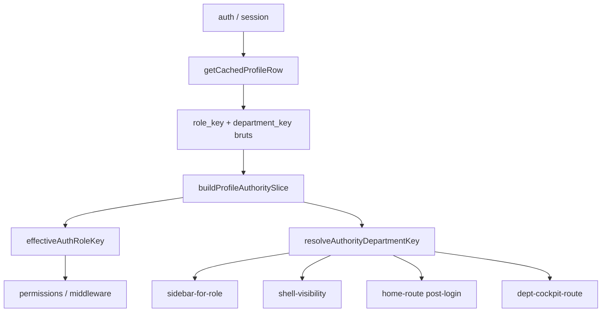

# ROLE SOURCE LOCK — Bloc 1 Étape 2

**Date :** 22 mai 2026  
**Version :** `role-source-lock-v1`  
**Verdict :** `ROLE_SOURCE_LOCKED` (avec dette documentée hors périmètre)

---

## 1. Contexte

Post-P9, après **RBAC Master Audit** (Étape 1, verdict PARTIAL). Mission : verrouiller la vérité rôle/département **avant** isolation sidebar/routes (Étape 3+), sans refonte navigation ni zone Super Admin gelée.

---

## 2. Résumé audit Étape 1

| ID | Constat | Priorité |
|----|---------|----------|
| D1 | `profiles.role_key` / `department_key` = source DB | P0 |
| D2 | Duplication `LEGACY_ROLE_TO_DEPARTMENT` vs `LEGACY_ROLE_ALIASES` | P1 |
| D3 | `shellRail` ignorait alias legacy si `department_key` NULL | **P0** |
| D4 | `directeur_general` → sidebar ERP globale | P1 (hors scope) |
| D5 | Cookie `rempres_role` = hint UX uniquement | OK |

---

## 3. Autorité rôle (Phase 1)

**Source officielle :** `profiles.role_key` + `profiles.department_key` (RLS Supabase).

**Pipeline verrouillé :**

**Module canonique :** `lib/auth/profile-authority.ts`  
**Super Admin :** branche `role === super_admin` inchangée — pas de fallback SA pour manager/agent.

---

## 4. Alias gouvernés (Phase 2)

| Couche | Fichier | Rôle |
|--------|---------|------|
| Rôle générique | `lib/auth/roles.ts` → `LEGACY_ROLE_ALIASES` | `responsable_vente` → `manager` |
| Département legacy | `profile-authority.ts` → `LEGACY_ROLE_TO_DEPARTMENT` | `responsable_vente` → `VENTE` |

**Règle :** pas d’alias implicites hors ces maps versionnées. `resolveSidebarDepartmentKey` délègue à `resolveAuthorityDepartmentKey`.

---

## 5. Department source (Phase 3)

**Priorité :**

1. `department_key` profil → `resolveEffectiveDepartmentKey` (consultation → formation)
2. Sinon `LEGACY_ROLE_TO_DEPARTMENT[role_key]`

**Exposé serveur :** `CachedProfileRow.authorityDepartmentKey`, `ProfileAuthBrief.authorityDepartmentKey`, `authorityDriftFlags`.

**Diagnostic SQL :** `supabase/sql/063_profile_authority_diagnostics.sql` (lecture seule).

---

## 6. Shell visibility alignment (Phase 4)

**Correction P0 :** `resolveShellRailVisibility` utilise `resolveAuthorityDepartmentKey(roleKey, departmentKey)` — aligné sur la sidebar.

**Test ajouté :** `responsable_vente` + `department_key: null` → rail Commerce/CRM visible si permissions lecture.

Super Admin : rail métier toujours masqué (inchangé).

---

## 7. Profile hardening (Phase 5)

| Flag | Signification |
|------|----------------|
| `missing_role_key` | Profil sans rôle |
| `missing_department_key` | `department_key` NULL |
| `department_from_legacy_role_only` | Dept dérivé uniquement de `role_key` legacy |
| `generic_role_without_department` | `manager`/`agent` sans dept résolu |

Pas de migration massive — correction données ciblée via SQL diagnostic + admin.

---

## 8. Performance (Phase 6)

- **Une résolution** `buildProfileAuthoritySlice` par `getCachedProfileRow` (React `cache()`).
- `getProfileAuthBrief` réutilise le slice sans recalcul DB.
- Fonctions shell/sidebar : O(1) lookup map, pas de requête supplémentaire.

---

## 9. Dette restante (hors Étape 2)

| Item | Statut |
|------|--------|
| `directeur_general` → `ErpNavSidebar` | Étape 3+ (nav isolation) |
| `/dept/*` legacy leak `responsable_*` | Route isolation Étape 3+ |
| `m3-75-final-lock.test.ts` (nom sidebar SA) | Drift test pré-existant |
| Profils DB `role_key` incorrect (`super_admin` métier) | Correction données manuelle |

---

## 10. Verdict

**`ROLE_SOURCE_LOCKED`** pour le périmètre Étape 2 :

- Source rôle/département unique (`profile-authority`)
- Alias documentés et centralisés
- Shell rail aligné sidebar (P0 corrigé)
- Drift profil diagnostiquable
- Super Admin non modifié
- Build/lint/tests unitaires ciblés PASS

**PARTIAL global RBAC** reste valide jusqu’à Étape 3 (isolation routes/sidebar métier).
