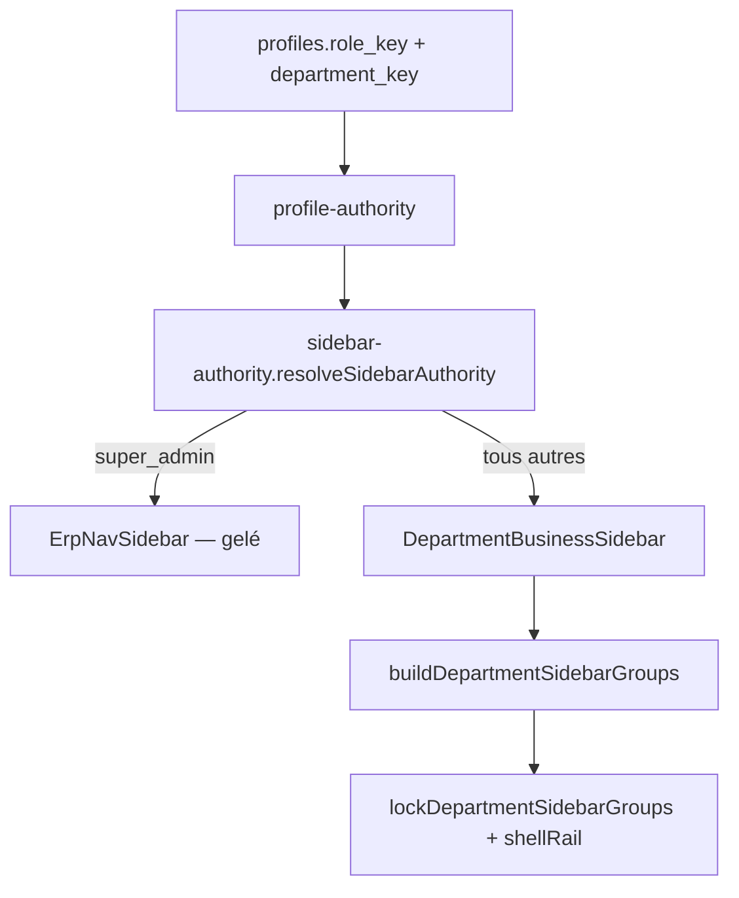

# SIDEBAR ISOLATION — Bloc 1 Étape 3

**Date :** 22 mai 2026  
**Version :** `sidebar-isolation-v1`  
**Verdict :** `SIDEBAR_ISOLATED`

---

## 1. Contexte

Post-P9, après :

- **Étape 1** — RBAC Master Audit (PARTIAL)
- **Étape 2** — Role Source Lock (`ROLE_SOURCE_LOCKED`)

Mission : isoler la sidebar par rôle à partir de la vérité autoritaire, **sans** refonte navigation, **sans** modifier Super Admin (`ErpNavSidebar` gelé).

---

## 2. Rappel étapes 1–2

| Étape | Livrable | Impact sidebar |
|-------|----------|----------------|
| 1 | P0 shellRail ≠ sidebar | Identifié |
| 2 | `profile-authority.ts` | `resolveAuthorityDepartmentKey` unique |

---

## 3. Authority path (Phase 1)

**Module canonique sidebar :** `lib/navigation/sidebar-authority.ts`  
**Wrapper AppShell :** `lib/navigation/sidebar-for-role.ts` (délégation uniquement)

---

## 4. Isolation logique (Phase 2)

| Rôle / profil | Mode | Composant | Sections visibles |
|---------------|------|-----------|-------------------|
| `super_admin` | `super_admin_erp` | ErpNavSidebar | ERP global (inchangé) |
| `manager` + VENTE | `department_business` | DepartmentBusinessSidebar | Commerce, CRM |
| `manager` + FINANCE | `department_business` | DepartmentBusinessSidebar | Finance |
| `manager` + RH | `department_business` | DepartmentBusinessSidebar | RH |
| `responsable_vente` (legacy) | `department_business` | DepartmentBusinessSidebar | Commerce, CRM |
| `comptable` | `department_business` | DepartmentBusinessSidebar | Finance |
| `directeur_general` | `department_business` | DepartmentBusinessSidebar | Gouvernance (actions) |

**Supprimé :** mode `director_erp` / `department_legacy` / branche `DeptSidebarNav` dans AppShell.

---

## 5. Analyse directeur général (Phase 2)

**Décision documentée :**

- `directeur_general` **ne doit plus** utiliser `ErpNavSidebar` (visuel proche SA).
- Alias gouverné : `LEGACY_ROLE_TO_DEPARTMENT.directeur_general` → `ADMINISTRATION`.
- Architecture sidebar : `OFFICIAL_DEPARTMENT_SIDEBAR_ARCHITECTURE[ADMINISTRATION]` (gouvernance : actions, plateforme, approbations, journaux).
- `hasAdminConsoleAccess` aligné sur département effectif (`userDept`) dans `shell-visibility`.

**Super Admin :** inchangé — seul rôle dans `ERP_GLOBAL_SIDEBAR_ROLES`.

---

## 6. Legacy cleanup (Phase 3)

| Élément | Action |
|---------|--------|
| `DEPT_NAV_CONFIGS` / `DeptSidebarNav` | `@deprecated` — plus branché AppShell |
| `department_legacy` | Supprimé |
| `FULL_SIDEBAR_ROLES` | Réduit à `["super_admin"]` |
| `director_erp` | Supprimé |
| Duplication maps dept | Centralisée dans `profile-authority` |

---

## 7. Performance (Phase 5)

- Une résolution `resolveSidebarAuthority` par render AppShell (`useMemo`).
- `lockDepartmentSidebarGroups` = alias explicite du filtre (pas de double logique).
- Imports `resolveEffectiveDepartmentKey` depuis `profile-authority` (évite chaîne home-route).
- `DeptSidebarNav` retiré du bundle dynamique AppShell.

---

## 8. Dette restante

| Item | Statut |
|------|--------|
| Isolation routes `/dept/*` legacy | Étape 4+ |
| `filterNavConfig` pour SA uniquement | OK (gelé) |
| Profils DB `role_key` incorrect | Correction données |
| `m3-75-final-lock.test.ts` | Drift nom composant SA (pré-existant) |

---

## 9. Validation matrix (Phase 6)

| ROLE | SIDEBAR | VISIBLE | UNEXPECTED | RESULT |
|------|---------|---------|------------|--------|
| super_admin | ErpNavSidebar | ERP global | — | PASS |
| manager + VENTE | Dept business | commerce, crm | finance, rh | PASS |
| manager + FINANCE | Dept business | finance | commerce, crm | PASS |
| manager + RH | Dept business | rh | commerce, finance | PASS |
| responsable_vente | Dept business | commerce, crm | finance | PASS |
| directeur_general + ADMIN | Dept business | actions | commerce, settings | PASS |
| manager + LOGISTIQUE | Dept business | logistique | commerce, finance | PASS |

Tests automatisés : `sidebar-isolation-matrix.test.ts`, `sidebar-authority.test.ts`.

---

## 10. Verdict

**`SIDEBAR_ISOLATED`**

- Sidebar consomme `profile-authority` via `sidebar-authority`
- Isolation complète non-SA (y compris DG)
- Legacy nettoyé / gouverné
- Visibilité verrouillée (`lockDepartmentSidebarGroups` + shellRail)
- Super Admin pixel-identique
- lint / build / tests unitaires ciblés PASS
