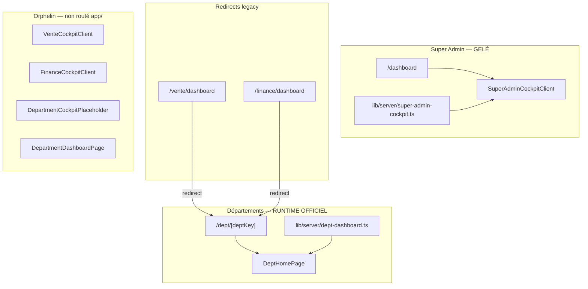

# COCKPIT OWNERSHIP REPORT — Bloc 2 Étape 1

**Date :** 22 mai 2026

## Cockpit topology

## Ownership matrix

| Cockpit | Route | Owner component | Data source | Runtime |
|---------|-------|-----------------|-------------|---------|
| Super Admin | `/dashboard` | `SuperAdminCockpitClient` | `getSuperAdminCockpitPayload` | **ACTIF — GELÉ** |
| Département unifié | `/dept/{key}` | `DeptHomePage` | `getDeptDashboardData` | **ACTIF — CANONIQUE** |
| Vente legacy | `/vente/dashboard` | redirect | — | Redirect → `/dept/vente` |
| Finance legacy | `/finance/dashboard` | redirect | — | Redirect → `/dept/finance` |
| Vente B2.4 ref | — | `VenteCockpitClient` | `vente-cockpit-payload` | **ORPHELIN** (governance ref) |
| Finance B3 ref | — | `FinanceCockpitClient` | `finance-cockpit-payload` | **ORPHELIN** |
| Placeholder M3 | — | `DepartmentCockpitPlaceholder` | — | **ORPHELIN** via `DepartmentDashboardPage` |

## Double cockpit ?

| Question | Réponse |
|----------|---------|
| Double cockpit actif par dept ? | **Non** — seul `DeptHomePage` sur `/dept/*` |
| Overlap SA vs dept ? | **Non** — `/dashboard` redirect non-SA vers dept/home-route |
| Fallback cockpit ? | `DepartmentCockpitPlaceholder` existe mais **non importé** par routes actives |
| Legacy cockpit UI ? | `VenteCockpitClient` / `FinanceCockpitClient` maintenus pour standard B2/B3, pas montés |

## Contrat architecture (`erp-ux-architecture.ts`)

- `SUPER_ADMIN_COCKPIT_ROUTE = "/dashboard"`
- `OFFICIAL_DEPARTMENT_SIDEBAR_ARCHITECTURE` → `cockpitRoute: "/dept/{slug}"`
- Aligné avec runtime actuel

## Verdict cockpit

**PARTIAL** — **1 owner runtime** (`DeptHomePage` + SA séparé) ; dette = UI modules orphelins + placeholder non supprimés.
