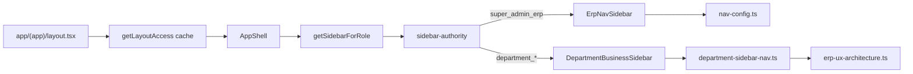

# NAV ARCH REPORT — Bloc 2 Étape 1

**Date :** 22 mai 2026

## Navigation topology

## ONE SOURCE ?

| Layer | Source of truth | Statut |
|-------|-----------------|--------|
| Sidebar mode (SA vs dept) | `sidebar-authority.ts` | **UNIQUE** (Bloc 1 Étape 3) |
| Dept sidebar items | `department-sidebar-nav.ts` + `erp-ux-architecture.ts` | **UNIQUE** |
| SA sidebar items (runtime) | `nav-config.ts` via `ErpNavSidebar` | **UNIQUE production** |
| SA sidebar (parallel) | `super-admin-nav.ts` | **DUPLICATE** — orphan components only |
| Route access | `route-authority` + middleware | **UNIQUE** (Bloc 1 Étape 4) |
| Shell rail visibility | `shell-visibility.ts` + `profile-authority` | **UNIQUE** |
| Post-login home | `home-route.ts` | **UNIQUE** |

## AppShell audit

| Élément | État |
|---------|------|
| Single layout `(app)/layout.tsx` | OK — pas de double AppShell |
| Dynamic import sidebars | OK — code-split ErpNav + DeptBusiness |
| Legacy `DeptSidebarNav` | **Retiré** — fichier orphelin reste |
| Legacy `PrimarySidebar` / `MobileSidebar` | **Non branchés** |
| Cookie `rempres_role` logout clear | Encore présent (logout only) |

## Nav duplication (documentée, pas corrigée)

1. **`nav-config.ts`** vs **`super-admin-nav.ts`** — même domaine SA, deux arbres
2. **`dept-nav-configs.ts`** vs **`department-sidebar-nav.ts`** — legacy vs actif
3. **Governance nav hubs** : `lib/actions/governance-nav`, `lib/archives/governance-nav`, `lib/settings/governance-nav` — hubs séparés mais cohérents par zone

## Ownership drift post-Bloc 1

| Check | Résultat |
|-------|----------|
| Sidebar suit `profile-authority` | **Oui** |
| Routes suivent `route-authority` | **Oui** |
| `m3-75-final-lock.test.ts` attend `SuperAdminPrimarySidebar` | **DRIFT** — runtime = `ErpNavSidebar` |

## Verdict navigation

**PARTIAL** — runtime **une seule chaîne** pour AppShell ; dette = fichiers nav SA legacy + test drift.
